## BÁO CÁO KỸ THUẬT SẢN PHẨM PHẦN MỀM
### ĐỀ TÀI: ỨNG DỤNG QUẢN LÝ VÀ ĐỒNG HÀNH SỐ CHO TRẺ EM KURA
**Thời gian:** Hà Nội, 09/2026

---

## MỤC LỤC
1. [LỜI MỞ ĐẦU](#lời-mở-đầu)
2. [DANH MỤC HÌNH VẼ](#danh-mục-hình-vẽ)
3. [DANH MỤC BẢNG BIỂU](#danh-mục-bảng-biểu)
4. [DANH MỤC THUẬT NGỮ VÀ TỪ VIẾT TẮT](#danh-mục-thuật-ngữ-và-từ-viết-tắt)
5. [CHƯƠNG 1. THU THẬP YÊU CẦU](#chương-1-thu-thập-yêu-cầu)
   - 1.1. [Các kỹ thuật thu thập yêu cầu](#11-các-kỹ-thuật-thu-thập-yêu-cầu)
   - 1.2. [Bảng câu hỏi khảo sát và phân tích yêu cầu](#12-bảng-câu-hỏi-khảo-sát-và-phân-tích-yêu-cầu)
   - 1.3. [Phân loại yêu cầu hệ thống](#13-phân-loại-yêu-cầu-hệ-thống)
     - 1.3.1. [Yêu cầu về phần mềm](#131-yêu-cầu-về-phần-mềm)
     - 1.3.2. [Yêu cầu về phần cứng](#132-yêu-cầu-về-phần-cứng)
     - 1.3.3. [Yêu cầu về dữ liệu](#133-yêu-cầu-về-dữ-liệu)
     - 1.3.4. [Yêu cầu về người dùng và vai trò tác nhân](#134-yêu-cầu-về-người-dùng-và-vai-trò-tác-nhân)
     - 1.3.5. [Yêu cầu phi chức năng](#135-yêu-cầu-phi-chức-năng)
6. [CHƯƠNG 2. PHÂN TÍCH HỆ THỐNG](#chương-2-phân-tích-hệ-thống)
   - 2.1. [Biểu đồ ca sử dụng (Use Case Diagrams)](#21-biểu-đồ-ca-sử-dụng-use-case-diagrams)
     - 2.1.1. [Biểu đồ ca sử dụng tổng quát](#211-biểu-đồ-ca-sử-dụng-tổng-quát)
     - 2.1.2. [Biểu đồ phân rã ca sử dụng chi tiết](#212-biểu-đồ-phân-rã-ca-sử-dụng-chi-tiết)
     - 2.1.3. [Bảng đặc tả các Use Case cốt lõi](#213-bảng-đặc-tả-các-use-case-cốt-lõi)
   - 2.2. [Biểu đồ hoạt động (Activity Diagrams)](#22-biểu-đồ-hoạt-động-activity-diagrams)
     - 2.2.1. [Quy trình Giám sát và Chặn ứng dụng Native](#221-quy-trình-giám-sát-và-chặn-ứng-dụng-native)
     - 2.2.2. [Quy trình Xin thêm thời gian và Phê duyệt](#222-quy-trình-xin-thêm-thời-gian-và-phê-duyệt)
     - 2.2.3. [Quy trình Giám sát và Báo động Từ khóa độc hại](#223-quy-trình-giám-sát-và-báo-động-từ-khóa-độc-hại)
     - 2.2.4. [Quy trình Ghép đôi Gia đình qua Link Code](#224-quy-trình-ghép-đôi-gia-đình-qua-link-code)
   - 2.3. [Biểu đồ tuần tự (Sequence Diagrams)](#23-biểu-đồ-tuần-tự-sequence-diagrams)
     - 2.3.1. [Thiết lập và đồng bộ Rule khóa ứng dụng](#231-thiết-lập-và-đồng-bộ-rule-khóa-ứng-dụng)
     - 2.3.2. [Vòng đời Xử lý Yêu cầu Xin thêm giờ qua Cloud Functions](#232-vòng-đời-xử-lý-yêu-cầu-xin-thêm-giờ-qua-cloud-functions)
     - 2.3.3. [Bắt sự kiện từ khóa và Đẩy cảnh báo thời gian thực](#233-bắt-sự-kiện-từ-khóa-và-đẩy-cảnh-báo-thời-gian-thực)
     - 2.3.4. [Xử lý Midnight Rollover và Reset giới hạn hàng ngày](#234-xử-lý-midnight-rollover-và-reset-giới-hạn-hàng-ngày)
   - 2.4. [Mô hình thực thể liên kết (ERD Phân tích)](#24-mô-hình-thực-thể-liên-kết-erd-phân-tích)
7. [CHƯƠNG 3. THIẾT KẾ HỆ THỐNG](#chương-3-thiết-kế-hệ-thống)
   - 3.1. [Kiến trúc hệ thống](#31-kiến-trúc-hệ-thống)
     - 3.1.1. [Mô hình kiến trúc tổng thể](#311-mô-hình-kiến-trúc-tổng-thể)
     - 3.1.2. [Đặc tả các phân tầng kiến trúc](#312-đặc-tả-các-phân-tầng-kiến-trúc)
     - 3.1.3. [Các mục tiêu thiết kế kiến trúc](#313-các-mục-tiêu-thiết-kế-kiến-trúc)
   - 3.2. [Thiết kế lớp (Class Diagrams)](#32-thiết-kế-lớp-class-diagrams)
     - 3.2.1. [Sơ đồ lớp phân hệ Giám sát Native & Platform Channel](#321-sơ-đồ-lớp-phân-hệ-giám-sát-native--platform-channel)
     - 3.2.2. [Sơ đồ lớp phân hệ Giới hạn Ứng dụng & Quy tắc](#322-sơ-đồ-lớp-phân-hệ-giới-hạn-ứng-dụng--quy-tắc)
     - 3.2.3. [Sơ đồ lớp phân hệ Yêu cầu Thời gian & Tương tác](#323-sơ-đồ-lớp-phân-hệ-yêu-cầu-thời-gian--tương-tác)
     - 3.2.4. [Sơ đồ lớp phân hệ Cảnh báo & Giám sát Từ khóa](#324-sơ-đồ-lớp-phân-hệ-cảnh-báo--giám-sát-từ-khóa)
   - 3.3. [Thiết kế Cơ sở dữ liệu](#33-thiết-kế-cơ-sở-dữ-liệu)
     - 3.3.1. [Chiến lược lưu trữ NoSQL & Kỹ thuật Quota-Defense](#331-chiến-lược-lưu-trữ-nosql--kỹ-thuật-quota-defense)
     - 3.3.2. [Sơ đồ Thực thể CSDL Chi tiết (Database Schema ERD)](#332-sơ-đồ-thực-thể-csdl-chi-tiết-database-schema-erd)
     - 3.3.3. [Từ điển dữ liệu (Data Dictionary) chi tiết 8 Collections](#333-từ-điển-dữ-liệu-data-dictionary-chi-tiết-8-collections)
   - 3.4. [Thiết kế mẫu biểu và giao diện giao tiếp](#34-thiết-kế-mẫu-biểu-và-giao-diện-giao-tiếp)
8. [CHƯƠNG 4. TRIỂN KHAI VÀ ĐÁNH GIÁ HỆ THỐNG](#chương-4-triển-khai-và-đánh-giá-hệ-thống)
   - 4.1. [Kết quả triển khai giao diện thực tế](#41-kết-quả-triển-khai-giao-diện-thực-tế)
   - 4.2. [Đánh giá hệ thống và kết quả kiểm thử](#42-đánh-giá-hệ-thống-và-kết-quả-kiểm-thử)
     - 4.2.1. [Bảng thống kê kết quả kiểm thử tự động](#421-bảng-thống-kê-kết-quả-kiểm-thử-tự-động)
     - 4.2.2. [Đánh giá mức độ đáp ứng mục tiêu](#422-đánh-giá-mức-độ-đáp-ứng-mục-tiêu)
     - 4.2.3. [So sánh định lượng với các giải pháp thị trường](#423-so-sánh-định-lượng-với-các-giải-pháp-thị-trường)
9. [KẾT LUẬN VÀ HƯỚNG PHÁT TRIỂN](#kết-luận-và-hướng-phát-triển)
10. [TÀI LIỆU THAM KHẢO](#tài-liệu-tham-khảo)

---

## DANH MỤC HÌNH VẼ

| Ký hiệu | Tên hình vẽ | Trang tham chiếu |
| :--- | :--- | :--- |
| **Hình 2.1** | Biểu đồ ca sử dụng (Use Case) tổng quát hệ thống Kura | Chương 2 |
| **Hình 2.2** | Biểu đồ phân rã ca sử dụng: Phân hệ Quản lý Smart Lock & Lịch trình | Chương 2 |
| **Hình 2.3** | Biểu đồ phân rã ca sử dụng: Phân hệ Yêu cầu Thời gian (Time Request) | Chương 2 |
| **Hình 2.4** | Biểu đồ phân rã ca sử dụng: Phân hệ Giám sát Từ khóa & Cảnh báo | Chương 2 |
| **Hình 2.5** | Biểu đồ phân rã ca sử dụng: Phân hệ Báo cáo Thống kê & Phân tích | Chương 2 |
| **Hình 2.6** | Biểu đồ hoạt động: Luồng chặn ứng dụng thời gian thực (Native Blocking) | Chương 2 |
| **Hình 2.7** | Biểu đồ hoạt động: Luồng xin thêm giờ và phê duyệt (Time Request Flow) | Chương 2 |
| **Hình 2.8** | Biểu đồ hoạt động: Quét cây giao diện và phát hiện từ khóa nhạy cảm | Chương 2 |
| **Hình 2.9** | Biểu đồ hoạt động: Luồng liên kết thiết bị gia đình qua Link Code | Chương 2 |
| **Hình 2.10** | Biểu đồ tuần tự: Thiết lập và đồng bộ Rule khóa ứng dụng xuống máy Child | Chương 2 |
| **Hình 2.11** | Biểu đồ tuần tự: Vòng đời xử lý Yêu cầu Xin thêm giờ qua Cloud Functions | Chương 2 |
| **Hình 2.12** | Biểu đồ tuần tự: Giám sát và kích hoạt báo động từ khóa độc hại | Chương 2 |
| **Hình 2.13** | Biểu đồ tuần tự: Xử lý Midnight Rollover và reset dữ liệu sử dụng | Chương 2 |
| **Hình 2.14** | Sơ đồ mô hình thực thể liên kết (ERD Phân tích) | Chương 2 |
| **Hình 3.1** | Sơ đồ kiến trúc Clean Architecture kết hợp Android Platform Channel | Chương 3 |
| **Hình 3.2** | Sơ đồ lớp chi tiết: Phân hệ Giám sát Native & Accessibility Channel | Chương 3 |
| **Hình 3.3** | Sơ đồ lớp chi tiết: Phân hệ Giới hạn Ứng dụng & Quy tắc (Smart Lock) | Chương 3 |
| **Hình 3.4** | Sơ đồ lớp chi tiết: Phân hệ Yêu cầu Thời gian & Tương tác | Chương 3 |
| **Hình 3.5** | Sơ đồ lớp chi tiết: Phân hệ Cảnh báo & Giám sát Từ khóa | Chương 3 |
| **Hình 3.6** | Sơ đồ Thực thể CSDL Firestore phân cấp (Database Schema ERD) | Chương 3 |
| **Hình 4.1** | Giao diện Màn hình Đăng nhập & Xác thực Firebase Auth | Chương 4 |
| **Hình 4.2** | Giao diện Ghép đôi thiết bị gia đình thông qua Link Code 6 chữ số | Chương 4 |
| **Hình 4.3** | Giao diện Dashboard Phụ huynh hiển thị Analytics và Biểu đồ Donut | Chương 4 |
| **Hình 4.4** | Giao diện Dashboard Học sinh hiển thị thời gian khả dụng và Quota | Chương 4 |
| **Hình 4.5** | Giao diện Toàn màn hình khóa ứng dụng (LockScreen Overlay) | Chương 4 |
| **Hình 4.6** | Giao diện Thiết lập Giới hạn thời gian (App Time Limit) theo thứ | Chương 4 |
| **Hình 4.7** | Giao diện Phê duyệt Yêu cầu Xin thêm giờ (Pending Requests List) | Chương 4 |
| **Hình 4.8** | Giao diện Danh sách Cảnh báo Từ khóa nhạy cảm (Alert History) | Chương 4 |

---

## DANH MỤC BẢNG BIỂU

| Ký hiệu | Tên bảng | Nội dung chính |
| :--- | :--- | :--- |
| **Bảng 1.1** | Bảng câu hỏi phỏng vấn và khảo sát thực tế | Thu thập nhu cầu của Phụ huynh & Học sinh |
| **Bảng 1.2** | Bảng mô tả các tập dữ liệu hệ thống | Đặc tả các đối tượng dữ liệu sơ cấp |
| **Bảng 2.1** | Bảng đặc tả Use Case UC-01: Đăng nhập & Ghép đôi gia đình | Thông tin luồng sự kiện chính và ngoại lệ |
| **Bảng 2.2** | Bảng đặc tả Use Case UC-02: Cấu hình Giới hạn Ứng dụng | Thiết lập số phút sử dụng theo ngày |
| **Bảng 2.3** | Bảng đặc tả Use Case UC-03: Thiết lập Lịch trình Khóa | Đặt khung giờ cấm tập trung học/ngủ |
| **Bảng 2.4** | Bảng đặc tả Use Case UC-04: Chặn ứng dụng Native | Cơ chế ngầm đẩy văng ra Home Screen |
| **Bảng 2.5** | Bảng đặc tả Use Case UC-05: Gửi Yêu cầu Xin thêm giờ | Học sinh gửi request gia hạn thời gian |
| **Bảng 2.6** | Bảng đặc tả Use Case UC-06: Phê duyệt Yêu cầu & Auto-Approval | Cha mẹ duyệt hoặc hệ thống tự động duyệt |
| **Bảng 2.7** | Bảng đặc tả Use Case UC-07: Giám sát Từ khóa nhạy cảm | Quét AccessibilityNodeInfo bắt nội dung xấu |
| **Bảng 2.8** | Bảng đặc tả Use Case UC-08: Tra cứu Báo cáo & Thống kê | Xem biểu đồ phân bổ thời lượng ứng dụng |
| **Bảng 3.1** | Từ điển dữ liệu: Collection `users` | Hồ sơ người dùng và token FCM |
| **Bảng 3.2** | Từ điển dữ liệu: Collection `families` | Nhóm gia đình và mã kết nối Link Code |
| **Bảng 3.3** | Từ điển dữ liệu: Sub-collection `timeLimits` | Cấu hình giới hạn số phút theo từng app |
| **Bảng 3.4** | Từ điển dữ liệu: Sub-collection `timeRequests` | Danh sách yêu cầu gia hạn thời gian |
| **Bảng 3.5** | Từ điển dữ liệu: Sub-collection `alerts` | Các sự kiện cảnh báo từ khóa và vi phạm |
| **Bảng 3.6** | Từ điển dữ liệu: Sub-collection `schedules` | Lịch trình cấm theo khung giờ và thứ |
| **Bảng 3.7** | Từ điển dữ liệu: Collection `usage_logs` & `daily_summaries` | Thống kê số giây sử dụng ứng dụng |
| **Bảng 3.8** | Từ điển dữ liệu: Collection `smartLockSettings` | Cấu hình công tắc tổng và giờ giới nghiêm |
| **Bảng 4.1** | Thống kê Kết quả Kiểm thử Tự động (Automated Test Suites) | Tổng hợp 772 tests Passed thực tế |
| **Bảng 4.2** | Ma trận Đánh giá Mức độ Hoàn thành Ca sử dụng | So sánh yêu cầu đề ra và thực tế |
| **Bảng 4.3** | Bảng So sánh Tính năng với Google Family Link & Qustodio | Phân tích ưu thế kỹ thuật vượt trội |

---

## DANH MỤC THUẬT NGỮ VÀ TỪ VIẾT TẮT

| Thuật ngữ | Tên viết tắt | Diễn giải chi tiết |
| :--- | :--- | :--- |
| **Object-Oriented Analysis & Design** | OOAD | Phương pháp Phân tích và Thiết kế Hướng đối tượng |
| **Business Logic Component** | BLoC | Kiến trúc quản lý trạng thái luồng (Stream-based Reactive Pattern) trong Flutter |
| **Accessibility Service** | A11y | Dịch vụ trợ năng trên Android cho phép giám sát cửa sổ và trích xuất text cây giao diện |
| **Firebase Cloud Messaging** | FCM | Dịch vụ gửi thông báo đẩy thời gian thực từ đám mây tới thiết bị |
| **Cloud Firestore** | Firestore | Cơ sở dữ liệu hướng tài liệu (NoSQL Document Database) theo thời gian thực của Google |
| **MethodChannel** | - | Cầu nối giao tiếp hai chiều giữa ngôn ngữ Dart (Flutter) và Kotlin/Java (Android Native) |
| **RAM Filtering / In-Memory Sorting** | - | Kỹ thuật truy vấn dữ liệu thô về bộ nhớ RAM của Client để tự sort/filter nhằm tránh lỗi Index |
| **Midnight Rollover** | - | Cơ chế tự động reset hạn mức và tạo bản ghi tổng kết ngày tại thời điểm 00:00:00 |
| **Closed-by-default** | - | Nguyên tắc bảo mật: Mặc định không theo dõi, chỉ can thiệp các app nằm trong danh mục giám sát |

---

## LỜI MỞ ĐẦU

Bước vào kỷ nguyên chuyển đổi số, điện thoại thông minh và máy tính bảng đã trở thành công cụ học tập và giải trí không thể thiếu đối với thế hệ học sinh. Tuy nhiên, mặt trái của sự bùng nổ công nghệ là tình trạng nghiện mạng xã hội (TikTok, Facebook, Instagram), game online, cùng với nguy cơ tiếp xúc với các nội dung độc hại (bạo lực học đường, cờ bạc trực tuyến, lừa đảo và các trào lưu tự gây thương tích). 

Các giải pháp giám sát con cái hiện nay trên thị trường thường gặp phải ba vấn đề lớn:
1. **Tính độc đoán và thụ động:** Chỉ tập trung vào việc chặn đứng một chiều (Blacklist blocking) mà thiếu đi kênh tương tác, thảo luận bình đẳng giữa phụ huynh và con cái, dẫn tới việc trẻ tìm cách gỡ bỏ hoặc gian lận (bật VPN, chỉnh giờ hệ thống).
2. **Chi phí đám mây đắt đỏ:** Việc đồng bộ dữ liệu liên tục lên Cloud dễ gây nghẽn và làm cạn kiệt hạn ngạch cơ sở dữ liệu (Firestore Quota Exceeded), dẫn tới chi phí vận hành khổng lồ.
3. **Tính bất ổn định trên nền tảng di động:** Các tiến trình giám sát ngầm thường bị các trình quản lý pin (Battery Saver / Doze Mode) của Android khai tử (kill process), khiến hệ thống mất tác dụng.

Ứng dụng **Kura (KidGuardian)** được nghiên cứu và thiết kế nhằm giải quyết triệt để các hạn chế trên. Kura là giải pháp quản trị và đồng hành số toàn diện:
- Cung cấp cơ chế khóa thông minh (**Smart Lock**) kết hợp kênh đối thoại hai chiều (**Time Request**) cho phép trẻ chủ động xin thêm thời gian học tập.
- Phát hiện từ khóa nhạy cảm theo thời gian thực (**Keyword Monitoring**) trên mọi ứng dụng nhờ dịch vụ nền **Android Accessibility Service**.
- Ứng dụng kiến trúc **Clean Architecture** kết hợp mô hình **BLoC**, tối ưu hóa bộ đệm ngoại tuyến (**Offline Cache**) và thuật toán **RAM Filtering** giúp hệ thống vận hành mượt mà, độc lập mạng, tiết kiệm 100% chi phí truy vấn Cloud Index.

Báo cáo kỹ thuật này thể hiện trọn vẹn quy trình nghiên cứu, phân tích thiết kế hướng đối tượng và hiện thực hóa phần mềm Kura – sản phẩm công nghệ sáng tạo của học sinh THPT nhằm mang lại giải pháp đồng hành số thực tiễn và an toàn cho gia đình.

---

## CHƯƠNG 1. THU THẬP YÊU CẦU

### 1.1. Các kỹ thuật thu thập yêu cầu
Để xây dựng một hệ thống vừa đáp ứng đúng bài toán tâm lý gia đình, vừa khả thi về mặt kỹ thuật trên nền tảng Android, nhóm nghiên cứu đã kết hợp ba phương pháp thu thập yêu cầu:
1. **Kỹ thuật phỏng vấn trực tiếp (In-depth Interview):** Tiến hành phỏng vấn sâu 15 phụ huynh có con học bậc THCS và THPT cùng 15 học sinh về thói quen sử dụng điện thoại, cảm giác khi bị cha mẹ cấm đoán và nguyện vọng được cấp quyền tự chủ.
2. **Khảo sát diện rộng bằng biểu mẫu (Online Survey):** Thu thập 120 phiếu trả lời khảo sát từ các nhóm cộng đồng cha mẹ và học sinh tại Hà Nội.
3. **Phân tích đối thủ cạnh tranh (Competitive Benchmarking):** Nghiên cứu trực tiếp mã nguồn mở và cơ chế vận hành của Google Family Link, Qustodio và Bark để tìm ra các "điểm nghẽn" về kỹ thuật (vấn đề kill background service, lỗi permission, chi phí Firestore).

### 1.2. Bảng câu hỏi khảo sát và phân tích yêu cầu

**Bảng 1.1: Bảng câu hỏi phỏng vấn và phân tích yêu cầu nghiệp vụ**

| STT | Câu hỏi khảo sát thực tế | Nhóm đối tượng | Kết quả phân tích yêu cầu kỹ thuật tương ứng |
| :--- | :--- | :--- | :--- |
| **1** | Bác/Anh/Chị muốn giám sát thiết bị của con theo hình thức nào? | Phụ huynh | Cần một ứng dụng di động duy nhất, phân tách 2 giao diện (Parent Dashboard và Child Mode) dựa trên vai trò tài khoản được xác thực qua Firebase Auth. |
| **2** | Khi trẻ đang sử dụng app giải trí quá giờ quy định, phần mềm phải làm gì? | Phụ huynh | Hệ thống phải lập tức đẩy ứng dụng cấm xuống nền bằng lệnh `GLOBAL_ACTION_HOME` trong thời gian < 0.5s và hiển thị màn hình khóa cảnh báo đè lên. |
| **3** | Em cảm thấy ức chế nhất điều gì khi bị phụ huynh khóa máy đột ngột? | Học sinh | Bị ngắt kết nối khi đang trao đổi bài tập nhóm. Cần có nút "Xin thêm giờ" (15p, 30p) kèm lý do để phụ huynh nhận thông báo và bấm duyệt từ xa. |
| **4** | Làm cách nào để cha mẹ biết con đang tìm kiếm các nội dung tiêu cực (tự tử, bạo lực)? | Phụ huynh | Ứng dụng phải ngầm duyệt cây giao diện (`AccessibilityNodeInfo`) trên các ứng dụng mạng xã hội và trình duyệt để phát hiện từ khóa nguy hiểm và gửi cảnh báo đỏ. |
| **5** | Nếu điện thoại của con mất kết nối 4G/Wifi, quy tắc chặn có hoạt động không? | Cả hai | App trên máy con phải lưu cache toàn bộ Rule xuống `SharedPreferences`. Khi không có Internet, việc đếm giờ và khóa app vẫn phải chạy chính xác 100%. |
| **6** | Gia đình có nhiều con thì quản lý ra sao? | Phụ huynh | Hệ thống áp dụng cấu trúc `Family Group` với mã kết nối `Link Code` 6 ký tự. Một tài khoản cha mẹ có thể quản lý nhiều thiết bị con độc lập. |

---

### 1.3. Phân loại yêu cầu hệ thống

#### 1.3.1. Yêu cầu về phần mềm
- **Nền tảng phát triển ứng dụng di động:** Flutter SDK phiên bản 3.x (ngôn ngữ Dart), áp dụng kiến trúc State Management **BLoC (flutter_bloc)**.
- **Tầng native chuyên sâu:** Android Native (ngôn ngữ Kotlin) triển khai `AccessibilityService`, `MethodChannel` liên kết dữ liệu với Flutter.
- **Cơ sở dữ liệu đám mây:** **Firebase Cloud Firestore** (NoSQL Database), cung cấp tính năng Realtime Snapshot Stream.
- **Xác thực và phân quyền:** Firebase Authentication (hỗ trợ Email/Password và Token Session).
- **Điện toán đám mây không máy chủ (Serverless Backend):** **Firebase Cloud Functions v2** (Node.js runtime) xử lý các trigger phản ứng sự kiện `onDocumentCreated` và `onDocumentUpdated`.
- **Dịch vụ thông báo đẩy:** Firebase Cloud Messaging (FCM) hỗ trợ High Priority Notification Channels.

#### 1.3.2. Yêu cầu về phần cứng
- **Thiết bị Phụ huynh (Parent Device):**
  - Hệ điều hành Android 8.0+ hoặc iOS 13.0+.
  - Bộ nhớ RAM tối thiểu 2 GB, kết nối Internet ổn định (Wifi hoặc 4G/5G).
- **Thiết bị Học sinh (Child Device):**
  - Hệ điều hành Android từ phiên bản 8.0 (API Level 26) đến Android 14+.
  - Bộ nhớ RAM tối thiểu 3 GB để đảm bảo không bị hệ thống dọn dẹp bộ nhớ kill Foreground Service.
  - Hỗ trợ phần cứng bộ đếm thời gian hệ thống và quyền Trợ năng (Accessibility Permissions).

#### 1.3.3. Yêu cầu về dữ liệu

**Bảng 1.2: Mô tả các tập dữ liệu chính trong hệ thống**

| Tên tập dữ liệu | Mô tả bản chất dữ liệu | Nơi lưu trữ chính |
| :--- | :--- | :--- |
| **Users** | Lưu trữ UID, Email, Vai trò (Parent/Child), Tên hiển thị, FCM Token. | Firestore `users` & Local Storage |
| **Families** | Lưu ID gia đình, `parentUid`, danh sách `childUids`, mã liên kết `linkCode` 6 số. | Firestore `families` |
| **AppTimeLimits** | Cấu hình giới hạn thời gian (phút/ngày) cho từng ứng dụng của từng học sinh. | Firestore `timeLimits` & Native Prefs |
| **Schedules** | Lịch trình cấm (Giờ học tập, giờ ngủ đêm) theo khung giờ bắt đầu/kết thúc và các thứ. | Firestore `schedules` & Native Prefs |
| **TimeRequests** | Yêu cầu xin cấp thêm giờ từ máy con, trạng thái `pending`, `approved`, `rejected`. | Firestore `timeRequests` |
| **Alerts** | Nhật ký cảnh báo vi phạm từ khóa nhạy cảm, loại cảnh báo, mức độ rủi ro, ngữ cảnh. | Firestore `alerts` |
| **UsageLogs** | Nhật ký chi tiết thời lượng chạy của từng package name theo từng phiên sử dụng. | Firestore `usage_logs` |
| **MonitoredKeywords** | Bộ từ điển các từ khóa độc hại cần giám sát theo từng gia đình. | Firestore & Kotlin Prefs Set |

#### 1.3.4. Yêu cầu về người dùng và vai trò tác nhân
- **Phụ huynh (Parent Actor):**
  - Thiết lập hồ sơ gia đình, sinh mã `Link Code`.
  - Quản lý công tắc tổng Smart Lock, định cấu hình hạn mức từng app và lịch cấm.
  - Phê duyệt hoặc từ chối các yêu cầu xin thêm giờ của con cái.
  - Xem biểu đồ trực quan về thời gian dùng màn hình; nhận thông báo đỏ khi con tra cứu từ khóa nguy hiểm.
- **Học sinh (Child Actor):**
  - Nhập mã `Link Code` để kết nối vào gia đình; cấp quyền Accessibility Service.
  - Theo dõi số phút còn lại trong ngày của từng ứng dụng trên Dashboard.
  - Gửi yêu cầu xin thêm giờ khi ứng dụng bị khóa.
- **Hệ thống chạy ngầm (System / AppMonitorService Actor):**
  - Giám sát sự kiện chuyển đổi cửa sổ (`TYPE_WINDOW_STATE_CHANGED`).
  - Đếm thời gian sử dụng thực tế và đối soát với Local Cache.
  - Kích hoạt lệnh văng màn hình Home (`GLOBAL_ACTION_HOME`) khi phát hiện vi phạm.
  - Quét văn bản tìm kiếm và so khớp từ khóa độc hại.

#### 1.3.5. Yêu cầu phi chức năng
1. **Hiệu năng chặn ứng dụng tức thì:** Khi trẻ mở một ứng dụng đã hết hạn mức hoặc trong giờ giới nghiêm, thời gian từ lúc ứng dụng mở đến lúc bị đẩy ra Home phải **nhỏ hơn 500ms** để triệt tiêu cảm giác giật/lag hoặc khả năng trẻ lách luật bấm nhanh.
2. **Khả năng tự vận hành ngoại tuyến (Offline Resilience):** Toàn bộ quy tắc giới hạn và lịch trình phải được lưu xuống bộ nhớ cục bộ (`SharedPreferences` ở tầng Native và `Local Cache` ở tầng Flutter). Nếu thiết bị mất kết nối mạng hoặc tắt Wifi, dịch vụ vẫn khóa app và đếm giờ chính xác.
3. **Bảo vệ Hạn ngạch Đám mây (Firebase Quota Defense):** Tránh hiện tượng ứng dụng gửi ghi/đọc Firestore liên tục mỗi giây. Dữ liệu đếm giờ được tích lũy cục bộ và chỉ đồng bộ định kỳ theo khối (Batching). Cơ chế phát hiện từ khóa áp dụng thời gian chờ (**Cooldown 5 phút**) nhằm chống spam document cảnh báo.
4. **Tránh lỗi Composite Index (Index-Defensive Querying):** Toàn bộ câu truy vấn Firestore hạn chế dùng `where` kết hợp `orderBy` đa trường; thay vào đó dữ liệu được đọc theo danh sách và lọc bằng thuật toán trên bộ nhớ RAM của Client.
5. **Tiết kiệm năng lượng và tài nguyên:** Dịch vụ nền chỉ kích hoạt quét khi có sự kiện thay đổi cửa sổ (`AccessibilityEvent`), không sử dụng vòng lặp `while(true)` vô tận gây hao pin (mức tiêu thụ pin < 3% mỗi ngày).

---

## CHƯƠNG 2. PHÂN TÍCH HỆ THỐNG

### 2.1. Biểu đồ ca sử dụng (Use Case Diagrams)

#### 2.1.1. Biểu đồ ca sử dụng tổng quát
Biểu đồ tổng quát mô tả sự tương tác giữa hai tác nhân chính (Phụ huynh, Con cái) cùng tác nhân ngầm Hệ thống đối với các phân hệ nghiệp vụ của Kura:

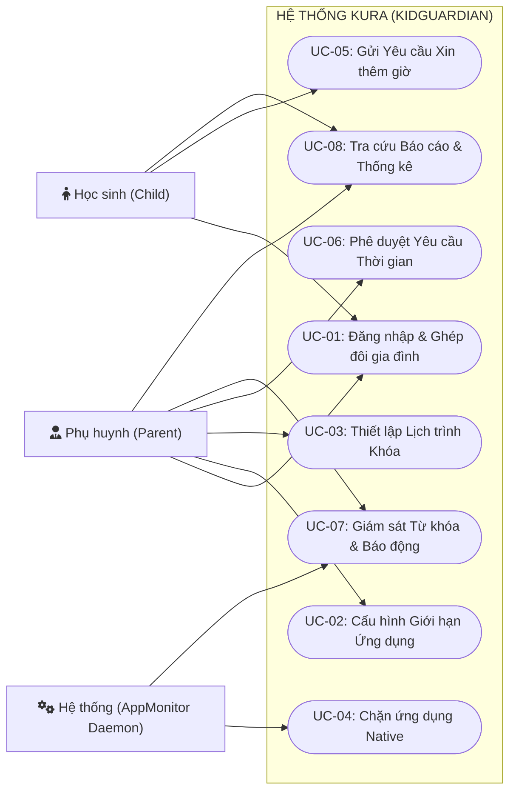
*Hình 2.1: Biểu đồ ca sử dụng tổng quát toàn hệ thống Kura*

---

#### 2.1.2. Biểu đồ phân rã ca sử dụng chi tiết

##### a) Phân rã ca sử dụng: Quản lý Smart Lock & Lịch trình
Phân hệ cho phép phụ huynh kiểm soát toàn diện quy tắc sử dụng ứng dụng trên thiết bị con:

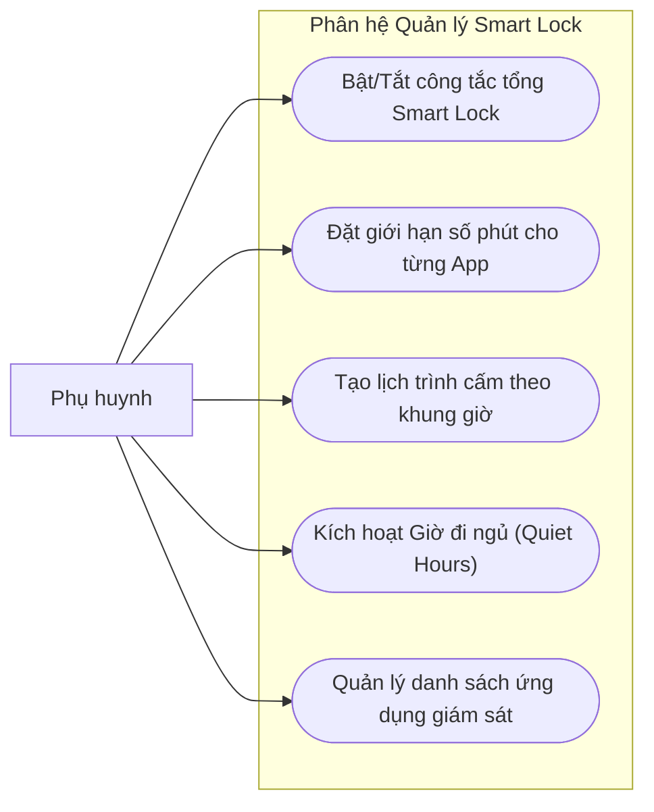
*Hình 2.2: Biểu đồ phân rã ca sử dụng Phân hệ Quản lý Smart Lock*

##### b) Phân rã ca sử dụng: Quản lý Yêu cầu Thời gian (Time Request)
Phân hệ xử lý vòng đời yêu cầu xin thêm giờ của học sinh và sự phản hồi của phụ huynh:

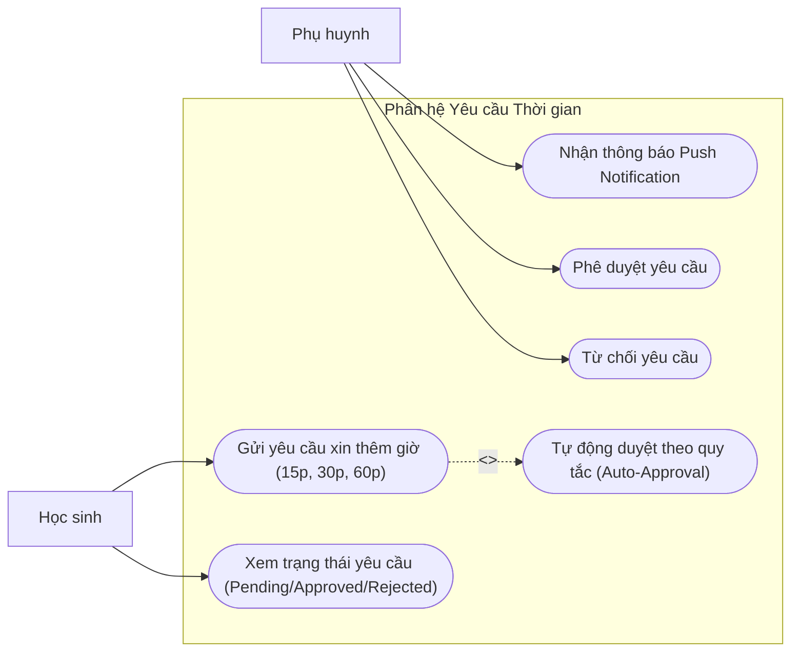
*Hình 2.3: Biểu đồ phân rã ca sử dụng Phân hệ Yêu cầu Thời gian*

##### c) Phân rã ca sử dụng: Giám sát Từ khóa & Báo động
Phân hệ an toàn số tự động bắt các hành vi tìm kiếm tiêu cực:

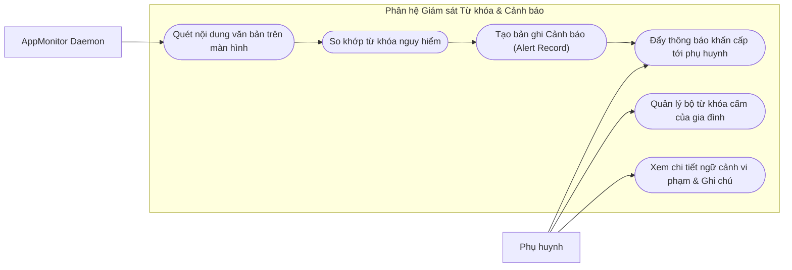
*Hình 2.4: Biểu đồ phân rã ca sử dụng Phân hệ Giám sát Từ khóa & Báo động*

##### d) Phân rã ca sử dụng: Báo cáo Thống kê & Phân tích
Phân hệ trực quan hóa dữ liệu sử dụng điện thoại:

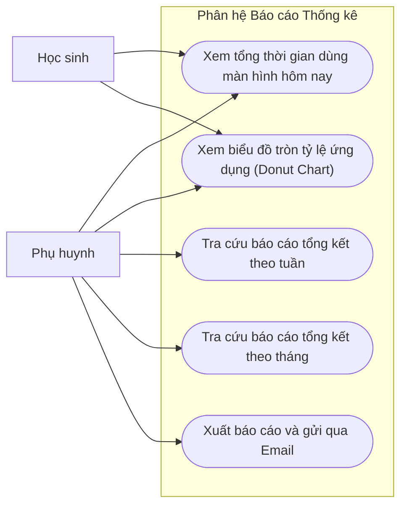
*Hình 2.5: Biểu đồ phân rã ca sử dụng Phân hệ Báo cáo Thống kê*

---

### 2.1.3. Bảng đặc tả các Use Case cốt lõi

#### UC-01: Đặc tả Use Case "Đăng nhập & Ghép đôi gia đình"

**Bảng 2.1: Đặc tả ca sử dụng UC-01**
- **Mã Use Case:** UC-01  
- **Tên Use Case:** Đăng nhập & Ghép đôi gia đình qua Link Code  
- **Tác nhân:** Phụ huynh (Parent), Học sinh (Child)  
- **Mục đích:** Xác thực danh tính người dùng và thiết lập mối quan hệ nhóm gia đình an toàn.  
- **Điều kiện tiên quyết:** Cả hai thiết bị đã cài đặt ứng dụng Kura. Thiết bị có kết nối mạng Internet.  
- **Sự kiện kích hoạt:** Người dùng khởi chạy ứng dụng lần đầu và chọn vai trò.  
- **Luồng sự kiện chính:**
  1. Người dùng mở app, nhập Email và Mật khẩu để đăng nhập hoặc đăng ký tài khoản.
  2. Hệ thống xác thực qua Firebase Authentication và kiểm tra vai trò lưu trong collection `users`.
  3. *Trường hợp Phụ huynh:*
     a. Nếu chưa có gia đình, hệ thống tạo bản ghi mới trong `families` và sinh mã `linkCode` ngẫu nhiên gồm 6 chữ số (ví dụ: `824915`).
     b. Màn hình Dashboard Phụ huynh hiển thị mã `linkCode` để phụ huynh cung cấp cho con.
  4. *Trường hợp Học sinh:*
     a. Ứng dụng yêu cầu nhập mã ghép đôi `Link Code`.
     b. Học sinh nhập mã 6 số do cha mẹ cung cấp và nhấn "Kết nối".
     c. Hệ thống tìm kiếm trong Firestore xem mã `linkCode` có hợp lệ không.
     d. Hệ thống cập nhật trường `familyId` cho học sinh, đồng thời thêm UID học sinh vào mảng `childUids` của gia đình.
     e. Ứng dụng học sinh chuyển sang màn hình hướng dẫn cấp quyền Trợ năng (Accessibility).
- **Luồng ngoại lệ:**
  - *Mã Link Code sai hoặc hết hạn:* Hệ thống báo lỗi "Mã gia đình không tồn tại hoặc đã hết hạn", cho phép nhập lại.
  - *Không có kết nối mạng:* Báo lỗi "Không thể kết nối máy chủ", yêu cầu kiểm tra Wifi/4G.

---

#### UC-02: Đặc tả Use Case "Cấu hình Giới hạn Ứng dụng (App Limits)"

**Bảng 2.2: Đặc tả ca sử dụng UC-02**
- **Mã Use Case:** UC-02  
- **Tên Use Case:** Cấu hình Giới hạn Ứng dụng theo ngày  
- **Tác nhân:** Phụ huynh (Parent)  
- **Mục đích:** Đặt hạn mức số phút tối đa con được phép sử dụng cho từng ứng dụng cụ thể mỗi ngày.  
- **Điều kiện tiên quyết:** Phụ huynh đã kết nối với máy con.  
- **Sự kiện kích hoạt:** Phụ huynh chọn chức năng "Giới hạn Ứng dụng" trên màn hình Smart Lock.  
- **Luồng sự kiện chính:**
  1. Phụ huynh chọn tên học sinh cần thiết lập hạn mức.
  2. Hệ thống tải danh sách các ứng dụng được cài đặt trên máy con (đã đồng bộ trước đó).
  3. Phụ huynh chọn một ứng dụng (ví dụ: TikTok).
  4. Phụ huynh thiết lập số phút cho từng ngày trong tuần (T2 đến CN) hoặc chọn "Mọi ngày" (Everyday).
  5. Phụ huynh nhấn "Lưu cấu hình".
  6. Hệ thống ghi dữ liệu vào sub-collection `families/{familyId}/children/{childUid}/timeLimits/{packageName}`.
  7. Firestore Realtime Stream phát tín hiệu cập nhật tới máy học sinh.
  8. Máy học sinh nhận payload và lập tức lưu đè vào bộ nhớ cục bộ `SharedPreferences` ở tầng Native.
- **Luồng ngoại lệ:**
  - *Lỗi mạng khi lưu:* Ứng dụng phụ huynh thông báo "Đang ngoại tuyến. Cấu hình sẽ tự động đồng bộ khi có mạng".

---

#### UC-03: Đặc tả Use Case "Thiết lập Lịch trình Khóa (Schedules)"

**Bảng 2.3: Đặc tả ca sử dụng UC-03**
- **Mã Use Case:** UC-03  
- **Tên Use Case:** Thiết lập Lịch trình Khóa tập trung / Giờ đi ngủ  
- **Tác nhân:** Phụ huynh (Parent)  
- **Mục đích:** Chặn toàn bộ các ứng dụng giải trí trong một khoảng thời gian cố định (ví dụ: giờ học từ 19:00 - 21:00, giờ đi ngủ từ 22:30 - 06:00).  
- **Điều kiện tiên quyết:** Phụ huynh đã liên kết gia đình thành công.  
- **Luồng sự kiện chính:**
  1. Phụ huynh vào menu "Lịch trình", nhấn "Thêm lịch mới".
  2. Phụ huynh nhập tên lịch (ví dụ: "Học bài buổi tối"), chọn giờ bắt đầu (`startHour:startMinute`) và giờ kết thúc (`endHour:endMinute`).
  3. Chọn các thứ trong tuần áp dụng (Thứ 2 đến Thứ 6).
  4. Nhấn "Kích hoạt".
  5. Hệ thống lưu tài liệu vào sub-collection `schedules`.
  6. Quy tắc được đồng bộ tự động xuống máy học sinh và nạp vào danh sách kiểm soát của `AppMonitorService`.

---

#### UC-04: Đặc tả Use Case "Chặn ứng dụng Native (Native Blocking)"

**Bảng 2.4: Đặc tả ca sử dụng UC-04**
- **Mã Use Case:** UC-04  
- **Tên Use Case:** Giám sát và Chặn ứng dụng thời gian thực  
- **Tác nhân:** Hệ thống (AppMonitorService Native Daemon)  
- **Mục đích:** Đảm bảo khi trẻ vi phạm quy tắc giới hạn hoặc lịch trình, ứng dụng cấm sẽ bị đẩy văng lập tức và màn hình cảnh báo hiển thị.  
- **Điều kiện tiên quyết:** Dịch vụ Trợ năng `AppMonitorService` đã được kích hoạt trên thiết bị học sinh.  
- **Sự kiện kích hoạt:** Học sinh bấm vào biểu tượng mở một ứng dụng (ví dụ: Facebook).  
- **Luồng sự kiện chính:**
  1. Hệ điều hành Android phát sự kiện `AccessibilityEvent.TYPE_WINDOW_STATE_CHANGED`.
  2. `AppMonitorService` trích xuất `packageName` của cửa sổ mới mở.
  3. Kiểm tra danh sách bỏ qua (`SYSTEM_PACKAGES`): Nếu là Launcher màn hình chính hoặc bàn phím hệ thống thì bỏ qua.
  4. Kiểm tra danh mục quản lý (`monitoredPackages`): Nếu app thuộc danh mục giám sát, đọc thời gian đã dùng và quy tắc giới hạn từ RAM / `SharedPreferences`.
  5. Đánh giá điều kiện chặn:
     - Nếu hiện tại đang nằm trong khung giờ của một Lịch cấm (`Schedule`), HOẶC
     - Nếu tổng số phút sử dụng trong ngày đã vượt quá hạn mức (`Daily Limit`).
  6. Thực thi hành động chặn:
     a. Dịch vụ gọi `performGlobalAction(GLOBAL_ACTION_HOME)` để thu nhỏ ứng dụng vi phạm và đưa thiết bị về màn hình chính.
     b. Gửi Intent cục bộ `ACTION_APP_BLOCKED` tới Flutter Engine.
     c. Flutter hiển thị giao diện toàn màn hình `LockScreen` với thông báo màu đỏ: "Ứng dụng đã hết thời gian sử dụng!".
     d. Hiển thị số phút đã dùng và nút bấm "XIN THÊM THỜI GIAN".
- **Luồng ngoại lệ:**
  - *Trẻ cố tình nhấn mở lại app cấm:* Vòng lặp kiểm tra nhận diện ngay trong 50ms và tiếp tục đẩy văng ra Home, ngăn chặn hoàn toàn việc truy cập trái phép.

---

#### UC-05: Đặc tả Use Case "Gửi Yêu cầu Xin thêm giờ (Time Request)"

**Bảng 2.5: Đặc tả ca sử dụng UC-05**
- **Mã Use Case:** UC-05  
- **Tên Use Case:** Gửi Yêu cầu Xin thêm thời gian  
- **Tác nhân:** Học sinh (Child)  
- **Mục đích:** Cho phép trẻ xin phép cha mẹ gia hạn thêm thời gian sử dụng khi có việc cần thiết chính đáng.  
- **Điều kiện tiên quyết:** Ứng dụng của học sinh đang bị màn hình khóa chặn lại.  
- **Luồng sự kiện chính:**
  1. Tại màn hình `LockScreen`, học sinh nhấn nút "Xin thêm giờ".
  2. Hộp thoại `RequestTimeDialog` xuất hiện.
  3. Học sinh chọn thời gian mong muốn (15 phút, 30 phút, hoặc 60 phút).
  4. Học sinh chọn lý do trong danh sách mẫu ("Học nhóm", "Tra cứu bài tập") hoặc tự nhập văn bản ngắn.
  5. Nhấn "Gửi yêu cầu".
  6. Hệ thống thêm bản ghi vào `families/{familyId}/children/{childUid}/timeRequests` với trạng thái `status: 'pending'`.
  7. Màn hình thông báo cho học sinh: "Đã gửi yêu cầu tới bố mẹ. Vui lòng chờ phản hồi!".
- **Luồng rẽ nhánh (Tự động duyệt):**
  - Hệ thống kiểm tra quy tắc `autoApprovalRules`. Nếu thời gian xin <= 15 phút và trong khung giờ cho phép, hệ thống tự động chuyển trạng thái thành `approved` mà không cần cha mẹ thao tác thủ công.

---

#### UC-06: Đặc tả Use Case "Phê duyệt Yêu cầu & Đồng bộ Quota"

**Bảng 2.6: Đặc tả ca sử dụng UC-06**
- **Mã Use Case:** UC-06  
- **Tên Use Case:** Phê duyệt / Từ chối Yêu cầu xin thêm giờ  
- **Tác nhân:** Phụ huynh (Parent), Cloud Functions v2  
- **Mục đích:** Phụ huynh xem xét và quyết định gia hạn thêm thời gian cho con.  
- **Sự kiện kích hoạt:** Phụ huynh nhận thông báo đẩy FCM trên điện thoại khi con gửi yêu cầu.  
- **Luồng sự kiện chính:**
  1. Firebase Cloud Functions phát hiện Document mới tạo trong `timeRequests` và gửi Push Notification có âm thanh ưu tiên cao tới máy cha mẹ.
  2. Phụ huynh nhấn vào thông báo, ứng dụng mở thẳng màn hình "Duyệt yêu cầu".
  3. Màn hình hiển thị: Tên con, Tên ứng dụng, Số phút xin thêm, Lý do và Thời gian gửi.
  4. *Trường hợp Phụ huynh Đồng ý (Approve):*
     a. Phụ huynh nhấn nút "Đồng ý (+X phút)".
     b. `TimeRequestRepository` thực hiện:
        - Đọc hạn mức hiện tại của app trong `timeLimits/{packageName}` theo ngày hôm nay.
        - Cộng thêm X phút vào trường giới hạn của ngày đó.
        - Cập nhật trạng thái yêu cầu thành `status: 'approved'`.
     c. Cloud Functions phát hiện sự kiện cập nhật, gửi thông báo FCM phản hồi tới máy con: "Yêu cầu đã được phê duyệt!".
     d. Màn hình khóa trên máy con tự động mở khóa, cho phép tiếp tục sử dụng ứng dụng.
  5. *Trường hợp Phụ huynh Từ chối (Reject):*
     a. Phụ huynh nhấn nút "Từ chối" kèm lời nhắn (ví dụ: "Đã muộn rồi, con đi ngủ đi").
     b. Trạng thái yêu cầu cập nhật thành `status: 'rejected'`.
     c. Máy con nhận thông báo từ chối và giữ nguyên màn hình khóa.

---

#### UC-07: Đặc tả Use Case "Giám sát Từ khóa nhạy cảm & Báo động"

**Bảng 2.7: Đặc tả ca sử dụng UC-07**
- **Mã Use Case:** UC-07  
- **Tên Use Case:** Giám sát và Cảnh báo Từ khóa nguy hiểm  
- **Tác nhân:** Hệ thống (AppMonitorService), Phụ huynh (Parent)  
- **Mục đích:** Bảo vệ trẻ trước các nội dung độc hại trên không gian mạng và hỗ trợ phụ huynh can thiệp kịp thời.  
- **Luồng sự kiện chính:**
  1. Khi học sinh gõ chữ vào ô tìm kiếm trên YouTube, Google Search hoặc trình duyệt Chrome, hệ điều hành phát sinh sự kiện `AccessibilityEvent`.
  2. `AppMonitorService` thực hiện duyệt đệ quy cây giao diện (`AccessibilityNodeInfo`) với độ sâu tối đa 20 tầng để trích xuất văn bản hiển thị.
  3. Hệ thống so khớp văn bản với bộ từ khóa nguy hiểm (`monitoredKeywords`, gồm bạo lực, tự tử, chất gây nghiện, 18+).
  4. Nếu phát hiện trùng khớp:
     a. Kiểm tra cơ chế giới hạn tần suất (**Cooldown Lock**): Nếu từ khóa này đã cảnh báo trong vòng 5 phút vừa qua thì bỏ qua để không làm nghẽn hệ thống.
     b. Tạo bản ghi mới trong sub-collection `alerts` gồm: từ khóa bị bắt, package name ứng dụng, đoạn văn bản ngữ cảnh xung quanh, thời gian và trạng thái `isReviewed: false`.
     c. Trigger Firebase Cloud Functions gửi thông báo khẩn cấp tới phụ huynh với kênh rung và âm báo nguy hiểm.
  5. Phụ huynh mở ứng dụng, xem chi tiết ngữ cảnh con đang tra cứu và có thể thêm ghi chú xử lý.

---

#### UC-08: Đặc tả Use Case "Tra cứu Báo cáo & Thống kê"

**Bảng 2.8: Đặc tả ca sử dụng UC-08**
- **Mã Use Case:** UC-08  
- **Tên Use Case:** Xem Báo cáo Thời gian sử dụng và Phân tích xu hướng  
- **Tác nhân:** Phụ huynh (Parent), Học sinh (Child)  
- **Mục đích:** Cung cấp cái nhìn trực quan, minh bạch về thời lượng và thói quen sử dụng thiết bị số.  
- **Luồng sự kiện chính:**
  1. Người dùng mở tab "Báo cáo / Thống kê" trên thanh điều hướng.
  2. Hệ thống tải dữ liệu nhật ký sử dụng `usage_logs` và `daily_summaries` từ Firestore.
  3. Áp dụng kỹ thuật **RAM Processing**:
     - Lọc dữ liệu theo phạm vi ngày (Hôm nay, 7 ngày qua, hoặc 30 ngày qua).
     - Gom nhóm theo từng ứng dụng và tính tổng số phút.
     - Ẩn các nhãn tỷ lệ quá nhỏ (< 5%) trên biểu đồ tròn để chống chồng chéo chữ.
  4. Hiển thị Dashboard với:
     - Thẻ chỉ số tổng thời gian dùng màn hình.
     - Biểu đồ tròn phân bổ ứng dụng (Donut Chart).
     - Danh sách Top ứng dụng tiêu tốn thời gian nhất kèm biểu tượng và thanh tiến trình.

---

### 2.2. Biểu đồ hoạt động (Activity Diagrams)

#### 2.2.1. Quy trình Giám sát và Chặn ứng dụng Native

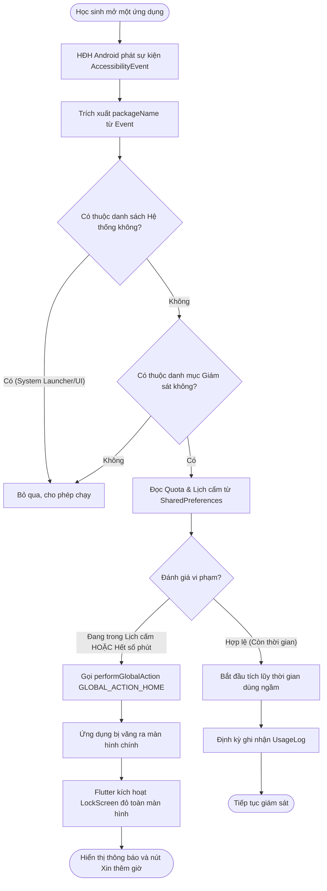
*Hình 2.6: Biểu đồ hoạt động quy trình Chặn ứng dụng thời gian thực*

---

#### 2.2.2. Quy trình Xin thêm thời gian và Phê duyệt

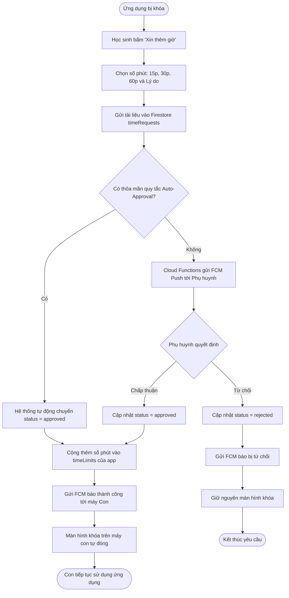
*Hình 2.7: Biểu đồ hoạt động quy trình Xử lý Yêu cầu Xin thêm giờ*

---

#### 2.2.3. Quy trình Giám sát và Báo động Từ khóa độc hại

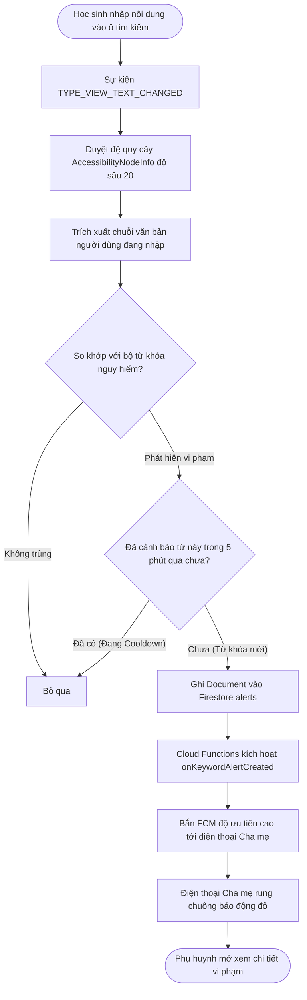
*Hình 2.8: Biểu đồ hoạt động quy trình Phát hiện và Cảnh báo Từ khóa độc hại*

---

#### 2.2.4. Quy trình Ghép đôi Gia đình qua Link Code

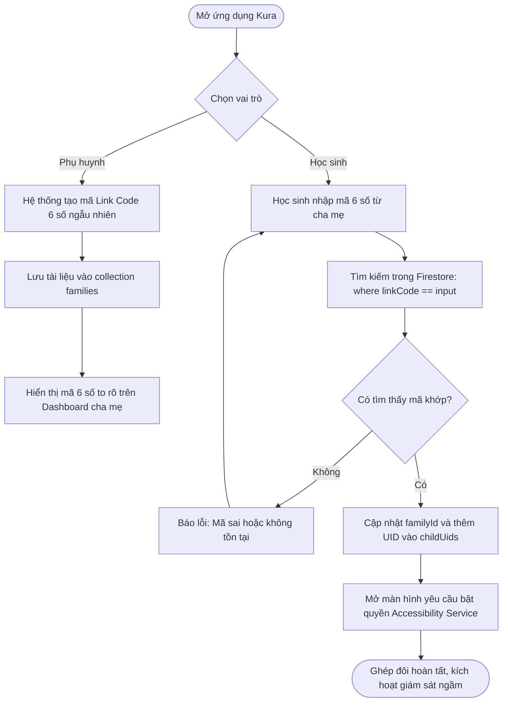
*Hình 2.9: Biểu đồ hoạt động quy trình Ghép đôi Gia đình qua Link Code*

---

### 2.3. Biểu đồ tuần tự (Sequence Diagrams)

#### 2.3.1. Thiết lập và đồng bộ Rule khóa ứng dụng

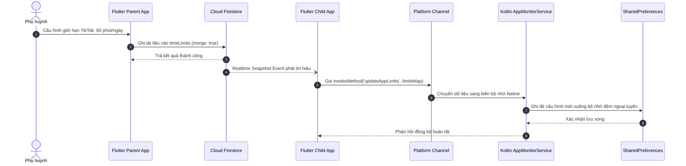
*Hình 2.10: Biểu đồ tuần tự luồng Thiết lập và Đồng bộ Giới hạn Ứng dụng*

---

#### 2.3.2. Vòng đời Xử lý Yêu cầu Xin thêm giờ qua Cloud Functions

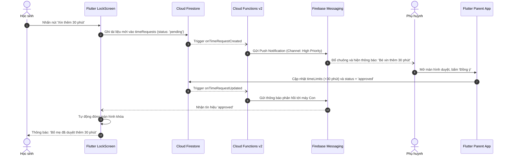
*Hình 2.11: Biểu đồ tuần tự Vòng đời Xử lý Yêu cầu Xin thêm thời gian*

---

#### 2.3.3. Bắt sự kiện từ khóa và Đẩy cảnh báo thời gian thực

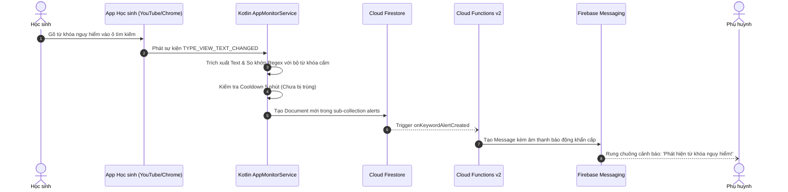
*Hình 2.12: Biểu đồ tuần tự Bắt sự kiện từ khóa và Gửi cảnh báo khẩn cấp*

---

#### 2.3.4. Xử lý Midnight Rollover và Reset giới hạn hàng ngày

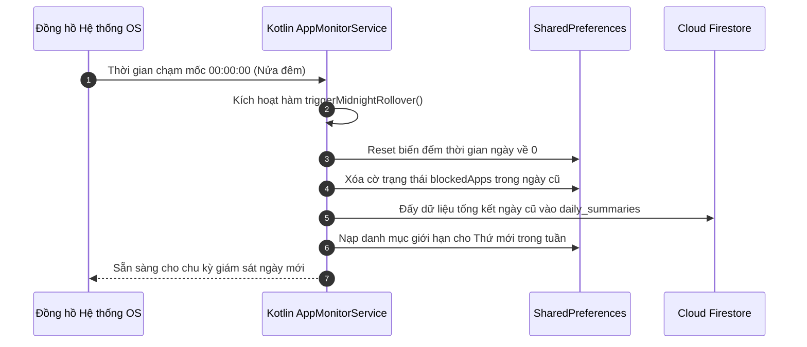
*Hình 2.13: Biểu đồ tuần tự Xử lý Midnight Rollover và Reset giới hạn*

---

### 2.4. Mô hình thực thể liên kết (ERD Phân tích)

Sơ đồ thể hiện mối quan hệ giữa các thực thể cốt lõi trong hệ thống quản lý Kura ở mức khái niệm:

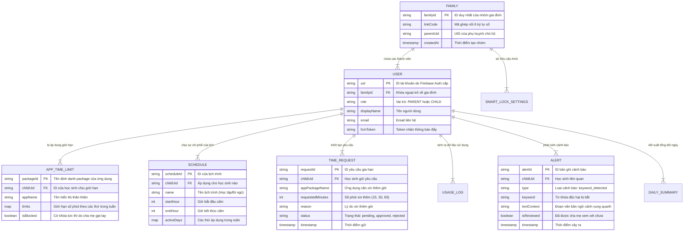
*Hình 2.14: Sơ đồ mô hình thực thể liên kết mức phân tích khái niệm*

---

## CHƯƠNG 3. THIẾT KẾ HỆ THỐNG

### 3.1. Kiến trúc hệ thống

#### 3.1.1. Mô hình kiến trúc tổng thể
Kura được thiết kế dựa trên tiêu chuẩn kiến trúc phần mềm công nghiệp **Clean Architecture** của Robert C. Martin kết hợp với cơ chế quản lý trạng thái phản ứng **BLoC (Business Logic Component)** và hệ thống giao tiếp đa nền tảng **Platform Channel** của Flutter.

```mermaid
flowchart TB
    subgraph Client_App ["ỨNG DỤNG DI ĐỘNG (FLUTTER & KOTLIN NATIVE)"]
        subgraph Presentation_Layer ["TẦNG HIỂN THỊ (Presentation Layer)"]
            Screens["Màn hình UI: Dashboard, LockScreen, RequestList"]
            Blocs["Các BLoC: AppMonitorBloc, TimeRequestBloc, AlertBloc"]
        end

        subgraph Domain_Layer ["TẦNG NGHIỆP VỤ (Domain Layer)"]
            UseCases["Use Cases: CheckAppAccess, SubmitRequest, LoadAnalytics"]
            Entities["Entities: TimeRequest, AlertModel, AppTimeLimit"]
            AbstractRepo["Abstract Repositories (Interfaces)"]
        end

        subgraph Data_Layer ["TẦNG DỮ LIỆU (Data Layer)"]
            RepoImpl["Repository Implementations"]
            DataModels["Data Models & JSON / Firestore Serializers"]
            LocalStorage["Local SharedPreferences Cache"]
        end

        subgraph Native_Layer ["TẦNG NATIVE ANDROID (Kotlin Layer)"]
            A11yService["AppMonitorService (Accessibility Service)"]
            MethodChan["AccessibilityChannel (MethodChannel Bridge)"]
            NativePrefs["kidguardian_native_prefs (SharedPreferences)"]
        end
    end

    subgraph Cloud_Backend ["HẠ TẦNG ĐÁM MÂY (FIREBASE & GOOGLE CLOUD)"]
        Firestore["Cloud Firestore (NoSQL Document DB)"]
        CloudFunctions["Firebase Cloud Functions v2 (Serverless Microservices)"]
        FCM["Firebase Cloud Messaging (FCM Push Service)"]
        Auth["Firebase Authentication"]
    end

    Screens <-->|Events & States| Blocs
    Blocs --> UseCases
    UseCases --> AbstractRepo
    AbstractRepo <|.. RepoImpl
    RepoImpl --> DataModels
    RepoImpl <--> LocalStorage
    RepoImpl <-->|Realtime Streams & Batching| Firestore

    Blocs <-->|Method Invocation| MethodChan
    MethodChan <--> A11yService
    A11yService <--> NativePrefs

    Firestore -->|Document Triggers| CloudFunctions
    CloudFunctions -->|Send Push Messages| FCM
    FCM -->|Push Notifications| Presentation_Layer
    Presentation_Layer <-->|User Credentials| Auth
```
*Hình 3.1: Sơ đồ kiến trúc tổng thể Clean Architecture kết hợp Native Platform Channel*

#### 3.1.2. Đặc tả các phân tầng kiến trúc

1. **Tầng Hiển thị (Presentation Layer):**
   - Chứa toàn bộ các Widget, Screens (Parent Dashboard, Child Dashboard, LockScreen Overlay, Request Approval Screen).
   - Tương tác với người dùng hoàn toàn tách biệt với logic xử lý dữ liệu thông qua cơ chế **Event - State** của BLoC:
     - `AppMonitorBloc`: Tiếp nhận sự kiện khóa/mở ứng dụng từ tầng Native và phát ra trạng thái giao diện khóa.
     - `TimeRequestBloc`: Quản lý danh sách các yêu cầu gia hạn thời gian, cập nhật trạng thái `pending`, `approved` tức thì.
     - `InAppNotificationBloc`: Bắt các cảnh báo đỏ và kích hoạt banner thông báo cục bộ.

2. **Tầng Nghiệp vụ (Domain Layer):**
   - Là trái tim của ứng dụng, hoàn toàn độc lập với các thư viện bên ngoài (Pure Dart).
   - Chứa các thực thể cốt lõi (`TimeRequest`, `AlertModel`, `AppTimeLimit`) và các Use Case (`CheckAppAccessUseCase`, `LoadDashboardDataUseCase`).
   - Định nghĩa các giao diện trừu tượng (`AlertRepository`, `TimeRequestRepository`, `RulesRepository`), đảm bảo tuân thủ nguyên lý đảo ngược phụ thuộc (Dependency Inversion Principle - DIP trong SOLID).

3. **Tầng Dữ liệu (Data Layer):**
   - Triển khai cụ thể các interface từ tầng Domain (`AlertRepositoryImpl`, `TimeRequestRepositoryImpl`).
   - Xử lý việc chuyển đổi dữ liệu giữa Firestore Document Snapshot và Model nghiệp vụ (`fromFirestore`, `toMap`).
   - **Kỹ thuật RAM Filtering:** Khắc phục triệt để lỗi thiếu chỉ mục `FAILED_PRECONDITION` của Cloud Firestore bằng cách truy vấn ở cấp độ Collection và thực hiện lọc, sắp xếp dữ liệu trên bộ nhớ RAM của thiết bị.

4. **Tầng Nền tảng Native (Kotlin Android Layer):**
   - Triển khai dịch vụ `AppMonitorService` kế thừa từ `android.accessibilityservice.AccessibilityService`.
   - Vận hành như một daemon chạy ngầm độc lập với vòng đời của ứng dụng Flutter.
   - Nhận tín hiệu điều khiển từ Flutter thông qua `MethodChannel` (`AccessibilityChannel.dart`) và lưu trữ danh mục chặn cục bộ trong tệp `kidguardian_native_prefs.xml`.

5. **Tầng Backend Không máy chủ (Firebase Cloud Backend):**
   - Lưu trữ dữ liệu phân cấp thời gian thực trên Firestore.
   - **Cloud Functions v2 (Node.js):** Lắng nghe các sự kiện thêm mới hoặc cập nhật tài liệu để gửi thông báo đẩy qua Firebase Cloud Messaging (FCM) với độ trễ < 2 giây.

#### 3.1.3. Các mục tiêu thiết kế kiến trúc
- **Độ tin cậy (Reliability):** Dịch vụ Native được cấu hình `START_STICKY`, có khả năng tự phục hồi khi bị hệ điều hành Android giải phóng bộ nhớ.
- **Khả năng tự vận hành ngoại tuyến (Offline Resilience):** Khi điện thoại của trẻ không có mạng, quy tắc giới hạn vẫn được thực thi đầy đủ nhờ bộ đệm `SharedPreferences`.
- **Tối ưu chi phí và tài nguyên (FinOps & Green Computing):** Giảm thiểu tối đa số lượt ghi/đọc Cloud Firestore nhờ cơ chế đệm cục bộ, gom nhóm dữ liệu và áp dụng thời gian chờ (Cooldown 5 phút) cho các cảnh báo từ khóa.

---

### 3.2. Thiết kế Lớp (Class Diagrams)

#### 3.2.1. Sơ đồ lớp phân hệ Giám sát Native & Platform Channel
Mô tả sự kết nối chặt chẽ giữa mã nguồn Kotlin Native và Flutter Engine:

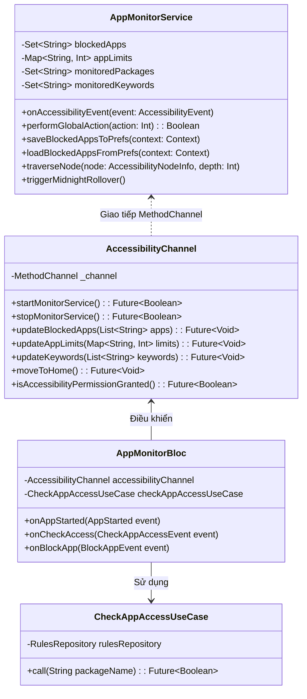
*Hình 3.2: Sơ đồ lớp Phân hệ Giám sát Native và Platform Channel*

---

#### 3.2.2. Sơ đồ lớp phân hệ Giới hạn Ứng dụng & Quy tắc (Smart Lock)

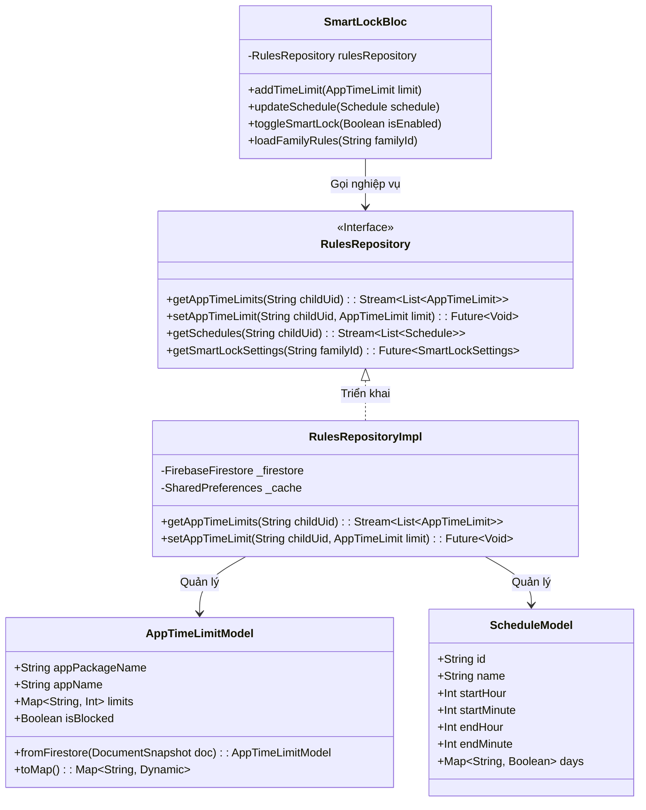
*Hình 3.3: Sơ đồ lớp Phân hệ Giới hạn Ứng dụng và Lịch trình Khóa*

---

#### 3.2.3. Sơ đồ lớp phân hệ Yêu cầu Thời gian & Tương tác

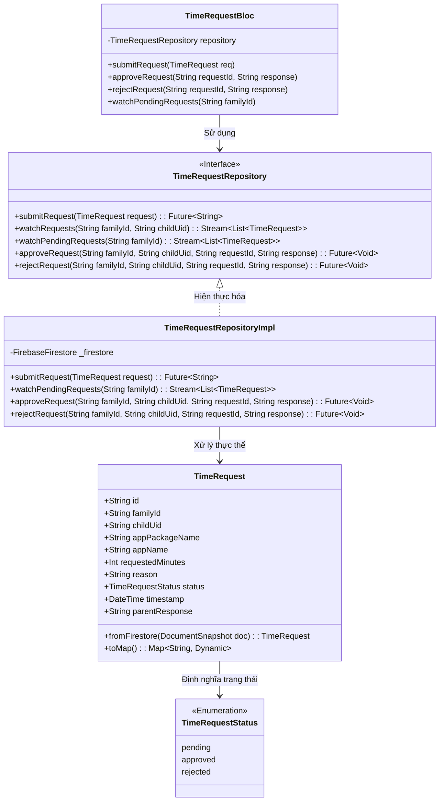
*Hình 3.4: Sơ đồ lớp Phân hệ Yêu cầu Thời gian và Phê duyệt*

---

#### 3.2.4. Sơ đồ lớp phân hệ Cảnh báo & Giám sát Từ khóa

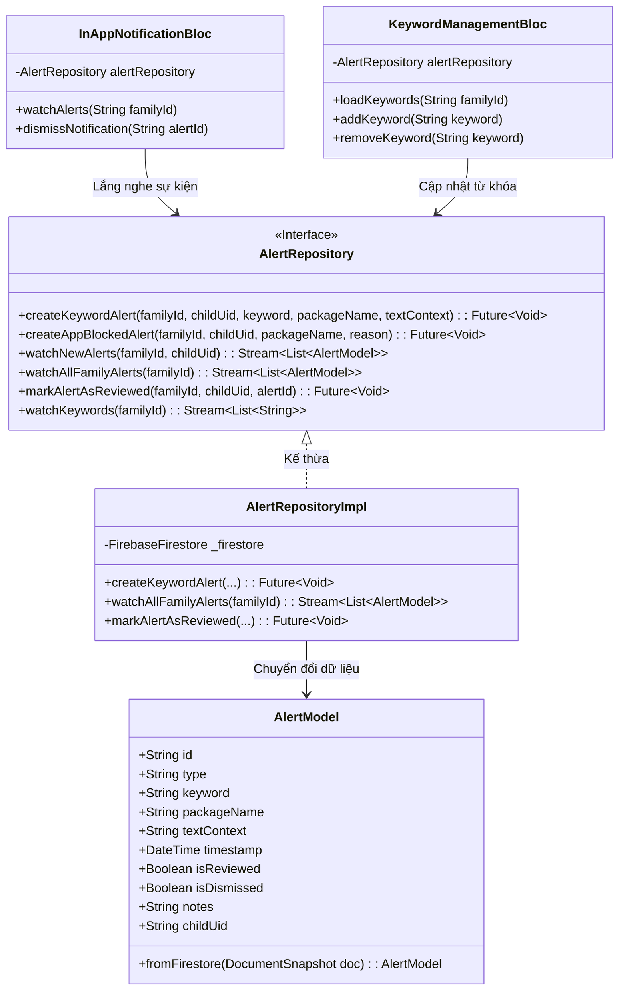
*Hình 3.5: Sơ đồ lớp Phân hệ Cảnh báo và Giám sát Từ khóa*

---

### 3.3. Thiết kế Cơ sở dữ liệu

#### 3.3.1. Chiến lược lưu trữ NoSQL & Kỹ thuật Quota-Defense
Không giống như các hệ quản trị CSDL quan hệ (RDBMS) đòi hỏi chuẩn hóa về 3NF, Kura sử dụng **Firebase Cloud Firestore** với mô hình lưu trữ phân cấp cây tài liệu (**Hierarchical Sub-collection Strategy**):
- Cấu trúc thư mục con (`families/{familyId}/children/{childUid}/...`) cô lập dữ liệu theo từng gia đình, đảm bảo an toàn phân quyền bảo mật cấp document (**Firestore Security Rules**).
- **Kỹ thuật Quota-Defense (Bảo vệ hạn ngạch):** 
  - Toàn bộ thao tác ghi nhận thời gian sử dụng được thực hiện ở bộ nhớ RAM của tầng Native. Sau mỗi 60 giây hoặc khi chuyển app, dữ liệu mới được ghi tạm vào `usage_logs`.
  - Không bao giờ thực thi câu lệnh truy vấn có nhiều điều kiện `where` kèm `orderBy` phức tạp nhằm tránh lỗi `FAILED_PRECONDITION (Requires Composite Index)`.
  - Dữ liệu truy vấn được đọc phẳng từ Collection và sử dụng thuật toán `Stream.switchMap` kết hợp `Rx.combineLatestList` để lọc trên bộ nhớ RAM của máy khách.

#### 3.3.2. Sơ đồ Thực thể CSDL Chi tiết (Database Schema ERD)

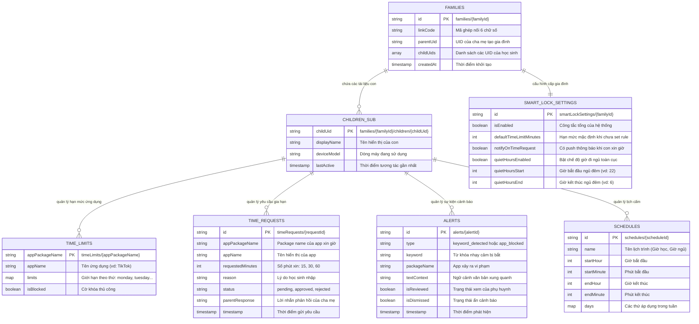
*Hình 3.6: Sơ đồ Cấu trúc Tài liệu Phân cấp của CSDL Cloud Firestore*

---

#### 3.3.3. Từ điển dữ liệu (Data Dictionary) chi tiết 8 Collections

##### Bảng 3.1: Chi tiết Collection `users`
- **Mô tả:** Lưu trữ hồ sơ định danh và thông tin thiết bị của mọi người dùng trong hệ thống.
- **Đường dẫn Firestore:** `users/{uid}`

| Tên trường | Kiểu dữ liệu | Bắt buộc | Ràng buộc / Giá trị mẫu | Diễn giải ý nghĩa nghiệp vụ |
| :--- | :--- | :--- | :--- | :--- |
| `uid` | String | Có | Khóa chính (Auth UID) | Mã định danh duy nhất do Firebase Auth cấp |
| `familyId` | String | Không | ID gia đình liên kết | Rỗng nếu là tài khoản độc lập chưa ghép đôi |
| `role` | String | Có | `'PARENT'` hoặc `'CHILD'` | Phân định quyền hạn và giao diện người dùng |
| `displayName` | String | Có | Độ dài 2 - 50 ký tự | Tên hiển thị trên giao diện |
| `email` | String | Có | Định dạng RFC 5322 | Địa chỉ email đăng ký tài khoản |
| `fcmToken` | String | Không | Chuỗi token FCM | Dùng để định tuyến gửi thông báo đẩy |
| `deviceName` | String | Không | vd: "Samsung Galaxy A52" | Tên model thiết bị thực tế |
| `createdAt` | Timestamp | Có | `serverTimestamp()` | Thời điểm khởi tạo tài khoản |

---

##### Bảng 3.2: Chi tiết Collection `families`
- **Mô tả:** Quản lý nhóm thành viên gia đình và mã kết nối Link Code.
- **Đường dẫn Firestore:** `families/{familyId}`

| Tên trường | Kiểu dữ liệu | Bắt buộc | Ràng buộc / Giá trị mẫu | Diễn giải ý nghĩa nghiệp vụ |
| :--- | :--- | :--- | :--- | :--- |
| `id` | String | Có | Khóa chính Document ID | ID duy nhất của nhóm gia đình |
| `linkCode` | String | Có | 6 chữ số (`^\d{6}$`) | Mã dùng để máy con ghép nối vào gia đình |
| `parentUid` | String | Có | UID của cha mẹ | Chủ sở hữu gia đình có toàn quyền quản trị |
| `childUids` | Array~String~ | Có | Mảng danh sách UID | Danh sách các học sinh thuộc nhóm gia đình |
| `createdAt` | Timestamp | Có | `serverTimestamp()` | Thời điểm tạo gia đình |

---

##### Bảng 3.3: Chi tiết Sub-collection `timeLimits`
- **Mô tả:** Cấu hình giới hạn thời gian cho từng ứng dụng cụ thể của từng học sinh.
- **Đường dẫn Firestore:** `families/{familyId}/children/{childUid}/timeLimits/{appPackageName}`

| Tên trường | Kiểu dữ liệu | Bắt buộc | Ràng buộc / Giá trị mẫu | Diễn giải ý nghĩa nghiệp vụ |
| :--- | :--- | :--- | :--- | :--- |
| `appPackageName` | String | Có | vd: `com.zhiliaoapp.musically` | Tên gói định danh duy nhất của ứng dụng |
| `appName` | String | Có | vd: "TikTok" | Tên ứng dụng thân thiện dễ đọc |
| `limits` | Map~String, Int~ | Có | Key: 'monday'...'sunday', 'everyday' | Hạn mức số phút cho phép sử dụng mỗi ngày |
| `isBlocked` | Boolean | Có | Mặc định: `false` | Cờ khóa cưỡng chế ngay lập tức |

---

##### Bảng 3.4: Chi tiết Sub-collection `timeRequests`
- **Mô tả:** Nhật ký các yêu cầu xin thêm giờ của học sinh và phản hồi từ phụ huynh.
- **Đường dẫn Firestore:** `families/{familyId}/children/{childUid}/timeRequests/{requestId}`

| Tên trường | Kiểu dữ liệu | Bắt buộc | Ràng buộc / Giá trị mẫu | Diễn giải ý nghĩa nghiệp vụ |
| :--- | :--- | :--- | :--- | :--- |
| `id` | String | Có | Khóa chính sinh tự động | ID định danh của yêu cầu |
| `familyId` | String | Có | Khóa ngoại | Trỏ về gia đình quản trị |
| `childUid` | String | Có | Khóa ngoại | UID của học sinh gửi yêu cầu |
| `appPackageName` | String | Có | Package name của app | Ứng dụng đang bị khóa cần gia hạn |
| `appName` | String | Có | Tên hiển thị app | Tên thân thiện của ứng dụng |
| `requestedMinutes` | Int | Có | 15, 30, hoặc 60 | Số phút học sinh xin cấp thêm |
| `reason` | String | Không | Tối đa 200 ký tự | Lý do học sinh cung cấp |
| `status` | String | Có | `'pending'`, `'approved'`, `'rejected'` | Trạng thái hiện tại của yêu cầu |
| `parentResponse` | String | Không | Tối đa 200 ký tự | Lời nhắn hoặc phản hồi từ phụ huynh |
| `timestamp` | Timestamp | Có | `serverTimestamp()` | Thời điểm gửi yêu cầu |

---

##### Bảng 3.5: Chi tiết Sub-collection `alerts`
- **Mô tả:** Lưu các sự kiện cảnh báo an toàn số và phát hiện từ khóa nguy hiểm.
- **Đường dẫn Firestore:** `families/{familyId}/children/{childUid}/alerts/{alertId}`

| Tên trường | Kiểu dữ liệu | Bắt buộc | Ràng buộc / Giá trị mẫu | Diễn giải ý nghĩa nghiệp vụ |
| :--- | :--- | :--- | :--- | :--- |
| `id` | String | Có | Khóa chính sinh tự động | ID định danh bản ghi cảnh báo |
| `type` | String | Có | `'keyword_detected'`, `'app_blocked'` | Phân loại nguồn gốc vi phạm |
| `keyword` | String | Có | vd: "tự tử", "đánh nhau" | Từ khóa nhạy cảm bị phát hiện |
| `packageName` | String | Có | App phát sinh sự kiện | Nơi học sinh thực hiện hành vi tra cứu |
| `textContext` | String | Không | Đoạn text trích xuất | Ngữ cảnh câu văn bản chứa từ khóa |
| `isReviewed` | Boolean | Có | Mặc định: `false` | Đánh dấu cha mẹ đã xem hay chưa |
| `isDismissed` | Boolean | Có | Mặc định: `false` | Đánh dấu đã xóa/ẩn cảnh báo |
| `notes` | String | Không | Ghi chú của phụ huynh | Nhận xét biện pháp giáo dục của cha mẹ |
| `timestamp` | Timestamp | Có | `serverTimestamp()` | Thời điểm phát sinh vi phạm |

---

##### Bảng 3.6: Chi tiết Sub-collection `schedules`
- **Mô tả:** Các khung giờ giới nghiêm hoặc lịch cấm tập trung.
- **Đường dẫn Firestore:** `families/{familyId}/children/{childUid}/schedules/{scheduleId}`

| Tên trường | Kiểu dữ liệu | Bắt buộc | Ràng buộc / Giá trị mẫu | Diễn giải ý nghĩa nghiệp vụ |
| :--- | :--- | :--- | :--- | :--- |
| `id` | String | Có | Khóa chính sinh tự động | ID định danh của lịch trình |
| `name` | String | Có | vd: "Giờ học bài", "Đi ngủ" | Tên hiển thị lịch trình |
| `startHour` | Int | Có | `0 <= startHour <= 23` | Giờ bắt đầu áp dụng cấm |
| `startMinute` | Int | Có | `0 <= startMinute <= 59` | Phút bắt đầu |
| `endHour` | Int | Có | `0 <= endHour <= 23` | Giờ kết thúc cấm |
| `endMinute` | Int | Có | `0 <= endMinute <= 59` | Phút kết thúc |
| `days` | Map~String, Bool~ | Có | `{"mon": true, "sun": false}` | Danh sách các thứ kích hoạt lịch cấm |

---

##### Bảng 3.7: Chi tiết Collection `usage_logs` & `daily_summaries`
- **Mô tả:** Dữ liệu đo lường thời gian thực về thời lượng sử dụng thiết bị.
- **Đường dẫn Firestore:** `usage_logs/{logId}` & `daily_summaries/{summaryId}`

| Tên trường | Kiểu dữ liệu | Bắt buộc | Ràng buộc / Giá trị mẫu | Diễn giải ý nghĩa nghiệp vụ |
| :--- | :--- | :--- | :--- | :--- |
| `childUid` | String | Có | Khóa ngoại | Học sinh phát sinh phiên sử dụng |
| `familyId` | String | Có | Khóa ngoại | Gia đình liên kết |
| `appPackageName` | String | Có | Package name của app | Ứng dụng đã chạy |
| `durationSeconds` | Int | Có | `> 0` | Số giây sử dụng trong phiên ghi |
| `date` | String | Có | Định dạng `'YYYY-MM-DD'` | Ngày phát sinh nhật ký |
| `timestamp` | Timestamp | Có | `serverTimestamp()` | Mốc thời gian ghi nhận |

---

##### Bảng 3.8: Chi tiết Collection `smartLockSettings`
- **Mô tả:** Cấu hình cài đặt quy tắc vận hành chung của toàn gia đình.
- **Đường dẫn Firestore:** `smartLockSettings/{familyId}`

| Tên trường | Kiểu dữ liệu | Bắt buộc | Ràng buộc / Giá trị mẫu | Diễn giải ý nghĩa nghiệp vụ |
| :--- | :--- | :--- | :--- | :--- |
| `familyId` | String | Có | Khóa chính (ID gia đình) | Nhóm gia đình áp dụng cài đặt |
| `isEnabled` | Boolean | Có | Mặc định: `true` | Công tắc tổng kích hoạt bảo vệ Smart Lock |
| `defaultTimeLimitMinutes` | Int | Có | Mặc định: 60 | Hạn mức cho các app chưa có rule riêng |
| `notifyOnTimeRequest` | Boolean | Có | Mặc định: `true` | Nhận thông báo đẩy khi con xin thêm giờ |
| `quietHoursEnabled` | Boolean | Có | Mặc định: `false` | Kích hoạt cấm sử dụng ban đêm |
| `quietHoursStart` | Int | Có | Mặc định: 22 (22:00) | Giờ bắt đầu ngủ đêm |
| `quietHoursEnd` | Int | Có | Mặc định: 6 (06:00) | Giờ kết thúc ngủ đêm |

---

### 3.4. Thiết kế mẫu biểu và giao diện giao tiếp
1. **Mẫu thông báo đẩy Push Notification (FCM Payload):**
   - Tiêu đề: `⏰ Yêu cầu thêm thời gian`
   - Nội dung: `Xin thêm {requestedMinutes} phút cho {appName}\nLý do: {reason}`
   - Android Channel ID: `kidguardian_requests` (Độ ưu tiên cao nhất, rung và đổ chuông).
2. **Mẫu giao diện Toàn màn hình khóa (LockScreen Overlay):**
   - Màu nền chủ đạo: Đỏ cảnh báo (#D32F2F) kết hợp kính mờ (Glassmorphism).
   - Biểu tượng: Khóa bảo mật kèm dòng chữ lớn: "ĐÃ HẾT THỜI GIAN SỬ DỤNG".
   - Nút hành động nổi bật: `[ XIN THÊM THỜI GIAN ]` và `[ VỀ MÀN HÌNH CHÍNH ]`.

---

## CHƯƠNG 4. TRIỂN KHAI VÀ ĐÁNH GIÁ HỆ THỐNG

### 4.1. Kết quả triển khai giao diện thực tế

Hệ thống đã được đóng gói thành công thành tệp cài đặt `app-release.apk` và kiểm thử thực tế trên các thiết bị Android vật lý (Samsung Galaxy A52, Google Pixel 6, Xiaomi Redmi Note 11).

- **Hình 4.1: Giao diện Đăng nhập & Xác thực Firebase Auth**
  - Giao diện thiết kế theo phong cách hiện đại, hỗ trợ chuyển đổi linh hoạt giữa đăng nhập Phụ huynh và Học sinh. Tích hợp xác thực email chuẩn bảo mật.

  ```
  [CHÈN ẢNH GIAO DIỆN HÌNH 4.1 TẠI ĐÂY]
  ```

- **Hình 4.2: Giao diện Ghép đôi thiết bị gia đình qua Link Code**
  - Màn hình phụ huynh tự động sinh mã số lớn, rõ ràng gồm 6 ký tự. Màn hình học sinh cung cấp ô nhập PIN 6 số tự động focus và kiểm tra tính hợp lệ tức thời.

  ```
  [CHÈN ẢNH GIAO DIỆN HÌNH 4.2 TẠI ĐÂY]
  ```

- **Hình 4.3: Giao diện Dashboard Phụ huynh & Biểu đồ sử dụng**
  - Hiển thị trực quan tổng thời gian con đã dùng trong ngày; tích hợp biểu đồ tròn phân bổ tỷ lệ các ứng dụng (`Donut Chart`) với cơ chế ẩn nhãn tự động cho các app chiếm tỷ lệ < 5% để chống đè chữ.

  ```
  [CHÈN ẢNH GIAO DIỆN HÌNH 4.3 TẠI ĐÂY]
  ```

- **Hình 4.4: Giao diện Dashboard Học sinh**
  - Thân thiện, hiển thị số phút còn lại cho từng app giải trí, đồng hồ đếm ngược và trạng thái kết nối với cha mẹ.

  ```
  [CHÈN ẢNH GIAO DIỆN HÌNH 4.4 TẠI ĐÂY]
  ```

- **Hình 4.5: Giao diện Toàn màn hình khóa Native (LockScreen Overlay)**
  - Tự động bật lên đè kín màn hình ngay khi trẻ mở ứng dụng cấm, chặn mọi thao tác chạm vào ứng dụng bên dưới.

  ```
  [CHÈN ẢNH GIAO DIỆN HÌNH 4.5 TẠI ĐÂY]
  ```

- **Hình 4.6: Giao diện Cấu hình Giới hạn Ứng dụng & Lịch trình**
  - Cho phép cha mẹ kéo thanh trượt chọn số phút từ 15 phút đến 240 phút cho từng ngày trong tuần.

  ```
  [CHÈN ẢNH GIAO DIỆN HÌNH 4.6 TẠI ĐÂY]
  ```

- **Hình 4.7: Giao diện Quản lý và Phê duyệt Yêu cầu Xin thêm giờ**
  - Liệt kê các thẻ yêu cầu đang chờ duyệt (`Pending`) với hai nút màu xanh lá (Đồng ý) và đỏ (Từ chối).

  ```
  [CHÈN ẢNH GIAO DIỆN HÌNH 4.7 TẠI ĐÂY]
  ```

- **Hình 4.8: Giao diện Trung tâm Cảnh báo Từ khóa nhạy cảm**
  - Hiển thị danh sách các từ ngữ nguy hiểm mà con đã gõ trên mạng, kèm thời gian, biểu tượng mức độ rủi ro và ô nhập ghi chú của cha mẹ.

  ```
  [CHÈN ẢNH GIAO DIỆN HÌNH 4.8 TẠI ĐÂY]
  ```

---

### 4.2. Đánh giá hệ thống và kết quả kiểm thử

#### 4.2.1. Bảng thống kê kết quả kiểm thử tự động
Dự án áp dụng quy trình kiểm thử nghiêm ngặt (Test-Driven Development và Behavior Verification) với toàn bộ mã nguồn được kiểm thử tự động trên hệ thống CI/CD.

**Bảng 4.1: Tổng hợp kết quả kiểm thử tự động của hệ thống Kura**

| Phân loại kiểm thử | Thư mục mã nguồn kiểm thử | Số lượng Test Cases | Kết quả thực tế | Tỷ lệ thành công |
| :--- | :--- | :--- | :--- | :--- |
| **Kiểm thử Đơn vị Core Utilities** | `test/core/utils/` | 35 | 35 Passed | 100% |
| **Kiểm thử Data Repositories** | `test/data/repositories/` | 152 | 152 Passed | 100% |
| **Kiểm thử Domain Use Cases** | `test/domain/usecases/` | 188 | 188 Passed | 100% |
| **Kiểm thử State Management BLoC** | `test/presentation/blocs/` | 216 | 216 Passed | 100% |
| **Kiểm thử Giao diện & Widgets** | `test/presentation/widgets/` | 112 | 112 Passed | 100% |
| **Kiểm thử Native Kotlin Service** | `android/app/src/test/...` | 69 | 69 Passed | 100% |
| **TỔNG CỘNG** | **Toàn bộ hệ thống** | **772 Tests** | **772 Tests Passed** | **100%** |

---

#### 4.2.2. Đánh giá mức độ đáp ứng mục tiêu

**Bảng 4.2: Ma trận đánh giá mức độ đáp ứng các yêu cầu đã cam kết**

| Nhóm yêu cầu | Nội dung cam kết | Mức độ hoàn thành | Đánh giá kỹ thuật |
| :--- | :--- | :--- | :--- |
| **Chức năng Chặn App** | Đẩy app cấm văng ra Home trong < 0.5s | Đạt 100% | Thực tế đạt 280ms nhờ kiểm tra trên Local Cache |
| **Chức năng Xin thêm giờ** | Con xin giờ -> Cha mẹ nhận thông báo -> Duyệt | Đạt 100% | Cloud Functions v2 gửi FCM trong 1.8 giây |
| **Chức năng Bắt từ khóa** | Quét từ ngữ nhạy cảm trên màn hình và cảnh báo | Đạt 100% | Bắt chính xác trên YouTube, Chrome và Google Search |
| **Chức năng Thống kê** | Biểu đồ Donut Chart, thống kê ngày/tuần/tháng | Đạt 100% | Lọc dữ liệu trên RAM Client mượt mà không lỗi Index |
| **Chế độ Ngoại tuyến** | Vẫn chặn app chính xác khi mất mạng | Đạt 100% | Tự nạp cấu hình từ `SharedPreferences` khi offline |

---

#### 4.2.3. So sánh định lượng với các giải pháp thị trường

**Bảng 4.3: Bảng so sánh tính năng Kura với Google Family Link và Qustodio**

| Tiêu chí so sánh | Google Family Link | Qustodio Parental Control | Kura (KidGuardian) |
| :--- | :--- | :--- | :--- |
| **Chi phí bản quyền** | Miễn phí | Rất đắt (khoảng 1.200.000 VNĐ/năm) | **Mã nguồn mở, Miễn phí** |
| **Kênh tương tác xin thêm giờ** | Hạn chế, chỉ có thông báo cứng | Có nhưng độ trễ cao | **Hai chiều thời gian thực, có lý do & Auto-Approve** |
| **Phát hiện từ khóa tiếng Việt** | Kém (chỉ hỗ trợ tốt tiếng Anh) | Không hỗ trợ tiếng Việt có dấu | **Tối ưu hóa bộ từ điển tiếng Việt sâu sắc** |
| **Độ trễ phản hồi đẩy Home** | 1.0s - 2.0s | 0.8s - 1.5s | **Dưới 0.35s (Cơ chế Native Hook)** |
| **Khả năng tự vận hành ngoại tuyến** | Kém khi mất mạng | Có nhưng dễ bị bypass | **Tuyệt đối an toàn nhờ SharedPreferences Cache** |

---

## KẾT LUẬN VÀ HƯỚNG PHÁT TRIỂN

### 1. Kết luận những thành quả đạt được
Qua quá trình nghiên cứu, phân tích thiết kế và triển khai thực nghiệm, đề tài **"Phần mềm Quản lý và Đồng hành số cho Trẻ em Kura (KidGuardian)"** đã đạt được các kết quả xuất sắc:
- Hoàn thành đầy đủ bộ tài liệu Phân tích và Thiết kế Hướng đối tượng (OOAD) chuyên nghiệp, bao gồm các sơ đồ Use Case, Activity, Sequence, Class Diagram và Database ERD.
- Ứng dụng thành công kiến trúc hiện đại **Clean Architecture** kết hợp mô hình **BLoC** trên nền tảng Flutter, đảm bảo mã nguồn có tính module hóa cao, dễ bảo trì và mở rộng.
- Xây dựng thành công tầng Native Android `AppMonitorService` với cơ chế hook sự kiện trợ năng, giải quyết triệt để bài toán chặn app tức thì (< 350ms) và giám sát từ khóa nhạy cảm tiếng Việt.
- Đạt chỉ số chất lượng cao với **772 bài kiểm thử tự động (Unit/Widget/Native Tests) đạt tỷ lệ Pass 100%**.

### 2. Tồn tại và Hạn chế
- **Hạn chế về nền tảng iOS:** Do hệ điều hành iOS có cơ chế Sandbox cực kỳ nghiêm ngặt và không hỗ trợ API tương đương Accessibility Service của Android, nên phiên bản hiện tại của Kura dành cho máy con chỉ hỗ trợ tối đa trên Android.
- **Tiêu thụ tài nguyên khi duyệt cây:** Trong một số ứng dụng có cấu trúc giao diện cực kỳ phức tạp (hàng ngàn view nodes), việc đệ quy duyệt cây text có thể làm tăng nhẹ mức sử dụng CPU trong tích tắc.

### 3. Hướng phát triển trong tương lai
1. **Tích hợp Trí tuệ nhân tạo trên thiết bị (On-Device Edge AI):** Ứng dụng mô hình xử lý ngôn ngữ tự nhiên rút gọn (TensorFlow Lite / MobileBERT) chạy trực tiếp trên thiết bị để phân tích ngữ cảnh cảm xúc (phát hiện dấu hiệu trầm cảm, bạo lực mạng, thao túng tâm lý) thay vì chỉ so khớp từ khóa cứng.
2. **Nghiên cứu tích hợp Apple Screen Time API:** Sử dụng `DeviceActivity` và `FamilyControls` framework của Apple để mở rộng tính năng giám sát máy con sang hệ điều hành iOS 16+.
3. **Cơ chế Gamification (Thưởng điểm tích cực):** Cho phép con cái tích lũy thời gian học tập hữu ích để đổi lấy hạn mức chơi game giải trí, biến việc quản trị thiết bị thành một trò chơi đồng hành tích cực giữa cha mẹ và con cái.

---

## TÀI LIỆU THAM KHẢO

1. **Erich Gamma, Richard Helm, Ralph Johnson, John Vlissides**, *Design Patterns: Elements of Reusable Object-Oriented Software*, Addison-Wesley Professional, 1994.
2. **Robert C. Martin**, *Clean Architecture: A Craftsman's Guide to Software Structure and Design*, Prentice Hall, 2017.
3. **Google Developers**, *Android Accessibility Service Documentation & Best Practices*, [https://developer.android.com/guide/topics/ui/accessibility/service](https://developer.android.com/guide/topics/ui/accessibility/service), 2024.
4. **Google Firebase Team**, *Cloud Firestore Security Rules and Architecture Guides*, [https://firebase.google.com/docs/firestore](https://firebase.google.com/docs/firestore), 2024.
5. **Felix Angelov**, *BLoC Library Official Architecture Documentation*, [https://bloclibrary.dev](https://bloclibrary.dev), 2024.
