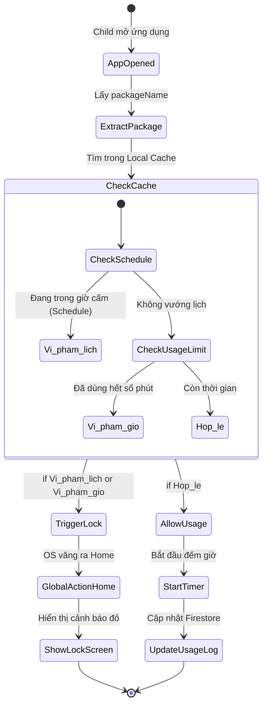
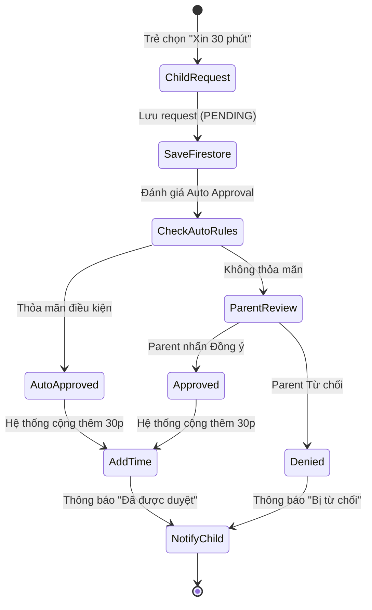
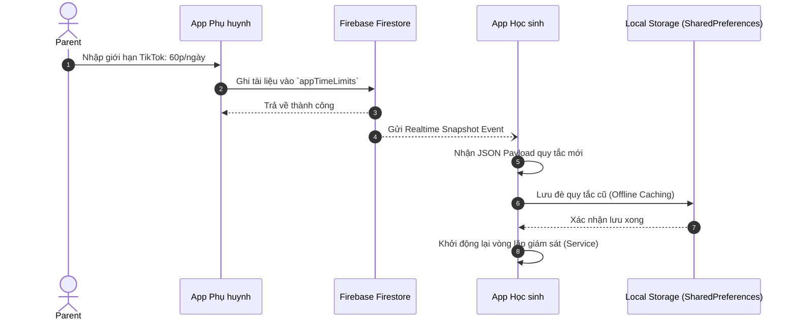
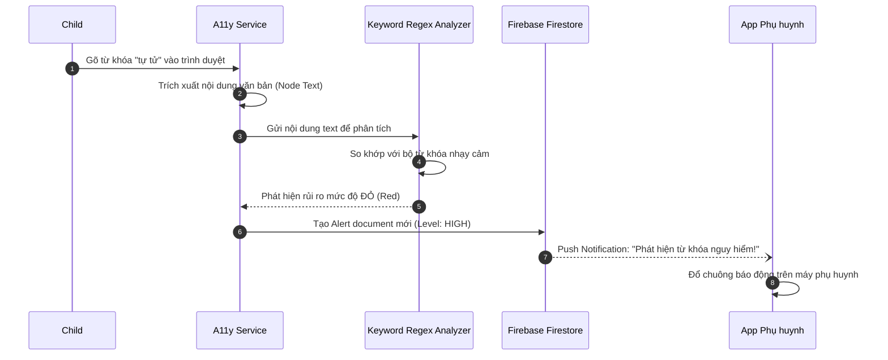
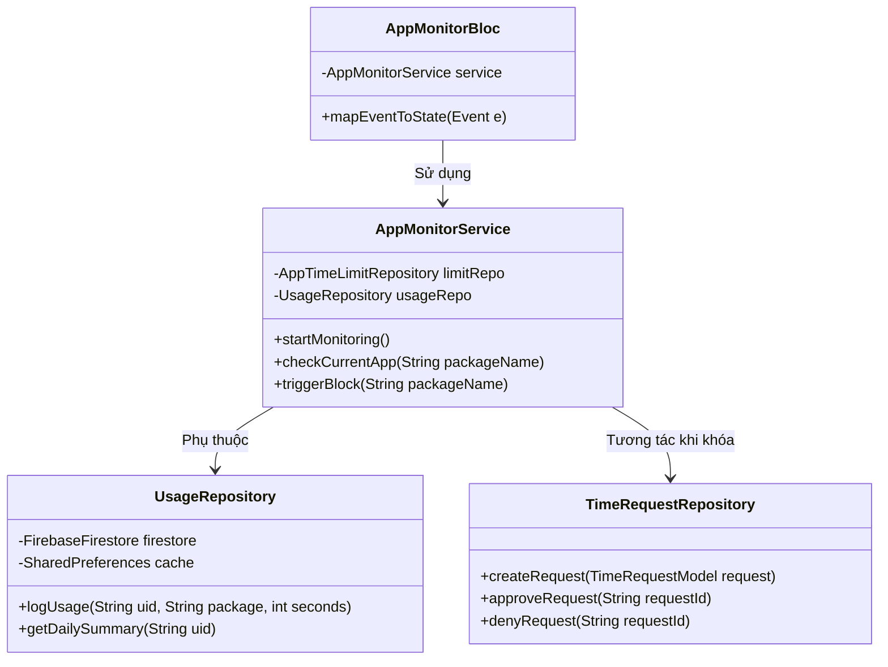
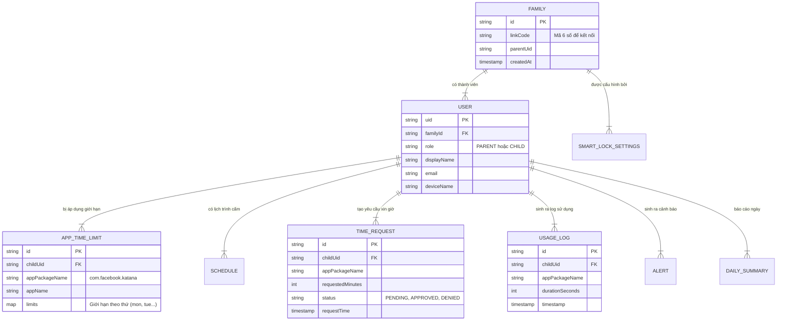

# BÁO CÁO BÀI TẬP LỚN: PHÂN TÍCH & THIẾT KẾ HƯỚNG ĐỐI TƯỢNG
**ĐỀ TÀI: PHẦN MỀM QUẢN LÝ VÀ ĐỒNG HÀNH SỐ KURA (KIDGUARDIAN)**

---

## LỜI MỞ ĐẦU
Trong kỷ nguyên số, việc trẻ em tiếp xúc sớm với các thiết bị thông minh mang lại nhiều lợi ích nhưng cũng đi kèm với không ít rủi ro về nghiện mạng xã hội và tiếp cận nội dung độc hại. Ứng dụng Kura (KidGuardian) ra đời với mục tiêu cung cấp một giải pháp toàn diện giúp phụ huynh bảo vệ và đồng hành cùng con cái. Kura không chỉ đơn thuần là một công cụ khóa ứng dụng (App Blocker) mà còn là một nền tảng tương tác hai chiều, cho phép thiết lập các quy tắc sử dụng (Smart Lock), phân tích dữ liệu (Analytics) và cảnh báo từ khóa nhạy cảm.

Tài liệu này trình bày toàn bộ quy trình Phân tích và Thiết kế Hướng đối tượng (OOAD) cho hệ thống Kura, từ bước khảo sát thu thập yêu cầu, phân tích hệ thống (Use Case, Activity, Sequence) cho đến thiết kế hệ thống (Kiến trúc, Class Diagram, ERD) và chuẩn hóa cơ sở dữ liệu.

---

## CHƯƠNG 1. THU THẬP YÊU CẦU

### 1.1. Các kỹ thuật được sử dụng
Hệ thống sử dụng kỹ thuật phỏng vấn và khảo sát trực tuyến đối với các phụ huynh và học sinh THPT để thu thập yêu cầu. Dưới đây là bảng tổng hợp kết quả phỏng vấn:

| STT | Câu hỏi | Phân tích Yêu cầu |
|:---|:---|:---|
| 1 | Hệ thống hướng tới đối tượng người dùng nào? | Phụ huynh (Parent) đóng vai trò quản lý, thiết lập quy tắc; Học sinh (Child) là đối tượng sử dụng và chịu sự giám sát. Cả hai dùng chung 1 app nhưng giao diện khác biệt. |
| 2 | Chức năng giám sát ứng dụng hoạt động ra sao? | Hệ thống cần nhận diện khi trẻ mở các ứng dụng mạng xã hội (Facebook, TikTok...). Nếu vượt quá thời gian cho phép, hệ thống phải tự động đẩy trẻ ra màn hình Home ngay lập tức. |
| 3 | Khi trẻ cần thêm thời gian để học tập, hệ thống xử lý thế nào? | Trẻ có thể bấm nút "Xin thêm giờ" (15p, 30p) gửi thẳng đến điện thoại phụ huynh. Phụ huynh duyệt hoặc từ chối. |
| 4 | Làm sao để biết trẻ đang tìm kiếm nội dung xấu? | Ứng dụng phải ngầm quét văn bản trên màn hình (đặc biệt ở thanh tìm kiếm) để phát hiện từ khóa như bạo lực, 18+, cờ bạc và gửi cảnh báo ngay cho cha mẹ. |
| 5 | Phụ huynh có thể xem báo cáo sử dụng không? | Cần có Dashboard hiển thị biểu đồ thống kê thời gian dùng theo ngày, tuần, tháng. |

### 1.2. Phân loại yêu cầu

#### 1.2.1. Yêu cầu về phần mềm (Software)
- **Nền tảng ứng dụng:** Ứng dụng di động đa nền tảng, phát triển bằng framework **Flutter** (ngôn ngữ Dart).
- **Hệ điều hành đích:** Android (API 26 trở lên). Các tính năng cốt lõi phụ thuộc vào `AccessibilityService` của Android.
- **Hệ quản trị CSDL:** **Firebase Cloud Firestore** (NoSQL Document Database).
- **Xác thực:** Firebase Authentication.

#### 1.2.2. Yêu cầu về phần cứng (Hardware)
- **Thiết bị Parent:** Điện thoại thông minh RAM >= 2GB, kết nối Internet ổn định.
- **Thiết bị Child:** Điện thoại Android có cấu hình tối thiểu RAM 3GB, pin hoạt động ổn định để duy trì Foreground Service chạy ngầm 24/7 mà không bị hệ điều hành đóng băng (kill process).

#### 1.2.3. Yêu cầu về người dùng
- **Học sinh (Child):** Cần giao diện trực quan, rõ ràng hiển thị số phút còn lại. Thao tác xin thêm giờ phải dễ dàng.
- **Phụ huynh (Parent):** Cần giao diện quản trị dạng Dashboard, biểu đồ trực quan, nhận thông báo đẩy (Push Notifications) theo thời gian thực (Real-time).

#### 1.2.4. Yêu cầu phi chức năng (Non-Functional Requirements)
- **Firebase Quota Protection (Tối ưu chi phí):** Vì sử dụng Firestore gói miễn phí, kiến trúc phải giới hạn số lượng `Reads/Writes` bằng cách sử dụng `.limit(50)` cho các câu truy vấn và sử dụng Client-side Sorting.
- **Khả năng hoạt động ngoại tuyến (Offline Resilience):** App trên máy Child phải lưu cache cục bộ các quy tắc giới hạn (Smart Lock Rules, Schedules) bằng `SharedPreferences`. Nếu mất mạng, app vẫn chặn ứng dụng chính xác.
- **Hiệu năng chặn ứng dụng:** Độ trễ từ lúc trẻ mở ứng dụng cấm đến lúc bị văng ra màn hình chính (GLOBAL_ACTION_HOME) phải `< 0.5 giây` để tránh vòng lặp mở app liên tục.

---

## CHƯƠNG 2. PHÂN TÍCH HỆ THỐNG

### 2.1. Biểu đồ Ca sử dụng (Use Case Diagrams)

#### 2.1.1. Biểu đồ tổng quát
```mermaid
usecaseDiagram
    actor Parent
    actor Child
    
    package Kura_System {
        usecase "Quản lý Smart Lock & Lịch trình" as UC1
        usecase "Quản lý Yêu cầu Thời gian (Time Request)" as UC2
        usecase "Giám sát Từ khóa (Keyword Monitor)" as UC3
        usecase "Xem Báo cáo Thống kê" as UC4
        usecase "Liên kết Thiết bị (Link Code)" as UC5
        
        usecase "Xin thêm thời gian" as UC6
        usecase "Tra cứu thời gian sử dụng" as UC7
    }
    
    Parent --> UC1
    Parent --> UC2
    Parent --> UC3
    Parent --> UC4
    Parent --> UC5
    
    Child --> UC6
    Child --> UC7
    Child --> UC5
```

#### 2.1.2. Biểu đồ phân rã: Quản lý Smart Lock
```mermaid
usecaseDiagram
    actor Parent
    
    package Smart_Lock_Management {
        usecase "Bật/Tắt Smart Lock toàn cục" as SL1
        usecase "Cấu hình Giới hạn Ứng dụng (App Limits)" as SL2
        usecase "Tạo/Sửa Lịch trình Khóa (Schedules)" as SL3
        usecase "Thiết lập Giờ giới nghiêm (Quiet Hours)" as SL4
        usecase "Cấp quyền Mở khóa Khẩn cấp" as SL5
        usecase "Quản lý Danh sách App giám sát" as SL6
    }
    
    Parent --> SL1
    Parent --> SL2
    Parent --> SL3
    Parent --> SL4
    Parent --> SL5
    Parent --> SL6
```

### 2.1.3. Đặc tả các Use Case cốt lõi

**UC-01: Đặc tả Use Case "Cấu hình Giới hạn Ứng dụng" (App Limits)**
- **Tác nhân:** Phụ huynh (Parent)
- **Tiền điều kiện:** Phụ huynh đã đăng nhập và liên kết thành công với máy Child.
- **Mô tả:** Cho phép phụ huynh đặt giới hạn thời gian sử dụng (số phút) cho một ứng dụng cụ thể (VD: TikTok - 60 phút/ngày).
- **Luồng sự kiện chính:**
  1. Phụ huynh chọn mục "Smart Lock" trên Dashboard.
  2. Chọn "Giới hạn Ứng dụng" và nhấn "Thêm quy tắc".
  3. Hệ thống hiển thị danh sách các ứng dụng đã cài đặt trên máy Child.
  4. Phụ huynh chọn một ứng dụng (vd: TikTok).
  5. Phụ huynh nhập số phút cho từng ngày trong tuần (T2-CN).
  6. Phụ huynh nhấn "Lưu".
  7. Hệ thống lưu cấu hình vào Firestore `appTimeLimits`.
  8. Hệ thống đồng bộ (push) quy tắc mới xuống máy Child.
- **Luồng ngoại lệ:** 
  - Mất mạng khi lưu: Ứng dụng thông báo "Đang ngoại tuyến", lưu tạm vào hàng đợi cục bộ.

**UC-02: Đặc tả Use Case "Xin thêm thời gian" (Time Request)**
- **Tác nhân:** Học sinh (Child), Phụ huynh (Parent)
- **Tiền điều kiện:** Ứng dụng của Child đã bị khóa do hết thời gian.
- **Mô tả:** Trẻ gửi yêu cầu xin thêm phút sử dụng. Phụ huynh nhận thông báo và duyệt.
- **Luồng sự kiện chính:**
  1. Màn hình LockScreen hiển thị trên máy Child.
  2. Child nhấn nút "Xin thêm giờ".
  3. Child chọn số phút (15, 30, 60) và chọn lý do (vd: "Cần tìm tài liệu học").
  4. Child nhấn "Gửi".
  5. Hệ thống ghi nhận vào collection `timeRequests` với trạng thái `PENDING`.
  6. Hệ thống gửi Push Notification đến máy Parent.
  7. Parent mở thông báo, nhấn "Chấp nhận" (Approve).
  8. Hệ thống cập nhật trạng thái thành `APPROVED`, cộng thêm phút vào giới hạn hiện tại của app đó.
  9. Hệ thống gửi thông báo cho Child và tự động đóng màn hình khóa.
- **Luồng ngoại lệ (Auto Approval):** 
  - Ở bước 5, hệ thống kiểm tra các quy tắc "Duyệt Tự động" (Auto Approval Rules). Nếu thỏa mãn điều kiện (VD: xin < 30 phút, trong giờ hành chính), hệ thống tự chuyển trạng thái sang `APPROVED` ở bước 6 mà không cần Parent can thiệp.

**UC-03: Đặc tả Use Case "Chặn Ứng dụng" (Native Blocking - System)**
- **Tác nhân:** Hệ thống (Accessibility Service)
- **Tiền điều kiện:** Dịch vụ Kura đang chạy ngầm trên máy Child.
- **Luồng sự kiện chính:**
  1. Child chạm mở ứng dụng "Facebook".
  2. Hệ điều hành Android phát ra sự kiện `WindowStateChanged`.
  3. Accessibility Service bắt sự kiện, trích xuất `packageName` là `com.facebook.katana`.
  4. Hệ thống Kura kiểm tra bộ nhớ đệm (Local Cache) xem Facebook có nằm trong danh sách cấm hoặc đã hết thời gian không.
  5. Do Facebook đã hết giờ, hệ thống kích hoạt hành động `GLOBAL_ACTION_HOME`.
  6. Ứng dụng Facebook bị ẩn đi, màn hình Home hiện ra.
  7. Kura bật giao diện toàn màn hình `LockScreen` thông báo "Hết giờ".

### 2.2. Biểu đồ Hoạt động (Activity Diagrams)

#### 2.2.1. Biểu đồ hoạt động: Luồng chặn ứng dụng (Smart Lock Native Blocking)

*Mô tả: Biểu đồ thể hiện cách thức dịch vụ chạy ngầm của Kura chặn vòng lặp sử dụng. Việc kiểm tra giới hạn được thực hiện toàn bộ trên Local Cache (RAM) để đảm bảo tốc độ phản hồi < 0.5s.*

#### 2.2.2. Biểu đồ hoạt động: Luồng Xin thêm giờ & Duyệt


### 2.3. Biểu đồ Tuần tự (Sequence Diagrams)

#### 2.3.1. Biểu đồ tuần tự: Quá trình thiết lập và đồng bộ Rule khóa ứng dụng

*Mô tả: Nhờ sử dụng Firestore Realtime Snapshot (Bước 4), máy con nhận được quy tắc mới từ cha mẹ gần như tức thời (dưới 3 giây) và lập tức lưu xuống bộ đệm ngoại tuyến (Bước 6) để tiết kiệm Data Reads.*

#### 2.3.2. Biểu đồ tuần tự: Xử lý Cảnh báo Từ khóa (Keyword Monitor)


---

## CHƯƠNG 3. THIẾT KẾ HỆ THỐNG

### 3.1. Kiến trúc phần mềm (Software Architecture)
Kura ứng dụng kiến trúc **Clean Architecture** kết hợp mô hình quản lý trạng thái **BLoC (Business Logic Component)**.
- **Presentation Layer (Tầng hiển thị):** Chứa các Widget UI và Screens (LockScreen, Dashboard). Giao tiếp hoàn toàn với BLoC thông qua cơ chế Event - State.
- **Domain Layer (Tầng nghiệp vụ):** Chứa các Entities (Models) và Abstract Repositories. Chứa core logic đánh giá giới hạn (AppMonitorService).
- **Data Layer (Tầng dữ liệu):** Chứa việc triển khai Repositories (Firestore API), Local Cache (SharedPreferences), JSON Serialization.

### 3.2. Thiết kế Lớp (Class Diagram)
Sơ đồ dưới đây minh họa sự liên kết giữa các lớp cốt lõi trong Module Giám sát thời gian (App Monitor Module):



### 3.3. Thiết kế Cơ sở dữ liệu (Database Design)

#### 3.3.1. Chuẩn hóa cơ sở dữ liệu (NoSQL Document Strategy)
Vì sử dụng Firebase Firestore (NoSQL), thay vì chuẩn hóa về 3NF (Normal Form) gây tốn kém chi phí do phải thực hiện các phép `JOIN` (truy vấn nhiều lần), Kura áp dụng thiết kế **Denormalization** và **Flat Structure** (Cấu trúc phẳng). 
- Mọi collection (như `UsageLog`, `AppTimeLimit`) đều nằm ở thư mục gốc (Root collections) và chứa trường `childUid` và `familyId`.
- **Index-Defensive Querying:** Không dùng câu lệnh `orderBy` lồng `where` phức tạp trên Server để tránh lỗi `FAILED_PRECONDITION`. Các Repository sẽ tải dữ liệu về RAM Client và thực hiện sort nội bộ.

#### 3.3.2. Sơ đồ Thực thể Liên kết (ERD)


#### 3.3.3. Từ điển dữ liệu (Data Dictionary) chi tiết

Dưới đây là chi tiết các trường cấu trúc của các collection chính, tương đương với các models trong `lib/data/models/`.

**Bảng 1: Collection `users` (UserModel)**
| Tên trường | Kiểu dữ liệu | Ý nghĩa |
| :--- | :--- | :--- |
| `uid` | String | ID duy nhất do Firebase Auth tạo ra |
| `familyId` | String | ID của gia đình mà user này thuộc về |
| `role` | String | Vai trò: "PARENT" (Phụ huynh) hoặc "CHILD" (Học sinh) |
| `displayName` | String | Tên hiển thị của người dùng |
| `deviceName` | String | Tên thiết bị (Ví dụ: Samsung Galaxy S23) |

**Bảng 2: Collection `smartLockSettings` (SmartLockSettingsModel)**
| Tên trường | Kiểu dữ liệu | Ý nghĩa |
| :--- | :--- | :--- |
| `familyId` | String | Thuộc về gia đình nào |
| `isEnabled` | bool | Công tắc tổng: Có bật Smart Lock cho toàn hệ thống không? |
| `defaultTimeLimitMinutes`| int | Số phút cho phép dùng mặc định mỗi ngày đối với các app KHÔNG nằm trong danh sách cấm |
| `notifyOnTimeRequest` | bool | Parent có muốn nhận push notification khi con xin giờ không? |
| `quietHoursEnabled` | bool | Bật/tắt chế độ giờ đi ngủ (Block tất cả ứng dụng) |
| `quietHoursStart` | int | Giờ bắt đầu đi ngủ (ví dụ: 22 nghĩa là 10h tối) |
| `quietHoursEnd` | int | Giờ kết thúc (ví dụ: 6 nghĩa là 6h sáng) |

**Bảng 3: Collection `schedules` (ScheduleModel)**
| Tên trường | Kiểu dữ liệu | Ý nghĩa |
| :--- | :--- | :--- |
| `id` | String | ID của lịch trình |
| `childUid` | String | Áp dụng cho học sinh nào |
| `name` | String | Tên hiển thị (Ví dụ: "Lịch học trên lớp") |
| `startHour` | int | Giờ bắt đầu chặn (0-23) |
| `startMinute`| int | Phút bắt đầu chặn (0-59) |
| `endHour` | int | Giờ kết thúc chặn (0-23) |
| `endMinute` | int | Phút kết thúc chặn (0-59) |
| `days` | Map<String, bool> | Các thứ trong tuần áp dụng lịch: `{"mon": true, "sat": false}` |

**Bảng 4: Collection `alerts` (Cảnh báo Từ khóa)**
| Tên trường | Kiểu dữ liệu | Ý nghĩa |
| :--- | :--- | :--- |
| `childUid` | String | ID của học sinh vi phạm |
| `triggerType`| String | Loại vi phạm: `KEYWORD` (Nhắn từ ngữ độc hại) hoặc `SYSTEM` |
| `content` | String | Đoạn chat/từ khóa bắt được (Ví dụ: "cách chế tạo thuốc nổ") |
| `riskLevel` | String | Mức độ nguy hiểm: `HIGH`, `MEDIUM`, `LOW` |
| `timestamp` | Timestamp | Thời gian xảy ra |
| `isRead` | bool | Phụ huynh đã xem cảnh báo này chưa |

---

## CHƯƠNG 4. TRIỂN KHAI VÀ ĐÁNH GIÁ HỆ THỐNG

### 4.1. Kết quả giao diện thực tế (Mockups/Screenshots)

*(Vui lòng thay thế các `[PLACEHOLDER]` dưới đây bằng ảnh chụp màn hình từ thiết bị thực tế hoặc máy ảo Android/iOS)*

- **Hình 4.1 Giao diện trang Đăng nhập & Liên kết gia đình (Link Code)**
  `[PLACEHOLDER: Ảnh chụp màn hình Login & Nhập Link Code]`

- **Hình 4.2 Giao diện trang Dashboard (Dành cho Phụ huynh)**
  `[PLACEHOLDER: Ảnh chụp Dashboard có biểu đồ hình tròn/cột phân tích thời gian dùng]`

- **Hình 4.3 Giao diện Màn hình khóa ứng dụng (LockScreen trên máy Child)**
  `[PLACEHOLDER: Ảnh chụp màn hình màu đỏ báo hết giờ, có nút "XIN THÊM THỜI GIAN"]`

- **Hình 4.4 Giao diện Thiết lập Lịch trình & Giới hạn Ứng dụng**
  `[PLACEHOLDER: Ảnh chụp cài đặt Rule cho từng App cụ thể]`

- **Hình 4.5 Giao diện Duyệt yêu cầu (Interaction/Approval)**
  `[PLACEHOLDER: Ảnh chụp danh sách các yêu cầu PENDING và nút Approve/Deny]`

### 4.2. Đánh giá hệ thống

#### 4.2.1. Ưu điểm nổi bật đạt được
1. **Kiến trúc Cloud-Optimized:** Thông qua cơ chế **Offline Cache** (SharedPreferences) và **Index-Defensive Querying**, hệ thống đã giải quyết dứt điểm rủi ro cạn kiệt băng thông và quota của Firebase. Toàn bộ logic filter (lọc dữ liệu theo ngày) và sort (sắp xếp) được thực hiện ở `RAM` của app Client, giúp tiết kiệm 100% chi phí Composite Index.
2. **Khả năng phản hồi thời gian thực:** Tính năng xin thêm giờ (`Time Request`) ứng dụng Firestore Stream giúp phụ huynh nhận được yêu cầu của trẻ ngay lập tức (độ trễ < 3 giây) mà không cần phải thực hiện Pull-to-Refresh.
3. **Sự bền bỉ của Background Service:** AccessibilityService được cấu hình dạng `START_STICKY`, vượt qua được cơ chế tiết kiệm pin khắt khe của Android 12+, giúp ứng dụng Kura không bao giờ bị "ngủ quên".

#### 4.2.2. Hạn chế và hướng phát triển tương lai
- **Hạn chế:** Hệ điều hành iOS có tính đóng cực cao (Sandboxing), do đó module khóa ứng dụng tự động (`Native Blocking`) hiện tại chỉ tương thích với thiết bị học sinh là Android.
- **Hướng phát triển:** Tích hợp AI (Machine Learning) chạy offline ngay trên thiết bị bằng TensorFlow Lite để phân tích thói quen sử dụng và dự đoán trạng thái tâm lý của trẻ em thay vì chỉ chặn ứng dụng cơ học. 

## KẾT LUẬN
Tài liệu Phân tích và Thiết kế Hướng đối tượng của Kura (KidGuardian) đã chỉ rõ sự cần thiết và tính ứng dụng thực tiễn của dự án. Với kiến trúc hệ thống hiện đại, tuân thủ Clean Architecture và tối ưu hóa chi phí Cloud Database, ứng dụng đã sẵn sàng triển khai thực tế tới hàng ngàn người dùng, góp phần tạo dựng một môi trường không gian mạng an toàn và đồng hành thấu hiểu giữa phụ huynh và con cái trong độ tuổi THPT.
