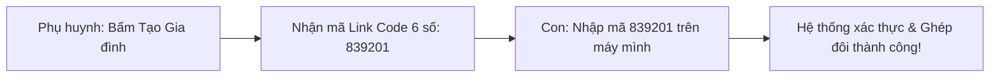

# TÀI LIỆU HƯỚNG DẪN SỬ DỤNG ỨNG DỤNG KURA
## GIẢI PHÁP QUẢN LÝ VÀ ĐỒNG HÀNH SỐ CHO CON VÀ GIA ĐÌNH
**Thời gian phát hành:** 09/2026  
**Phiên bản tài liệu:** 1.0 - Chính thức  
**Áp dụng cho:** Ứng dụng Kura (Hệ điều hành Android & Nền tảng Flutter)

---

## LỜI NÓI ĐẦU & QUY ƯỚC THUẬT NGỮ

Chào mừng bạn đến với **Kura** – Ứng dụng quản lý thời gian và đồng hành số thông minh, được nghiên cứu và phát triển bởi nhóm học sinh THPT nhằm giúp gia đình xây dựng văn hóa sử dụng thiết bị điện tử văn minh, an toàn và cân bằng.

### Quy ước vai trò & Thuật ngữ trong tài liệu:
- **Kura:** Tên gọi chính thức và duy nhất của sản phẩm phần mềm.
- **Phụ huynh (Parent):** Người giám hộ, quản lý thiết bị, cấu hình hạn mức sử dụng và phê duyệt các yêu cầu.
- **Con (Child):** Người trực tiếp sử dụng thiết bị được đồng hành, có quyền tự chủ tra cứu hạn mức và gửi yêu cầu gia hạn thời gian văn minh.
- **Smart Lock:** Phân hệ khóa ứng dụng thông minh thời gian thực dựa trên nền tảng dịch vụ Android Accessibility Service.
- **Link Code:** Mã kết nối bảo mật 6 chữ số dùng để liên kết thiết bị giữa phụ huynh và con trong cùng gia đình.

---

## MỤC LỤC

1. [CHƯƠNG 1. TỔNG QUAN & YÊU CẦU CÀI ĐẶT](#chương-1-tổng-quan--yêu-cầu-cài-đặt)
   - 1.1. Yêu cầu thiết bị và hệ điều hành
   - 1.2. Hướng dẫn tải và cài đặt tệp APK
   - 1.3. Cấp quyền Dịch vụ Hỗ trợ tiếp cận (Accessibility Service) trên máy Con
     - 1.3.1. Quy trình kích hoạt tự động từ ứng dụng Kura
     - 1.3.2. Gỡ bỏ lỗi "Cài đặt bị hạn chế" trên Android 13 & 14
     - 1.3.3. Thiết lập chi tiết cho từng dòng máy (Samsung, Xiaomi, Oppo, Vivo, Pixel)
     - 1.3.4. Kiểm tra trạng thái hoàn tất
2. [CHƯƠNG 2. ĐĂNG KÝ, ĐĂNG NHẬP & GHÉP ĐÔI GIA ĐÌNH](#chương-2-đăng-ký-đăng-nhập--ghép-đôi-gia-đình)
   - 2.1. Đăng ký tài khoản mới và Đăng nhập
   - 2.2. Lựa chọn vai trò (Phụ huynh hoặc Con)
   - 2.3. Tạo mã gia đình và Ghép đôi thiết bị qua Link Code
3. [CHƯƠNG 3. HƯỚNG DẪN DÀNH CHO PHỤ HUYNH](#chương-3-hướng-dẫn-dành-cho-phụ-huynh)
   - 3.1. Làm quen với Dashboard Phụ huynh
   - 3.2. Cấu hình Giới hạn Thời gian Ứng dụng (App Time Limits)
   - 3.3. Thiết lập Lịch trình Khóa & Giờ đi ngủ (Schedules & Quiet Hours)
   - 3.4. Tiếp nhận và Phê duyệt Yêu cầu Xin thêm giờ (Time Requests)
   - 3.5. Cấu hình Quy tắc Tự động Duyệt (Auto-Approval Rules)
   - 3.6. Trung tâm Cảnh báo Từ khóa An toàn & Quản lý Từ khóa
   - 3.7. Tra cứu Báo cáo Thống kê Tuần & Tháng
4. [CHƯƠNG 4. HƯỚNG DẪN DÀNH CHO CON](#chương-4-hướng-dẫn-dành-cho-con)
   - 4.1. Khám phá Dashboard của Con
   - 4.2. Trải nghiệm Màn hình Khóa Ứng dụng (LockScreen)
   - 4.3. Gửi Yêu cầu Xin thêm giờ văn minh
   - 4.4. Nhận kết quả phê duyệt và Mở khóa tự động
5. [CHƯƠNG 5. KHẮC PHỤC SỰ CỐ & CÂU HỎI THƯỜNG GẶP (FAQ)](#chương-5-khắc-phục-sự-cố--câu-hỏi-thường-gặp-faq)
   - 5.1. Khắc phục lỗi dịch vụ chạy ngầm bị dừng trên các dòng máy
   - 5.2. Máy con không nhận được thông báo sau khi phụ huynh duyệt
   - 5.3. Xử lý khi thiết bị ngoại tuyến (không có mạng Internet)
6. [DANH MỤC HÌNH ẢNH GIAO DIỆN](#danh-mục-hình-ảnh-giao-diện)

---

## CHƯƠNG 1. TỔNG QUAN & YÊU CẦU CÀI ĐẶT

### 1.1. Yêu cầu thiết bị và hệ điều hành
- **Thiết bị của Phụ huynh:** Hỗ trợ mọi thiết bị chạy hệ điều hành Android 8.0 trở lên hoặc iOS, có kết nối Internet (Wi-Fi/4G/5G).
- **Thiết bị của Con:** Bắt buộc là điện thoại hoặc máy tính bảng chạy **Android 8.0 (Oreo / API 26) đến Android 14 (API 34)**.
- **Quyền hạn cốt lõi:** Dịch vụ Hỗ trợ tiếp cận (**Accessibility Service**) trên máy con để quét và nhận diện ứng dụng đang chạy nền.

---

### 1.2. Hướng dẫn tải và cài đặt tệp APK

#### Các bước thực hiện:
1. Tải tệp cài đặt `kura-release.apk` về cả thiết bị của phụ huynh và máy của con.
2. Mở trình quản lý tệp trên điện thoại, bấm vào tệp APK vừa tải về.
3. Nếu điện thoại hiển thị cảnh báo *"Cài đặt ứng dụng từ nguồn không xác định"*, chọn **Cài đặt (Settings)** $\rightarrow$ Bật công tắc cho phép trình duyệt/trình quản lý tệp cài đặt ứng dụng.
4. Nhấn nút **Cài đặt (Install)** và chờ khoảng 10 giây để quá trình hoàn tất.
5. Nhấn **Mở (Open)** để khởi động Kura.

> 📸 **[CHÈN ẢNH GIAO DIỆN HÌNH 1.1: MÀN HÌNH CÀI ĐẶT APK VÀ KHỞI ĐỘNG KURA TẠI ĐÂY]**  
*Hình 1.1: Màn hình Cài đặt tệp APK và Màn hình Chào mừng Splash Screen của Kura*

---

### 1.3. Cấp quyền Dịch vụ Hỗ trợ tiếp cận (Accessibility Service) trên máy Con

> [!IMPORTANT]
> **Đây là quyền hạn quan trọng nhất của Kura trên máy con:**
> Dịch vụ Hỗ trợ tiếp cận (`Kura App Monitor Service`) là "trái tim" giúp Kura nhận diện ứng dụng đang mở trên màn hình, tính toán thời gian sử dụng, phát hiện từ khóa nguy hiểm và kích hoạt màn hình khóa Native ngay khi hết giờ. Nếu không kích hoạt quyền này, các tính năng giám sát và bảo vệ sẽ không thể hoạt động.

#### 1.3.1. Quy trình kích hoạt tự động từ ứng dụng Kura
1. Sau khi con nhập mã Link Code và ghép đôi thành công, ứng dụng Kura sẽ hiển thị thông báo: *"Yêu cầu cấp quyền Giám sát an toàn"*.
2. Nhấn vào nút **"Kích hoạt quyền Giám sát"** (màu cam nổi bật). Kura sẽ thông qua Platform Channel tự động mở trang cài đặt Trợ năng tương ứng của hệ điều hành Android.
3. Tìm đến mục **Kura App Monitor Service** và gạt công tắc sang **Bật (ON)**.

---

#### 1.3.2. Hướng dẫn gỡ bỏ lỗi "Cài đặt bị hạn chế" (Restricted Settings) trên Android 13 & Android 14
> [!WARNING]
> Từ phiên bản Android 13 trở lên, Google bổ sung cơ chế bảo mật tự động hạn chế cấp quyền Accessibility đối với các tệp APK cài đặt thủ công ngoài Google Play. Nếu khi vào mục cài đặt bạn thấy dịch vụ Kura bị mờ màu xám kèm thông báo *"Để bảo mật cho bạn, cài đặt này hiện không khả dụng" (Restricted setting)*, phụ huynh hãy thực hiện các bước sau để mở khóa:
>
> 1. Quay lại màn hình chính của điện thoại con $\rightarrow$ Nhấn giữ vào biểu tượng ứng dụng **Kura** $\rightarrow$ Chọn **Thông tin ứng dụng (App Info)** (biểu tượng chữ `i` trong hình tròn).
> 2. Tại góc trên cùng bên phải màn hình Thông tin ứng dụng, chạm vào biểu tượng **Dấu 3 chấm dọc (⋮)**.
> 3. Chọn dòng **"Cho phép cài đặt bị hạn chế" (Allow restricted settings)** $\rightarrow$ Xác nhận mở khóa bằng vân tay hoặc mã PIN của điện thoại.
> 4. Mở lại ứng dụng Kura $\rightarrow$ Bấm nút kích hoạt quyền, lúc này công tắc dịch vụ đã sáng rõ và phụ huynh có thể gạt Bật bình thường.

---

#### 1.3.3. Hướng dẫn thiết lập chi tiết theo từng dòng máy điện thoại phổ biến

Do mỗi nhà sản xuất tùy biến giao diện Android khác nhau, dưới đây là lộ trình thao tác cụ thể cho từng thương hiệu phổ biến tại Việt Nam:

##### a) Dòng máy SAMSUNG (Giao diện One UI 4 / 5 / 6)
1. Mở **Cài đặt (Settings)** trên điện thoại con $\rightarrow$ Cuộn xuống chọn **Hỗ trợ tiếp cận (Accessibility)**.
2. Nhấn vào mục **Ứng dụng đã cài đặt (Installed apps)**.
3. Tìm và chọn dịch vụ **Kura App Monitor Service** (hiện đang ở trạng thái *Tắt*).
4. Gạt công tắc sang **Bật (ON)**.
5. Hộp thoại hệ thống hỏi *"Cho phép Kura kiểm soát toàn bộ điện thoại?"* $\rightarrow$ Nhấn **Cho phép (Allow)**.

> 📸 **[CHÈN ẢNH GIAO DIỆN HÌNH 1.2a: CẤP QUYỀN ACCESSIBILITY TRÊN SAMSUNG ONE UI TẠI ĐÂY]**  
*Hình 1.2a: Các bước kích hoạt Kura App Monitor Service trên điện thoại Samsung*

---

##### b) Dòng máy XIAOMI / REDMI / POCO (Giao diện MIUI 13 / 14 & Xiaomi HyperOS)
1. *Mở khóa hạn chế (với Android 13/14):* Vào *Cài đặt* $\rightarrow$ *Ứng dụng* $\rightarrow$ *Quản lý ứng dụng* $\rightarrow$ Chọn *Kura* $\rightarrow$ Dấu 3 chấm góc trên $\rightarrow$ Chọn *Cho phép cài đặt bị hạn chế*.
2. Mở **Cài đặt (Settings)** $\rightarrow$ Chọn **Cài đặt bổ sung (Additional settings)**.
3. Chọn mục **Hỗ trợ tiếp cận (Accessibility)** $\rightarrow$ Chuyển sang tab **Đã tải xuống (Downloaded)**.
4. Nhấn chọn **Kura App Monitor Service** $\rightarrow$ Gạt công tắc sang **Bật (ON)**.
5. Màn hình cảnh báo bảo mật của Xiaomi sẽ hiển thị đếm ngược 10 giây: Tích vào ô tròn *"Tôi nhận thức được các rủi ro có thể xảy ra..."* $\rightarrow$ Chờ hết 10 giây và nhấn nút **OK**.

> 📸 **[CHÈN ẢNH GIAO DIỆN HÌNH 1.2b: CẤP QUYỀN VÀ VƯỢT QUA CẢNH BÁO TRÊN XIAOMI / REDMI TẠI ĐÂY]**  
*Hình 1.2b: Các bước cấp quyền và vượt qua xác thực cảnh báo trên Xiaomi MIUI/HyperOS*

---

##### c) Dòng máy OPPO / REALME / ONEPLUS (Giao diện ColorOS & Realme UI)
1. *Mở khóa hạn chế (với Android 13/14):* Vào *Cài đặt* $\rightarrow$ *Ứng dụng* $\rightarrow$ *Quản lý ứng dụng* $\rightarrow$ *Kura* $\rightarrow$ Bấm dấu 3 chấm góc phải $\rightarrow$ *Cho phép cài đặt bị hạn chế*.
2. Vào **Cài đặt (Settings)** $\rightarrow$ Chọn **Cài đặt hệ thống (System settings)** (hoặc *Cài đặt bổ sung* tùy đời máy).
3. Chọn **Trợ năng (Accessibility)** $\rightarrow$ Chọn mục **Ứng dụng đã tải xuống (Downloaded apps)**.
4. Chọn **Kura App Monitor Service** $\rightarrow$ Gạt công tắc sang **Bật (ON)**.
5. Nhập mã CAPTCHA xác nhận an toàn (gồm 4 chữ cái nếu hệ thống yêu cầu) $\rightarrow$ Nhấn **Bật (Turn on)** $\rightarrow$ Chọn **Cho phép**.

> 📸 **[CHÈN ẢNH GIAO DIỆN HÌNH 1.2c: CẤP QUYỀN ACCESSIBILITY TRÊN OPPO VÀ REALME TẠI ĐÂY]**  
*Hình 1.2c: Thao tác kích hoạt dịch vụ trợ năng trên điện thoại Oppo và Realme*

---

##### d) Dòng máy VIVO / IQOO (Giao diện Funtouch OS & OriginOS)
1. Mở **Cài đặt (Settings)** trên điện thoại $\rightarrow$ Chọn **Lối tắt và trợ năng (Shortcuts & accessibility)**.
2. Cuộn xuống dưới cùng chọn mục **Khả năng tiếp cận (Accessibility)**.
3. Tại nhóm *Dịch vụ đã tải xuống (Downloaded services)*, chạm vào **Kura App Monitor Service**.
4. Gạt công tắc sang **Bật (ON)** $\rightarrow$ Bấm **Cho phép (Allow)** tại hộp thoại xác nhận.

> 📸 **[CHÈN ẢNH GIAO DIỆN HÌNH 1.2d: CẤP QUYỀN ACCESSIBILITY TRÊN VIVO FUNTOUCH OS TẠI ĐÂY]**  
*Hình 1.2d: Giao diện kích hoạt quyền giám sát an toàn trên điện thoại Vivo*

---

##### e) Dòng máy GOOGLE PIXEL / VSMART / ANDROID THUẦN (Stock Android 9 đến 14)
1. Mở **Cài đặt (Settings)** $\rightarrow$ Chọn mục **Hỗ trợ tiếp cận (Accessibility)**.
2. Tìm đến nhóm **Ứng dụng đã tải xuống (Downloaded apps)** $\rightarrow$ Chọn **Kura App Monitor Service**.
3. Bật tùy chọn **Sử dụng Kura App Monitor Service (Use Kura App Monitor Service)**.
4. Nhấn nút **Cho phép (Allow)** khi hệ điều hành hiển thị thông báo xác nhận.

> 📸 **[CHÈN ẢNH GIAO DIỆN HÌNH 1.2e: CẤP QUYỀN TRÊN ANDROID THUẦN / GOOGLE PIXEL TẠI ĐÂY]**  
*Hình 1.2e: Các bước kích hoạt dịch vụ Accessibility trên thiết bị chạy Android gốc*

---

#### 1.3.4. Kiểm tra trạng thái hoàn tất
Khi hoàn tất cấp quyền và quay lại ứng dụng Kura trên máy con:
- Biểu tượng khiên bảo vệ chuyển sang **Màu xanh lục**.
- Trạng thái thông báo: *"Đã kích hoạt dịch vụ giám sát - Thiết bị đang được Kura đồng hành bảo vệ"*.
- Giao diện chuyển thẳng sang màn hình chính của con, sẵn sàng cho trải nghiệm an toàn.

---

## CHƯƠNG 2. ĐĂNG KÝ, ĐĂNG NHẬP & GHÉP ĐÔI GIA ĐÌNH

### 2.1. Đăng ký tài khoản mới và Đăng nhập

#### Bước 1: Mở màn hình Xác thực
Tại màn hình Đăng nhập của Kura, người dùng có thể lựa chọn:
- **Đăng nhập:** Nhập địa chỉ Email và Mật khẩu đã có, sau đó nhấn **Đăng nhập**.
- **Đăng ký tài khoản mới:** Nhấn vào liên kết *"Chưa có tài khoản? Đăng ký ngay"*.

#### Bước 2: Điền thông tin Đăng ký
1. Nhập Họ và tên hiển thị (ví dụ: *Nguyễn Văn A*).
2. Nhập Email liên hệ hợp lệ (dùng để nhận báo cáo định kỳ).
3. Nhập Mật khẩu (tối thiểu 6 ký tự) và Xác nhận mật khẩu.
4. Nhấn nút **"Tạo tài khoản"**. Hệ thống Firebase Auth sẽ khởi tạo tài khoản tức thì.

> 📸 **[CHÈN ẢNH GIAO DIỆN HÌNH 2.1: MÀN HÌNH ĐĂNG NHẬP VÀ ĐĂNG KÝ TÀI KHOẢN TẠI ĐÂY]**  
*Hình 2.1: Giao diện Đăng nhập và Đăng ký tài khoản Kura*

---

### 2.2. Lựa chọn vai trò (Phụ huynh hoặc Con)

Sau khi xác thực thành công lần đầu, Kura hiển thị màn hình chọn vai trò người dùng:
1. **Thẻ "Tôi là Phụ huynh":** Dành cho phụ huynh muốn quản lý thời gian, xem báo cáo thống kê và đồng hành cùng con.
2. **Thẻ "Tôi là Con":** Dành cho thiết bị của học sinh để tự theo dõi giờ giấc và học tập.

Người dùng chạm vào thẻ tương ứng để xác nhận phân quyền trên thiết bị.

> 📸 **[CHÈN ẢNH GIAO DIỆN HÌNH 2.2: MÀN HÌNH LỰA CHỌN VAI TRÒ NGƯỜI DÙNG TẠI ĐÂY]**  
*Hình 2.2: Màn hình Phân định vai trò Phụ huynh và Con*

---

### 2.3. Tạo mã gia đình và Ghép đôi thiết bị qua Link Code

Để thiết bị của phụ huynh quản lý được thiết bị của con, hai máy cần được kết nối vào cùng một nhóm gia đình thông qua mã **Link Code** gồm 6 chữ số bảo mật.

#### Các bước thực hiện:
- **Trên điện thoại Phụ huynh:**
  1. Sau khi chọn vai trò Phụ huynh, chọn **"Tạo nhóm gia đình mới"**.
  2. Hệ thống tự động khởi tạo nhóm và hiển thị một mã số gồm 6 chữ số lớn ở trung tâm màn hình (Ví dụ: `839201`).
  3. Phụ huynh giữ nguyên màn hình này hoặc chia sẻ mã số cho con.
- **Trên điện thoại của Con:**
  1. Sau khi chọn vai trò Con, màn hình hiển thị ô nhập mã ghép đôi gồm 6 ô số.
  2. Con nhập chính xác mã 6 chữ số từ điện thoại phụ huynh.
  3. Nhấn nút **"Tham gia gia đình"**.
  4. Hệ thống kiểm tra trong 1 giây; khi mã khớp, giao diện thông báo *"Ghép đôi thành công!"* và tự động chuyển tiếp sang bước cấp quyền Accessibility Service.

> 📸 **[CHÈN ẢNH GIAO DIỆN HÌNH 2.3: MÀN HÌNH GHÉP ĐÔI THIẾT BỊ BẰNG LINK CODE 6 SỐ TẠI ĐÂY]**  
*Hình 2.3: Giao diện Tạo và Nhập mã Link Code 6 số để liên kết gia đình*

---

## CHƯƠNG 3. HƯỚNG DẪN DÀNH CHO PHỤ HUYNH

### 3.1. Làm quen với Dashboard Phụ huynh

Dashboard Phụ huynh là trung tâm điều khiển toàn diện cho phép phụ huynh nắm bắt tức thì tình hình sử dụng thiết bị của con:

> 📸 **[CHÈN ẢNH GIAO DIỆN HÌNH 3.1: TỔNG QUAN DASHBOARD PHỤ HUYNH TẠI ĐÂY]**  
*Hình 3.1: Giao diện Dashboard Phụ huynh hiển thị Biểu đồ Donut và Tóm tắt hoạt động*

#### Các thành phần chính trên màn hình:
1. **Thanh chọn hồ sơ của Con (Child Selector):** Nếu gia đình có nhiều con, phụ huynh dễ dàng bấm chọn để chuyển đổi giữa các con.
2. **Thẻ Tóm tắt hôm nay (Today's Usage Summary):** Hiển thị tổng số giờ/phút con đã dùng điện thoại trong ngày và tỷ lệ so với hạn mức cho phép.
3. **Biểu đồ tròn (Donut Chart):** Trực quan hóa tỷ lệ thời gian giữa các ứng dụng (TikTok, YouTube, Facebook, Game, Học tập).
4. **Hàng nút tác vụ nhanh (Quick Actions):**
   - *Smart Lock:* Đặt giới hạn ứng dụng và khung giờ cấm.
   - *Yêu cầu chờ duyệt:* Xem các đơn xin thêm giờ của con (kèm huy hiệu chấm đỏ nếu có yêu cầu mới).
   - *Cảnh báo an toàn:* Xem các từ khóa nguy hiểm bị phát hiện.
   - *Báo cáo:* Xem phân tích tuần/tháng.
5. **Danh sách ứng dụng dùng nhiều nhất (Top Apps List):** Liệt kê chi tiết từng ứng dụng cùng số phút đã sử dụng.

---

### 3.2. Cấu hình Giới hạn Thời gian Ứng dụng (App Time Limits)

Tính năng cho phép phụ huynh kiểm soát thời lượng con được phép sử dụng từng ứng dụng cụ thể mỗi ngày.

> 📸 **[CHÈN ẢNH GIAO DIỆN HÌNH 3.2: MÀN HÌNH CẤU HÌNH GIỚI HẠN THỜI GIAN ỨNG DỤNG TẠI ĐÂY]**  
*Hình 3.2: Màn hình Cài đặt Giới hạn thời gian (Time Limit) theo từng thứ trong tuần*

#### Quy trình cài đặt từng bước:
1. Tại Dashboard, nhấn chọn mục **"Giới hạn ứng dụng" (App Time Limits)**.
2. Danh sách các ứng dụng đã cài trên máy con sẽ hiển thị (kèm icon và tên ứng dụng).
3. Nhấn vào ứng dụng muốn đặt giới hạn (Ví dụ: *TikTok* hoặc *YouTube*).
4. **Cài đặt số phút cho từng ngày:**
   - Phụ huynh có thể đặt thời gian riêng cho Ngày trong tuần (Thứ 2 đến Thứ 6 - ví dụ: *45 phút/ngày*).
   - Đặt thời gian riêng cho Ngày cuối tuần (Thứ 7, Chủ Nhật - ví dụ: *90 phút/ngày*).
   - Hoặc gạt bật tùy chọn *"Áp dụng cùng mức cho tất cả các ngày"*.
5. **Khóa tức thì (Manual Immediate Block):** Gạt bật công tắc đỏ *"Khóa ngay lập tức"* nếu muốn ngăn con mở ứng dụng đó ngay tại thời điểm hiện tại.
6. Nhấn nút **"Lưu cấu hình"**. Cấu hình mới sẽ được đồng bộ xuống máy con ngay lập tức qua Cloud Firestore và Platform Channel.

---

### 3.3. Thiết lập Lịch trình Khóa & Giờ đi ngủ (Schedules & Quiet Hours)

Lịch trình khóa giúp tạo thói quen sinh hoạt khoa học, tự động khóa toàn bộ các ứng dụng giải trí trong giờ học tập và giờ đi ngủ.

> 📸 **[CHÈN ẢNH GIAO DIỆN HÌNH 3.3: MÀN HÌNH THIẾT LẬP LỊCH TRÌNH KHÓA TẠI ĐÂY]**  
*Hình 3.3: Giao diện Tạo và Quản lý Lịch trình Cấm theo khung giờ*

#### Các bước tạo Lịch trình mới:
1. Nhấn vào mục **"Lịch trình cấm" (Schedules)** $\rightarrow$ Bấm biểu tượng dấu cộng **(+)** ở góc dưới màn hình.
2. **Đặt tên lịch trình:** Nhập tên dễ nhớ (Ví dụ: *"Giờ tự học tối"*, *"Giờ đi ngủ"*).
3. **Chọn khung giờ bắt đầu và kết thúc:**
   - Giờ bắt đầu: Ví dụ `22:00`.
   - Giờ kết thúc: Ví dụ `06:00` sáng hôm sau.
   > [!NOTE]
   > Kura hỗ trợ cơ chế **Lịch trình qua đêm (Overnight Schedule)**. Nếu giờ kết thúc nhỏ hơn giờ bắt đầu, hệ thống sẽ tự động hiểu khung giờ kéo dài qua nửa đêm sang ngày hôm sau.
4. **Chọn các ngày áp dụng:** Chạm vào các vòng tròn thứ trong tuần (T2, T3, T4, T5, T6, T7, CN).
5. Nhấn **"Lưu lịch trình"**. Kura sẽ tự động kích hoạt chế độ bảo vệ khi đồng hồ chạm mốc thời gian đã định.

---

### 3.4. Tiếp nhận và Phê duyệt Yêu cầu Xin thêm giờ (Time Requests)

Khi con dùng hết số phút hoặc cần dùng ứng dụng trong giờ cấm cho mục đích chính đáng (học tập, liên lạc), con sẽ gửi yêu cầu gia hạn. Phụ huynh sẽ nhận thông báo đẩy tức thì trên điện thoại.

> 📸 **[CHÈN ẢNH GIAO DIỆN HÌNH 3.4: MÀN HÌNH PHÊ DUYỆT YÊU CẦU XIN THÊM GIỜ TẠI ĐÂY]**  
*Hình 3.4: Giao diện Danh sách Yêu cầu chờ duyệt và Thao tác Phê duyệt / Từ chối*

#### Các bước xử lý yêu cầu:
1. Khi có thông báo *"Bé gửi yêu cầu xin thêm giờ"*, nhấn vào thông báo hoặc mở mục **"Yêu cầu chờ duyệt"** trên Dashboard.
2. Màn hình hiển thị chi tiết:
   - Tên ứng dụng: (Ví dụ: *YouTube*).
   - Thời lượng xin thêm: *15 phút*, *30 phút* hoặc *60 phút*.
   - Lý do con nhập: (Ví dụ: *"Con cần xem video bài giảng môn Hóa của cô giáo"*).
   - Thời điểm gửi yêu cầu.
3. **Quyết định của phụ huynh:**
   - **Đồng ý (Approve):** Nhấn nút xanh *"Chấp thuận"*. Hạn mức của app sẽ được cộng thêm số phút tương ứng, và màn hình khóa trên máy con lập tức tự đóng lại.
   - **Từ chối (Reject):** Nhấn nút đỏ *"Từ chối"*. Phụ huynh có thể nhập một dòng phản hồi nhẹ nhàng (Ví dụ: *"Mai con có bài kiểm tra, hãy ôn bài nhé!"*). Thông báo sẽ được gửi về máy con.

---

### 3.5. Cấu hình Quy tắc Tự động Duyệt (Auto-Approval Rules)

Nhằm giúp phụ huynh không bị làm phiền liên tục bởi các yêu cầu nhỏ trong khi đang làm việc, Kura tích hợp phân hệ **Auto-Approval**.

> 📸 **[CHÈN ẢNH GIAO DIỆN HÌNH 3.5: CẤU HÌNH QUY TẮC TỰ ĐỘNG DUYỆT TẠI ĐÂY]**  
*Hình 3.5: Giao diện Cài đặt Quy tắc Tự động Phê duyệt (Auto-Approval Rules)*

#### Các tùy chọn cấu hình:
- **Bật/Tắt chế độ tự động:** Công tắc tổng kích hoạt cơ chế.
- **Thời lượng tối đa cho phép tự duyệt:** Ví dụ tối đa *15 phút* hoặc *30 phút*.
- **Giới hạn số lần tự duyệt trong ngày:** Ví dụ tối đa *2 lần/ngày*. Nếu con xin đến lần thứ 3, hệ thống sẽ bắt buộc chuyển sang chế độ phụ huynh duyệt thủ công.
- **Danh mục ứng dụng được tự duyệt:** Chỉ cho phép tự động duyệt các ứng dụng phục vụ học tập (Zoom, Google Classroom, Từ điển,...), tuyệt đối không tự duyệt Game hoặc Mạng xã hội.

---

### 3.6. Trung tâm Cảnh báo Từ khóa An toàn & Quản lý Từ khóa

Kura bảo vệ con khỏi các cạm bẫy trực tuyến bằng cách quét ngầm nội dung tìm kiếm trên các trình duyệt và mạng xã hội.

> 📸 **[CHÈN ẢNH GIAO DIỆN HÌNH 3.6: MÀN HÌNH DANH SÁCH VÀ CHI TIẾT CẢNH BÁO TỪ KHÓA TẠI ĐÂY]**  
*Hình 3.6: Giao diện Trung tâm Cảnh báo An toàn Số và Chi tiết Ngữ cảnh vi phạm*

#### Xem chi tiết cảnh báo:
1. Khi có phát hiện nguy hiểm, điện thoại phụ huynh sẽ đổ chuông báo động khẩn cấp và rung cảnh báo.
2. Mở mục **"Cảnh báo an toàn" (Alert Center)**.
3. Chạm vào bản ghi cảnh báo để xem chi tiết:
   - **Từ khóa bị phát hiện:** Hiển thị màu đỏ nổi bật.
   - **Ứng dụng phát sinh vi phạm:** (Ví dụ: *Google Chrome* hoặc *YouTube*).
   - **Đoạn văn bản ngữ cảnh:** Đoạn câu văn con đã gõ vào ô tìm kiếm, giúp phụ huynh hiểu rõ ngữ cảnh thực tế (tránh hiểu lầm khi con tra cứu bài tập khoa học).
4. **Xử lý:** Nhấn **"Đánh dấu đã xem xét"** và nhập ghi chú trao đổi với con để lưu vào nhật ký đồng hành.

#### Quản lý danh mục từ khóa của gia đình:
- Vào mục Cài đặt $\rightarrow$ **"Quản lý từ khóa"**.
- Phụ huynh có thể bấm **(+) Thêm từ khóa** để bổ sung các từ ngữ nhạy cảm riêng theo quy ước gia đình.
- Hoặc bấm **"Khôi phục mặc định"** để lấy lại danh mục từ khóa an toàn chuẩn của Kura.

> 📸 **[CHÈN ẢNH GIAO DIỆN HÌNH 3.7: MÀN HÌNH QUẢN LÝ BỘ TỪ KHÓA CỦA GIA ĐÌNH TẠI ĐÂY]**  
*Hình 3.7: Giao diện Thêm/Xóa và Quản trị danh mục từ khóa giám sát*

---

### 3.7. Tra cứu Báo cáo Thống kê Tuần & Tháng

Phân hệ báo cáo giúp phụ huynh theo dõi tiến trình thay đổi hành vi và xây dựng thói quen số lành mạnh của con qua thời gian.

> 📸 **[CHÈN ẢNH GIAO DIỆN HÌNH 3.8: GIAO DIỆN BÁO CÁO THỐNG KÊ TUẦN VÀ THÁNG TẠI ĐÂY]**  
*Hình 3.8: Biểu đồ Thống kê Sử dụng theo Tuần và Xu hướng Hành vi của Con*

#### Thông tin cung cấp trong báo cáo:
- **Biểu đồ cột so sánh theo từng ngày trong tuần:** Nhìn thấy rõ ngày nào con dùng nhiều nhất (thường là cuối tuần).
- **Phân loại ứng dụng:** Tỷ lệ phần trăm thời gian dành cho Học tập vs Giải trí vs Mạng xã hội.
- **Số lần chạm vạch khóa và số lần gửi yêu cầu xin thêm giờ.**
- **Nút "Xuất báo cáo":** Hỗ trợ kết xuất dữ liệu gửi trực tiếp về hòm thư Email của phụ huynh.

---

## CHƯƠNG 4. HƯỚNG DẪN DÀNH CHO CON

Kura không phải là phần mềm cấm đoán cực đoan, mà là **người bạn đồng hành số** giúp con rèn luyện kỹ năng tự quản lý thời gian và bảo vệ bản thân trên mạng Internet.

### 4.1. Khám phá Dashboard của Con

Khi con mở Kura, giao diện được thiết kế thân thiện, tươi sáng và khích lệ:

> 📸 **[CHÈN ẢNH GIAO DIỆN HÌNH 4.1: GIAO DIỆN DASHBOARD DÀNH CHO CON TẠI ĐÂY]**  
*Hình 4.1: Màn hình Dashboard Con hiển thị Quota thời gian còn lại và Lịch cấm hôm nay*

#### Những thông tin con có thể chủ động theo dõi:
1. **Đồng hồ hạn mức còn lại:** Cho biết con còn bao nhiêu phút dùng các ứng dụng yêu thích trong ngày hôm nay.
2. **Khung giờ cấm sắp tới:** Thông báo nhắc nhở trước (Ví dụ: *"Giờ tự học sẽ bắt đầu lúc 19:30, hãy chuẩn bị sách vở nhé!"*).
3. **Danh sách ứng dụng và Quota:** Giúp con tự phân bổ thời gian: lướt video 20 phút, học tiếng Anh 30 phút.
4. **Huy hiệu thói quen:** Ghi nhận chuỗi ngày con hoàn thành xuất sắc mục tiêu không sử dụng điện thoại quá giờ đi ngủ.

---

### 4.2. Trải nghiệm Màn hình Khóa Ứng dụng (LockScreen)

Khi con sử dụng hết hạn mức thời gian của ứng dụng hoặc khi đến khung giờ cấm/giờ ngủ:
1. Ứng dụng con đang mở sẽ tự động thu nhỏ và văng ra màn hình chính (Home Screen).
2. Kura lập tức hiển thị **Màn hình Khóa bảo vệ toàn phần (LockScreen Overlay)** màu sắc rõ nét, ngăn chặn việc tiếp tục dùng quá đà.
3. Trên màn hình khóa hiển thị thông báo lý do:
   - *"Ứng dụng đã hết hạn mức cho phép hôm nay"* hoặc  
   - *"Đang trong khung giờ học tập / Giờ đi ngủ"*.

> 📸 **[CHÈN ẢNH GIAO DIỆN HÌNH 4.2: MÀN HÌNH KHÓA TOÀN PHẦN LOCKSCREEN TRÊN MÁY CON TẠI ĐÂY]**  
*Hình 4.2: Giao diện Toàn màn hình Khóa Native kèm thông báo và nút Xin thêm giờ*

---

### 4.3. Gửi Yêu cầu Xin thêm giờ văn minh

Nếu con thực sự có lý do chính đáng cần sử dụng thêm, con có thể chủ động trao đổi với phụ huynh thông qua tính năng gửi yêu cầu ngay trên màn hình khóa:

#### Các bước thực hiện:
1. Nhấn vào nút nổi bật **"Xin thêm giờ"** trên màn hình khóa.
2. Một bảng tùy chọn xuất hiện:
   - **Chọn số phút:** Bấm chọn một trong ba mức: **15 phút**, **30 phút** hoặc **60 phút**.
   - **Nhập lý do:** Nhập ngắn gọn lý do vì sao con cần dùng thêm (Ví dụ: *"Con cần tra từ vựng làm bài tập tiếng Anh"*, *"Con nói chuyện nhóm với bạn về bài thuyết trình"*).
3. Nhấn nút **"Gửi yêu cầu tới Phụ huynh"**.
4. Màn hình sẽ chuyển sang trạng thái xoay vòng: *"Đang chờ phụ huynh phản hồi..."*.

> 📸 **[CHÈN ẢNH GIAO DIỆN HÌNH 4.3: HỘP THOẠI CHỌN SỐ PHÚT VÀ NHẬP LÝ DO XIN THÊM GIỜ TẠI ĐÂY]**  
*Hình 4.3: Hộp thoại Nhập số phút và Gửi lý do xin thêm giờ văn minh*

---

### 4.4. Nhận kết quả phê duyệt và Mở khóa tự động

Con không cần phải bấm tắt mở lại ứng dụng; hệ thống Kura hoạt động hoàn toàn tự động theo thời gian thực:
- **Khi Phụ huynh đồng ý (hoặc Thỏa mãn Tự động duyệt):**
  - Màn hình khóa sẽ lập tức hiển thị hiệu ứng tích xanh chúc mừng: *"Phụ huynh đã duyệt thêm [X] phút cho con!"*.
  - Màn hình khóa tự động đóng lại sau 2 giây. Con có thể tiếp tục sử dụng ứng dụng ngay lập tức.
- **Khi Phụ huynh từ chối:**
  - Màn hình hiển thị thông báo: *"Yêu cầu chưa được duyệt"* kèm lời nhắn yêu thương dặn dò từ phụ huynh.
  - Con nhấn nút **"Về màn hình chính"** để chuyển sang các hoạt động thể thao, đọc sách hoặc nghỉ ngơi lành mạnh.

> 📸 **[CHÈN ẢNH GIAO DIỆN HÌNH 4.4: MÀN HÌNH THÔNG BÁO KẾT QUẢ DUYỆT THỜI GIAN TRÊN MÁY CON TẠI ĐÂY]**  
*Hình 4.4: Giao diện Thông báo Chấp thuận / Từ chối yêu cầu gia hạn thời gian*

---

## CHƯƠNG 5. KHẮC PHỤC SỰ CỐ & CÂU HỎI THƯỜNG GẶP (FAQ)

### 5.1. Khắc phục lỗi dịch vụ chạy ngầm bị dừng trên các dòng máy Android

Trên một số dòng điện thoại Android (như Xiaomi, Oppo, Vivo, Samsung, Realme), hệ điều hành có tính năng tự động đóng ứng dụng chạy ngầm cực đoan để tiết kiệm pin. Điều này có thể làm cho dịch vụ Accessibility của Kura bị ngắt.

#### Cách xử lý theo từng hãng máy:
1. **Đối với điện thoại Xiaomi / Redmi (MIUI / HyperOS):**
   - Vào *Cài đặt* $\rightarrow$ *Ứng dụng* $\rightarrow$ *Quản lý ứng dụng* $\rightarrow$ Chọn *Kura*.
   - Bật tùy chọn **Tự khởi chạy (Autostart)**.
   - Tại mục *Tiết kiệm pin*, chuyển sang chế độ **Không hạn chế (No restrictions)**.
   - Mở màn hình Đa nhiệm (Recent Apps) $\rightarrow$ Nhấn giữ ứng dụng Kura $\rightarrow$ Bấm vào biểu tượng **Chiếc khóa** để khóa ứng dụng không bị xóa khỏi RAM.
2. **Đối với điện thoại Samsung (One UI):**
   - Vào *Cài đặt* $\rightarrow$ *Chăm sóc thiết bị (Device Care)* $\rightarrow$ *Pin* $\rightarrow$ *Giới hạn sử dụng dưới nền*.
   - Chọn mục **Ứng dụng không bao giờ ngủ (Never sleeping apps)** $\rightarrow$ Bấm dấu `+` và thêm Kura vào danh sách.
3. **Đối với điện thoại Oppo / Realme (ColorOS):**
   - Vào *Cài đặt* $\rightarrow$ *Pin* $\rightarrow$ Chọn *Kura* $\rightarrow$ Bật **Cho phép hoạt động dưới nền** và **Cho phép tự khởi chạy**.

> 📸 **[CHÈN ẢNH GIAO DIỆN HÌNH 5.1: CẤU HÌNH TỰ KHỞI CHẠY VÀ KHÔNG HẠN CHẾ PIN TRÊN ANDROID TẠI ĐÂY]**  
*Hình 5.1: Hướng dẫn Cấu hình Chạy ngầm và Tối ưu hóa Pin cho Kura*

---

### 5.2. Máy con không nhận được thông báo sau khi phụ huynh duyệt

- **Nguyên nhân:** Điện thoại của con bị mất kết nối mạng Internet hoặc tính năng Tiết kiệm dữ liệu chặn Firebase Cloud Messaging (FCM).
- **Cách khắc phục:**
  1. Kiểm tra kết nối Wi-Fi hoặc 4G trên máy con đảm bảo truy cập mạng bình thường.
  2. Vào *Cài đặt máy* $\rightarrow$ *Ứng dụng* $\rightarrow$ *Kura* $\rightarrow$ *Thông báo* $\rightarrow$ Đảm bảo công tắc **Cho phép thông báo** đang Bật.
  3. Kura có cơ chế dự phòng: Ngay cả khi mất thông báo FCM, con chỉ cần chạm nhẹ vào màn hình khóa hoặc mở lại Kura, ứng dụng sẽ đồng bộ trực tiếp từ Cloud Firestore để cập nhật trạng thái duyệt.

---

### 5.3. Xử lý khi thiết bị ngoại tuyến (không có mạng Internet)

- Kura được thiết kế theo nguyên lý **Offline Resilience (Vận hành ngoại tuyến bền bỉ)**.
- Mọi quy tắc giới hạn số phút và lịch trình cấm đã lưu sẽ được lưu trữ trong bộ nhớ đệm an toàn `kidguardian_native_prefs` của máy con.
- Do đó, **ngay cả khi con tắt Wi-Fi hoặc rút SIM**, các ứng dụng bị hết giờ hoặc trong khung giờ cấm **vẫn sẽ bị khóa chính xác 100%**.
- Khi máy có mạng trở lại, toàn bộ dữ liệu nhật ký sử dụng offline sẽ tự động đồng bộ lên máy chủ và gửi về điện thoại phụ huynh.

---

## DANH MỤC HÌNH ẢNH GIAO DIỆN

Bảng tổng hợp vị trí các hình ảnh giao diện cần chụp màn hình và chèn vào tài liệu:

| Số thứ tự hình | Tên màn hình giao diện | Vị trí chèn trong tài liệu | Trạng thái chèn ảnh |
| :---: | :--- | :--- | :---: |
| **Hình 1.1** | Màn hình Cài đặt APK & Chào mừng Splash Screen | Mục 1.2, Chương 1 | `[Chờ chèn ảnh]` |
| **Hình 1.2a** | Cấp quyền Accessibility trên Samsung (One UI) | Mục 1.3, Chương 1 | `[Chờ chèn ảnh]` |
| **Hình 1.2b** | Cấp quyền & Mở khóa bảo mật trên Xiaomi (MIUI/HyperOS) | Mục 1.3, Chương 1 | `[Chờ chèn ảnh]` |
| **Hình 1.2c** | Cấp quyền Accessibility trên Oppo & Realme (ColorOS) | Mục 1.3, Chương 1 | `[Chờ chèn ảnh]` |
| **Hình 1.2d** | Cấp quyền Accessibility trên Vivo & iQOO (Funtouch OS) | Mục 1.3, Chương 1 | `[Chờ chèn ảnh]` |
| **Hình 1.2e** | Cấp quyền trên Google Pixel & Android thuần | Mục 1.3, Chương 1 | `[Chờ chèn ảnh]` |
| **Hình 2.1** | Giao diện Đăng nhập và Đăng ký tài khoản | Mục 2.1, Chương 2 | `[Chờ chèn ảnh]` |
| **Hình 2.2** | Giao diện Lựa chọn vai trò Phụ huynh & Con | Mục 2.2, Chương 2 | `[Chờ chèn ảnh]` |
| **Hình 2.3** | Màn hình Ghép đôi thiết bị bằng Link Code 6 số | Mục 2.3, Chương 2 | `[Chờ chèn ảnh]` |
| **Hình 3.1** | Tổng quan Dashboard Phụ huynh & Biểu đồ Donut | Mục 3.1, Chương 3 | `[Chờ chèn ảnh]` |
| **Hình 3.2** | Cấu hình Giới hạn thời gian (Time Limit) theo thứ | Mục 3.2, Chương 3 | `[Chờ chèn ảnh]` |
| **Hình 3.3** | Thiết lập Lịch trình cấm (Schedules) & Giờ đi ngủ | Mục 3.3, Chương 3 | `[Chờ chèn ảnh]` |
| **Hình 3.4** | Phê duyệt Yêu cầu xin thêm giờ (Pending Requests) | Mục 3.4, Chương 3 | `[Chờ chèn ảnh]` |
| **Hình 3.5** | Cấu hình Quy tắc Tự động duyệt (Auto-Approval) | Mục 3.5, Chương 3 | `[Chờ chèn ảnh]` |
| **Hình 3.6** | Trung tâm Cảnh báo An toàn & Ngữ cảnh vi phạm | Mục 3.6, Chương 3 | `[Chờ chèn ảnh]` |
| **Hình 3.7** | Quản lý danh mục bộ từ khóa cấm của gia đình | Mục 3.6, Chương 3 | `[Chờ chèn ảnh]` |
| **Hình 3.8** | Báo cáo Thống kê Sử dụng theo Tuần và Tháng | Mục 3.7, Chương 3 | `[Chờ chèn ảnh]` |
| **Hình 4.1** | Giao diện Dashboard Con & Quota thời gian khả dụng | Mục 4.1, Chương 4 | `[Chờ chèn ảnh]` |
| **Hình 4.2** | Màn hình Khóa toàn phần Native (LockScreen Overlay) | Mục 4.2, Chương 4 | `[Chờ chèn ảnh]` |
| **Hình 4.3** | Hộp thoại Chọn số phút & Nhập lý do xin thêm giờ | Mục 4.3, Chương 4 | `[Chờ chèn ảnh]` |
| **Hình 4.4** | Màn hình Nhận kết quả duyệt Chấp thuận / Từ chối | Mục 4.4, Chương 4 | `[Chờ chèn ảnh]` |
| **Hình 5.1** | Cấu hình Quyền chạy ngầm & Tối ưu hóa Pin trên Android | Mục 5.1, Chương 5 | `[Chờ chèn ảnh]` |

---

*Tài liệu được biên soạn và chuẩn hóa phục vụ đồng hành số an toàn cho học sinh và gia đình.*  
*Bản quyền phát triển © 2026 Nhóm tác giả Kura. Mọi quyền được bảo lưu.*
