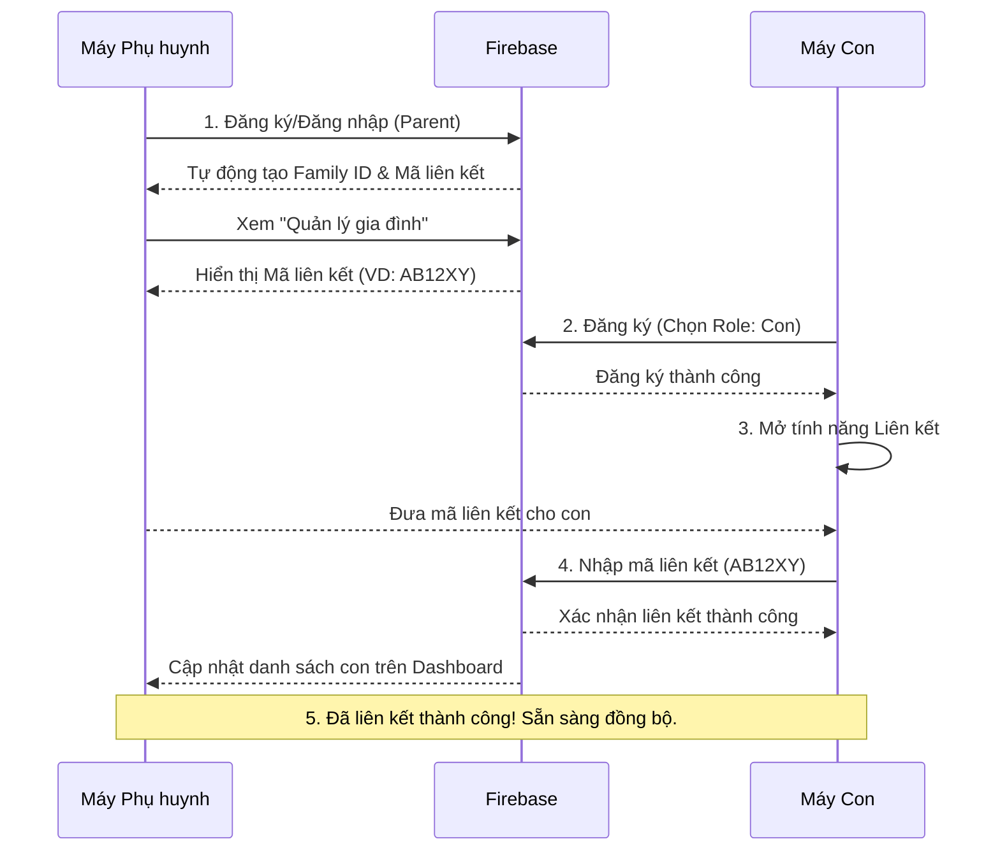

# HƯỚNG DẪN MANUAL TEST - KidGuardIAN

**Ứng dụng:** KidGuardian - Đồng Hành Số  
**Mục đích:** Quản lý thời gian sử dụng mạng xã hội cho trẻ em  
**File APK:** `build/app/outputs/flutter-apk/app-debug.apk`  
**Ngày tạo:** 31/05/2026

---

## MỤC LỤC

1. [Chuẩn bị trước khi test](#1-chuẩn-bị-trước-khi-test)
2. [Test Flow 1: Đăng ký & Đăng nhập](#2-test-flow-1-đăng-ký--đăng-nhập)
3. [Test Flow 2: Quản lý gia đình](#3-test-flow-2-quản-lý-gia-đình)
4. [Test Flow 3: Dashboard](#4-test-flow-3-dashboard)
5. [Test Flow 4: Smart Lock](#5-test-flow-4-smart-lock)
6. [Test Flow 5: Quản lý thời gian](#6-test-flow-5-quản-lý-thời-gian)
7. [Test Flow 6: Báo cáo & Thống kê](#7-test-flow-6-báo-cáo--thống-kê)
8. [Test Flow 7: Thông báo](#8-test-flow-7-thông-báo)
9. [Test Flow 8: Cài đặt](#9-test-flow-8-cài-đặt)
10. [Test Flow 9: Trợ giúp](#10-test-flow-9-trợ-giúp)
11. [Test Flow 10: Tương tác Parent-Child](#11-test-flow-10-tương-tác-parent-child)
12. [Test Flow 11: Khẩn cấp](#12-test-flow-11-khẩn-cấp)
13. [Bug Report Template](#13-bug-report-template)

---

## 1. Chuẩn bị trước khi test

### 1.1 Thiết bị yêu cầu
- [ ] Điện thoại Android 8.0+ (API 26+)
- [ ] Kết nối internet ổn định
- [ ] Ít nhất 2 điện thoại (1 cho Parent, 1 cho Child) hoặc dùng 2 tài khoản trên cùng máy

### 1.2 Cài đặt APK
```
1. Copy file app-debug.apk vào điện thoại
2. Vào Settings > Security > Unknown Sources → Bật
3. Mở file APK → Install
4. Cấp quyền: Notification, Storage
```

### ⚠️ 1.3 Bật Accessibility Service (BẮT BUỘC cho máy Child)

> **Quan trọng:** App dùng Accessibility Service để block app ở mức hardware (FIX C2).
> Nếu không bật, tính năng Smart Lock sẽ KHÔNG hoạt động trên máy Child.

**Cách bật chung (Android Gốc/Pixel):**
1. Vào **Cài đặt (Settings)** > **Trợ năng (Accessibility)**.
2. Tìm **KidGuardian** (hoặc nằm trong mục **Ứng dụng đã tải xuống / Downloaded apps**).
3. Bật ON > Bấm **Cho phép (Allow)**.

**📱 Đối với điện thoại Samsung:**
1. Vào **Cài đặt** > **Hỗ trợ (Accessibility)**.
2. Chọn **Ứng dụng đã cài đặt (Installed apps)**.
3. Tìm **KidGuardian** > Bật công tắc **Tắt (Off)** thành **Bật (On)**.
4. Chọn **Cho phép** khi có cảnh báo.

**📱 Đối với Xiaomi / Redmi / POCO (MIUI/HyperOS):**
1. Vào **Cài đặt** > **Cài đặt bổ sung (Additional settings)**.
2. Chọn **Hỗ trợ tiếp cận (Accessibility)**.
3. Chuyển sang tab **Đã tải xuống (Downloaded apps)**.
4. Chọn **KidGuardian** > Bật **Sử dụng KidGuardian**.
5. *Lưu ý trên Xiaomi:* Sẽ hiện ra màn hình cảnh báo nguy hiểm đếm ngược 10 giây. Bạn cần **Tích vào ô "Tôi nhận thức được..."**, chờ hết 10 giây rồi bấm **OK**.

### 1.4 Tài khoản test (LƯU Ý QUAN TRỌNG)

> **KHUYẾN NGHỊ:** Do ứng dụng vừa được nâng cấp cấu trúc Database trên Cloud (FIX C1, C2, C3), các tài khoản tạo từ trước có thể bị thiếu trường dữ liệu gây lỗi crash app.
> **Hãy đăng ký một cặp tài khoản hoàn toàn mới để test.**

Chuẩn bị 2 email (có thể là email ảo, chưa từng đăng ký app):
- **Email Parent:** `parent_new01@gmail.com`
- **Email Child:** `child_new01@gmail.com`
- **Mật khẩu:** `Test@123456`

### 1.5 Kiến trúc mới cần test đặc biệt (từ 06/06/2026)
| Fix | Mô tả | Section test |
|-----|--------|-------------|
| **FIX C1** | Foreground Service — monitoring không bị kill khi background | [Test Flow 12](#13-test-flow-12-foreground-service-fix-c1) |
| **FIX C2** | Native block app bằng `GLOBAL_ACTION_HOME` (Accessibility) | [Test Flow 13](#14-test-flow-13-native-app-blocking---accessibility-fix-c2) |
| **FIX C3** | Realtime notification cho phụ huynh khi con xin thêm giờ | [Test Flow 14](#15-test-flow-14-realtime-time-request-notification-fix-c3) |

---

## 2. Test Flow 1: Đăng ký & Đăng nhập

### TC-AUTH-001: Mở app lần đầu
| Bước | Hành động | Kết quả mong đợi | Pass/Fail |
|------|-----------|------------------|-----------|
| 1 | Mở app KidGuardian | Hiển thị màn hình Splash/Loading | ☐ |
| 2 | Đợi 2-3 giây | Chuyển đến màn hình Role Selection hoặc Login | ☐ |

### TC-AUTH-002: Chọn vai trò
| Bước | Hành động | Kết quả mong đợi | Pass/Fail |
|------|-----------|------------------|-----------|
| 1 | Xem màn hình chọn vai trò | Hiển thị 2 lựa chọn: Parent và Child | ☐ |
| 2 | Chọn "Phụ huynh" | Chuyển đến màn hình Login | ☐ |
| 3 | Quay lại và chọn "Con" | Chuyển đến màn hình Login/Link Child | ☐ |

### TC-AUTH-003: Đăng ký tài khoản Parent
| Bước | Hành động | Kết quả mong đợi | Pass/Fail |
|------|-----------|------------------|-----------|
| 1 | Nhấn "Đăng ký" | Hiển thị form đăng ký | ☐ |
| 2 | Để trống email → Nhấn đăng ký | Hiển thị lỗi "Email không được để trống" | ☐ |
| 3 | Nhập email sai format (abc) | Hiển thị lỗi "Email không hợp lệ" | ☐ |
| 4 | Nhập email đúng (`parent_test@gmail.com`) | Không lỗi | ☐ |
| 5 | Để trống password | Hiển thị lỗi "Mật khẩu không được để trống" | ☐ |
| 6 | Nhập password < 6 ký tự (123) | Hiển thị lỗi "Mật khẩu phải >= 6 ký tự" | ☐ |
| 7 | Nhập password đúng (`Test@123456`) | Không lỗi | ☐ |
| 8 | Nhập tên hiển thị | Không lỗi | ☐ |
| 9 | Nhấn "Đăng ký" | Hiển thị loading → Thông báo thành công và chuyển về trang Đăng nhập | ☐ |

### TC-AUTH-004: Đăng nhập
| Bước | Hành động | Kết quả mong đợi | Pass/Fail |
|------|-----------|------------------|-----------|
| 1 | Nhập email sai | Hiển thị lỗi "Tài khoản không tồn tại" | ☐ |
| 2 | Nhập email đúng, password sai | Hiển thị lỗi "Mật khẩu không đúng" | ☐ |
| 3 | Nhập đúng email + password | Hiển thị loading → Đăng nhập thành công | ☐ |
| 4 | Kiểm tra đã lưu phiên đăng nhập | Thoát app → Mở lại → Vẫn đăng nhập | ☐ |

### TC-AUTH-005: Quên mật khẩu
| Bước | Hành động | Kết quả mong đợi | Pass/Fail |
|------|-----------|------------------|-----------|
| 1 | Nhấn "Quên mật khẩu?" | Hiển thị dialog nhập email | ☐ |
| 2 | Nhập email không tồn tại | Hiển thị lỗi | ☐ |
| 3 | Nhập email hợp lệ | Hiển thị thông báo "Đã gửi email đặt lại mật khẩu" | ☐ |

### TC-AUTH-006: Đăng xuất
| Bước | Hành động | Kết quả mong đợi | Pass/Fail |
|------|-----------|------------------|-----------|
| 1 | Vào Profile/Settings | Hiển thị nút "Đăng xuất" | ☐ |
| 2 | Nhấn "Đăng xuất" | Hiển thị dialog xác nhận | ☐ |
| 3 | Nhấn "Hủy" | Đóng dialog, vẫn đăng nhập | ☐ |
| 4 | Nhấn "Đăng xuất" lần nữa → Xác nhận | Chuyển về màn hình Login | ☐ |
| 5 | Thoát app → Mở lại | Hiển thị màn hình Login (không tự đăng nhập) | ☐ |

---

## 3. Test Flow 2: Quản lý gia đình

### Sơ đồ luồng Liên kết tài khoản (Workaround Flow)
Để tránh lỗi treo máy khi tạo tài khoản phụ trên một số dòng Android, bạn có thể áp dụng luồng liên kết chủ động từ máy Child như sau:



### TC-FAMILY-001: Khởi tạo gia đình và thêm con (Parent)
| Bước | Hành động | Kết quả mong đợi | Pass/Fail |
|------|-----------|------------------|-----------|
| 1 | Đăng nhập bằng tài khoản Parent | Vào trang chính (Dashboard) | ☐ |
| 2 | Tại màn hình chính nhấn "Thêm con" hoặc vào Cài đặt > "Quản lý gia đình" > "Thêm tài khoản con" | Hiển thị form tạo tài khoản con | ☐ |
| 3 | Nhập tên con | Không lỗi | ☐ |
| 4 | Nhập tuổi (3-18) | Không lỗi | ☐ |
| 5 | Nhập tuổi < 3 hoặc > 18 | Hiển thị lỗi | ☐ |
| 6 | Nhấn "Tạo tài khoản" | Hệ thống tự khởi tạo gia đình (nếu chưa có), tạo thành công tài khoản con và hiển thị mã liên kết | ☐ |

### TC-FAMILY-002: Quản lý mã liên kết
| Bước | Hành động | Kết quả mong đợi | Pass/Fail |
|------|-----------|------------------|-----------|
| 1 | Ở màn hình báo tạo tài khoản con thành công | Hiển thị mã liên kết 6 ký tự | ☐ |
| 2 | Nhấn "Sao chép mã" | Hiển thị thông báo "Đã sao chép mã liên kết" | ☐ |
| 3 | Nhấn "Tạo tài khoản khác" | Trở lại form trống để tạo thêm thành viên | ☐ |

### TC-FAMILY-003: Liên kết Child với Parent
| Bước | Hành động | Kết quả mong đợi | Pass/Fail |
|------|-----------|------------------|-----------|
| 1 | Đăng nhập bằng tài khoản Child | Vào trang chính | ☐ |
| 2 | Nhập mã liên kết từ Parent | Hiển thị thông báo liên kết thành công | ☐ |
| 3 | Kiểm tra Family Management (Parent) | Child xuất hiện trong danh sách | ☐ |

### TC-FAMILY-004: Xóa thành viên khỏi gia đình
| Bước | Hành động | Kết quả mong đợi | Pass/Fail |
|------|-----------|------------------|-----------|
| 1 | Vào Family Management (Parent) | Hiển thị danh sách thành viên | ☐ |
| 2 | Nhấn vào Child → Xóa | Hiển thị dialog xác nhận | ☐ |
| 3 | Xác nhận xóa | Child bị xóa khỏi danh sách | ☐ |

---

## 4. Test Flow 3: Dashboard

### TC-DASH-001: Parent Dashboard
| Bước | Hành động | Kết quả mong đợi | Pass/Fail |
|------|-----------|------------------|-----------|
| 1 | Đăng nhập Parent | Hiển thị Parent Dashboard | ☐ |
| 2 | Xem tổng quan | Hiển thị danh sách con, thời gian sử dụng hôm nay | ☐ |
| 3 | Nhấn vào tên con | Chuyển đến chi tiết sử dụng của con | ☐ |
| 4 | Xem biểu đồ | Hiển thị biểu đồ thời gian sử dụng theo ngày | ☐ |

### TC-DASH-002: Child Dashboard
| Bước | Hành động | Kết quả mong đợi | Pass/Fail |
|------|-----------|------------------|-----------|
| 1 | Đăng nhập Child | Hiển thị Child Dashboard | ☐ |
| 2 | Xem thời gian còn lại | Hiển thị thời gian sử dụng còn lại hôm nay | ☐ |
| 3 | Xem danh sách app | Hiển thị các app đang được giám sát | ☐ |

### TC-DASH-003: Chi tiết sử dụng app
| Bước | Hành động | Kết quả mong đợi | Pass/Fail |
|------|-----------|------------------|-----------|
| 1 | Nhấn vào một app cụ thể | Hiển thị chi tiết thời gian sử dụng | ☐ |
| 2 | Xem biểu đồ theo giờ | Hiển thị biểu đồ sử dụng theo giờ | ☐ |
| 3 | Xem lịch sử | Hiển thị lịch sử sử dụng trong tuần | ☐ |

---

## 5. Test Flow 4: Smart Lock

### TC-LOCK-001: Xem danh sách app bị khóa
| Bước | Hành động | Kết quả mong đợi | Pass/Fail |
|------|-----------|------------------|-----------|
| 1 | Vào Smart Lock > Blocked Apps | Hiển thị danh sách app bị khóa | ☐ |
| 2 | Kiểm tra trạng thái từng app | Hiển thị: Đang khóa / Đang mở | ☐ |
| 3 | Nhấn vào app | Hiển thị chi tiết: thời gian còn lại, giới hạn | ☐ |

### TC-LOCK-002: Chặn app khi hết thời gian
| Bước | Hành động | Kết quả mong đợi | Pass/Fail |
|------|-----------|------------------|-----------|
| 1 | Sử dụng app (VD: Facebook) đến hết thời gian | Hiển thị màn hình khóa | ☐ |
| 2 | Kiểm tra màn hình khóa | Hiển thị: tên app, lý do khóa, thời gian sử dụng | ☐ |
| 3 | Nhấn "Quay về màn hình chính" | Thoát khỏi app bị khóa | ☐ |
| 4 | Nhấn "Xin thêm thời gian" | Gửi yêu cầu đến Parent | ☐ |
| 5 | Nhấn "Liên hệ khẩn cấp" | Hiển thị thông tin liên hệ | ☐ |

### TC-LOCK-003: Xem lịch sử khóa
| Bước | Hành động | Kết quả mong đợi | Pass/Fail |
|------|-----------|------------------|-----------|
| 1 | Vào Smart Lock > Lock History | Hiển thị lịch sử khóa | ☐ |
| 2 | Lọc theo ngày | Hiển thị kết quả theo ngày đã chọn | ☐ |
| 3 | Lọc theo trạng thái | Hiển thị: Tất cả / Đã xem xét / Chưa xem xét | ☐ |
| 4 | Nhấn vào mục lịch sử | Hiển thị chi tiết lần khóa | ☐ |

---

## 6. Test Flow 5: Quản lý thời gian

### TC-TIME-001: Đặt giới hạn thời gian (Parent)
| Bước | Hành động | Kết quả mong đợi | Pass/Fail |
|------|-----------|------------------|-----------|
| 1 | Vào Smart Lock > Time Limit | Hiển thị danh sách app | ☐ |
| 2 | Nhấn vào app (VD: TikTok) | Hiển thị cài đặt thời gian | ☐ |
| 3 | Đặt giới hạn 30 phút/ngày | Lưu thành công | ☐ |
| 4 | Đặt giới hạn 0 phút | Hiển thị lỗi hoặc cảnh báo | ☐ |
| 5 | Đặt giới hạn > 24 giờ | Hiển thị lỗi | ☐ |

### TC-TIME-002: Tạo lịch trình (Schedule)
| Bước | Hành động | Kết quả mong đợi | Pass/Fail |
|------|-----------|------------------|-----------|
| 1 | Vào Smart Lock > Schedule | Hiển thị danh sách lịch trình | ☐ |
| 2 | Nhấn "Tạo lịch trình mới" | Hiển thị form tạo lịch | ☐ |
| 3 | Chọn template "Giờ học" | Điền sẵn thời gian học | ☐ |
| 4 | Chọn template "Giờ ngủ" | Điền sẵn thời gian ngủ | ☐ |
| 5 | Tùy chỉnh: Thứ 2-6, 19:00-21:00 | Không lỗi | ☐ |
| 6 | Chọn ngày trong tuần | Hiển thị chọn T2-CN | ☐ |
| 7 | Lưu lịch trình | Lưu thành công, hiển thị trong danh sách | ☐ |

### TC-TIME-003: Chỉnh sửa lịch trình
| Bước | Hành động | Kết quả mong đợi | Pass/Fail |
|------|-----------|------------------|-----------|
| 1 | Nhấn vào lịch trình đã tạo | Hiển thị form chỉnh sửa | ☐ |
| 2 | Thay đổi thời gian | Không lỗi | ☐ |
| 3 | Lưu thay đổi | Cập nhật thành công | ☐ |

### TC-TIME-004: Xóa lịch trình
| Bước | Hành động | Kết quả mong đợi | Pass/Fail |
|------|-----------|------------------|-----------|
| 1 | Nhấn giữ hoặc vuốt lịch trình | Hiển thị tùy chọn xóa | ☐ |
| 2 | Nhấn "Xóa" | Hiển thị dialog xác nhận | ☐ |
| 3 | Xác nhận | Xóa thành công | ☐ |

---

## 7. Test Flow 6: Báo cáo & Thống kê

### TC-REPORT-001: Xem báo cáo tuần
| Bước | Hành động | Kết quả mong đợi | Pass/Fail |
|------|-----------|------------------|-----------|
| 1 | Vào Report > Weekly Report | Hiển thị báo cáo tuần hiện tại | ☐ |
| 2 | Xem tổng thời gian sử dụng | Hiển thị số giờ/phút | ☐ |
| 3 | Xem biểu đồ theo ngày | Hiển thị 7 cột (T2-CN) | ☐ |
| 4 | Xem top app sử dụng nhiều nhất | Hiển thị danh sách app | ☐ |

### TC-REPORT-002: Xem thống kê sử dụng
| Bước | Hành động | Kết quả mong đợi | Pass/Fail |
|------|-----------|------------------|-----------|
| 1 | Vào Usage Statistics | Hiển thị thống kê tổng quan | ☐ |
| 2 | Chọn khoảng thời gian (7 ngày/30 ngày) | Cập nhật biểu đồ | ☐ |
| 3 | Xem biểu đồ tròn (Pie Chart) | Hiển thị tỷ lệ sử dụng theo app | ☐ |
| 4 | Xem biểu đồ cột (Bar Chart) | Hiển thị sử dụng theo ngày | ☐ |
| 5 | Xem giờ cao điểm | Hiển thị khung giờ sử dụng nhiều nhất | ☐ |

### TC-REPORT-003: Xem tổng hợp hàng ngày
| Bước | Hành động | Kết quả mong đợi | Pass/Fail |
|------|-----------|------------------|-----------|
| 1 | Vào Summary > Daily Summary | Hiển thị tổng hợp hôm nay | ☐ |
| 2 | Xem tổng thời gian | Hiển thị số giờ/phút | ☐ |
| 3 | Xem cảnh báo | Hiển thị các cảnh báo vi phạm (nếu có) | ☐ |

### TC-REPORT-004: Gửi báo cáo qua email
| Bước | Hành động | Kết quả mong đợi | Pass/Fail |
|------|-----------|------------------|-----------|
| 1 | Vào Report > Settings | Hiển thị cài đặt email | ☐ |
| 2 | Bật "Gửi báo cáo qua email" | Toggle ON | ☐ |
| 3 | Nhập email nhận | Không lỗi | ☐ |
| 4 | Nhấn "Gửi ngay" | Hiển thị thông báo gửi thành công | ☐ |

---

## 8. Test Flow 7: Thông báo

### TC-NOTI-001: Xem trung tâm thông báo
| Bước | Hành động | Kết quả mong đợi | Pass/Fail |
|------|-----------|------------------|-----------|
| 1 | Nhấn icon chuông | Hiển thị Notification Center | ☐ |
| 2 | Xem danh sách thông báo | Hiển thị theo thời gian mới nhất | ☐ |
| 3 | Nhấn vào thông báo | Chuyển đến nội dung chi tiết | ☐ |
| 4 | Nhấn "Đánh dấu đã đọc" | Thông báo chuyển trạng thái đã đọc | ☐ |

### TC-NOTI-002: Đánh dấu tất cả đã đọc
| Bước | Hành động | Kết quả mong đợi | Pass/Fail |
|------|-----------|------------------|-----------|
| 1 | Vào Notification Center | Hiển thị thông báo chưa đọc | ☐ |
| 2 | Nhấn "Đánh dấu tất cả đã đọc" | Tất cả thông báo chuyển trạng thái đã đọc | ☐ |
| 3 | Kiểm tra badge icon | Badge biến mất hoặc hiển thị 0 | ☐ |

### TC-NOTI-003: Xem lịch sử thông báo
| Bước | Hành động | Kết quả mong đợi | Pass/Fail |
|------|-----------|------------------|-----------|
| 1 | Vào Notification History | Hiển thị tất cả thông báo | ☐ |
| 2 | Lọc theo trạng thái (Đã đọc/Chưa đọc) | Hiển thị kết quả lọc | ☐ |
| 3 | Xóa thông báo cũ | Xóa thành công | ☐ |

---

## 9. Test Flow 8: Cài đặt

### TC-SET-001: Cài đặt chung
| Bước | Hành động | Kết quả mong đợi | Pass/Fail |
|------|-----------|------------------|-----------|
| 1 | Vào Settings | Hiển thị trang cài đặt | ☐ |
| 2 | Đổi theme (Sáng/Tối/System) | Giao diện thay đổi theo | ☐ |
| 3 | Đổi ngôn ngữ | Ngôn ngữ thay đổi | ☐ |

### TC-SET-002: Cài đặt thông báo
| Bước | Hành động | Kết quả mong đợi | Pass/Fail |
|------|-----------|------------------|-----------|
| 1 | Vào Settings > Notifications | Hiển thị cài đặt thông báo | ☐ |
| 2 | Bật/Tắt thông báo | Toggle hoạt động | ☐ |
| 3 | Bật/Tắt âm thanh cảnh báo | Toggle hoạt động | ☐ |

### TC-SET-003: Cài đặt Smart Lock
| Bước | Hành động | Kết quả mong đợi | Pass/Fail |
|------|-----------|------------------|-----------|
| 1 | Vào Smart Lock Settings | Hiển thị cài đặt Smart Lock | ☐ |
| 2 | Bật/Tắt Smart Lock | Toggle hoạt động | ☐ |
| 3 | Đặt thời gian mặc định | Lưu thành công | ☐ |
| 4 | Xem trạng thái bật/tắt | Hiển thị đúng trạng thái | ☐ |

---

## 10. Test Flow 9: Trợ giúp

### TC-HELP-001: Xem FAQ
| Bước | Hành động | Kết quả mong đợi | Pass/Fail |
|------|-----------|------------------|-----------|
| 1 | Vào Help > FAQ | Hiển thị danh sách câu hỏi | ☐ |
| 2 | Nhấn vào câu hỏi | Mở rộng hiển thị câu trả lời | ☐ |
| 3 | Nhấn lại | Thu gọn câu trả lời | ☐ |
| 4 | Lọc theo danh mục | Hiển thị FAQ theo danh mục | ☐ |

### TC-HELP-002: Gửi hỗ trợ
| Bước | Hành động | Kết quả mong đợi | Pass/Fail |
|------|-----------|------------------|-----------|
| 1 | Vào Help > Contact Support | Hiển thị form liên hệ | ☐ |
| 2 | Nhập nội dung hỗ trợ | Không lỗi | ☐ |
| 3 | Nhấn "Gửi" | Hiển thị thông báo gửi thành công | ☐ |

### TC-HELP-003: Xem thông tin app
| Bước | Hành động | Kết quả mong đợi | Pass/Fail |
|------|-----------|------------------|-----------|
| 1 | Vào Help > App Info | Hiển thị thông tin app | ☐ |
| 2 | Kiểm tra phiên bản | Hiển thị version đúng | ☐ |
| 3 | Xem tài liệu pháp lý | Hiển thị điều khoản sử dụng | ☐ |

---

## 11. Test Flow 10: Tương tác Parent-Child

### TC-INT-001: Yêu cầu thêm thời gian (Child → Parent)
| Bước | Hành động | Kết quả mong đợi | Pass/Fail |
|------|-----------|------------------|-----------|
| 1 | Đăng nhập Child | Vào trang chính | ☐ |
| 2 | Nhấn "Xin thêm thời gian" | Hiển thị form yêu cầu | ☐ |
| 3 | Chọn app muốn thêm thời gian | Hiển thị danh sách app | ☐ |
| 4 | Nhập lý do | Không lỗi | ☐ |
| 5 | Nhập thời gian xin thêm (phút) | Không lỗi | ☐ |
| 6 | Nhấn "Gửi yêu cầu" | Hiển thị thông báo gửi thành công | ☐ |

### TC-INT-002: Duyệt yêu cầu (Parent)
| Bước | Hành động | Kết quả mong đợi | Pass/Fail |
|------|-----------|------------------|-----------|
| 1 | Đăng nhập Parent | Vào trang chính | ☐ |
| 2 | Nhận thông báo yêu cầu mới | Hiển thị badge/notification | ☐ |
| 3 | Vào Interaction > Request History | Hiển thị danh sách yêu cầu | ☐ |
| 4 | Nhấn vào yêu cầu | Hiển thị chi tiết: Child, app, lý do, thời gian | ☐ |
| 5 | Nhấn "Duyệt" | Yêu cầu được duyệt, Child nhận thông báo | ☐ |
| 6 | Nhấn "Từ chối" | Yêu cầu bị từ chối, Child nhận thông báo | ☐ |

### TC-INT-003: Xem lịch sử yêu cầu
| Bước | Hành động | Kết quả mong đợi | Pass/Fail |
|------|-----------|------------------|-----------|
| 1 | Vào Interaction > Request History | Hiển thị tất cả yêu cầu | ☐ |
| 2 | Lọc theo trạng thái | Hiển thị: Chờ duyệt / Đã duyệt / Đã từ chối | ☐ |
| 3 | Xem chi tiết yêu cầu | Hiển thị đầy đủ thông tin | ☐ |

---

## 12. Test Flow 11: Khẩn cấp

### TC-EMER-001: Kích hoạt chế độ khẩn cấp (Child)
| Bước | Hành động | Kết quả mong đợi | Pass/Fail |
|------|-----------|------------------|-----------|
| 1 | Ở màn hình khóa → Nhấn "Liên hệ khẩn cấp" | Hiển thị thông tin liên hệ | ☐ |
| 2 | Nhấn "Gọi khẩn cấp" | Thực hiện cuộc gọi | ☐ |
| 3 | Kiểm tra Emergency Access | Hiển thị trạng thái kích hoạt | ☐ |

### TC-EMER-002: Cài đặt số khẩn cấp (Parent)
| Bước | Hành động | Kết quả mong đợi | Pass/Fail |
|------|-----------|------------------|-----------|
| 1 | Vào Emergency Access Settings | Hiển thị cài đặt | ☐ |
| 2 | Nhập số điện thoại khẩn cấp | Không lỗi | ☐ |
| 3 | Lưu | Lưu thành công | ☐ |

### TC-EMER-003: Xem lịch sử khẩn cấp
| Bước | Hành động | Kết quả mong đợi | Pass/Fail |
|------|-----------|------------------|-----------|
| 1 | Vào Emergency Access > History | Hiển thị lịch sử kích hoạt | ☐ |
| 2 | Xem chi tiết lần kích hoạt | Hiển thị: thời gian, lý do, thời lượng | ☐ |

---

## 13. [MỚI] Test Flow 12: Foreground Service (FIX C1)

> **Mục tiêu:** Xác nhận monitoring service chạy liên tục ngay cả khi app bị đưa ra background / bị swipe.

### TC-C1-001: Service khởi động khi mở app
| Bước | Hành động | Kết quả mong đợi | Pass/Fail |
|------|-----------|------------------|-----------| 
| 1 | Mở app KidGuardian (tài khoản Child) | App khởi động | ☐ |
| 2 | Kéo notification bar xuống | Hiển thị thông báo **"KidGuardian đang giám sát"** (persistent) | ☐ |
| 3 | Kiểm tra thông báo | Có icon app, không thể dismiss (swipe away) | ☐ |

### TC-C1-002: Service sống sót khi swipe app
| Bước | Hành động | Kết quả mong đợi | Pass/Fail |
|------|-----------|------------------|-----------| 
| 1 | Mở app Child → App đang chạy bình thường | Thấy notification "đang giám sát" | ☐ |
| 2 | Swipe app ra khỏi Recent Apps (kill app) | — | ☐ |
| 3 | Kéo notification bar xuống | Vẫn còn thông báo "KidGuardian đang giám sát" | ☐ |
| 4 | Mở TikTok/YouTube và dùng ~1 phút | — | ☐ |
| 5 | Mở lại app KidGuardian | Thời gian sử dụng đã được ghi nhận | ☐ |

### TC-C1-003: Service tự khởi động lại sau khi bị kill bởi hệ thống
| Bước | Hành động | Kết quả mong đợi | Pass/Fail |
|------|-----------|------------------|-----------| 
| 1 | Vào Settings > Apps > KidGuardian > Force Stop | App bị kill hoàn toàn | ☐ |
| 2 | Đợi 30 giây | Service tự restart (START_STICKY) | ☐ |
| 3 | Kéo notification bar | Thông báo giám sát xuất hiện lại | ☐ |

---

## 14. [MỚI] Test Flow 13: Native App Blocking - Accessibility (FIX C2)

> **Mục tiêu:** Xác nhận app bị chặn ở mức hardware bằng `GLOBAL_ACTION_HOME` thay vì `moveTaskToBack` cũ (vốn không hiệu quả).
>
> **Điều kiện bắt buộc:** Đã bật Accessibility Service (xem mục 1.3)

### TC-C2-001: Xác nhận Accessibility Service đang bật
| Bước | Hành động | Kết quả mong đợi | Pass/Fail |
|------|-----------|------------------|-----------| 
| 1 | Vào KidGuardian > Smart Lock > Settings | Hiển thị cài đặt Smart Lock | ☐ |
| 2 | Kiểm tra trạng thái Accessibility | Hiển thị "✅ Accessibility Service: Đã bật" | ☐ |
| 3 | Nếu chưa bật, nhấn "Bật Accessibility" | Chuyển đến màn hình Accessibility của hệ thống | ☐ |

### TC-C2-002: App bị block → Văng về màn hình Home (không phải về Recent Apps)
| Bước | Hành động | Kết quả mong đợi | Pass/Fail |
|------|-----------|------------------|-----------| 
| 1 | Đặt giới hạn TikTok = 1 phút (để test nhanh) | Lưu thành công | ☐ |
| 2 | Mở TikTok trên máy Child, dùng đủ 1 phút | — | ☐ |
| 3 | Quan sát khi hết thời gian | Màn hình **tức thời trở về Home** (không phải Recent Apps, không phải Lock Screen của app) | ☐ |
| 4 | Thử mở lại TikTok | Lại bị văng về Home ngay lập tức | ☐ |
| 5 | Kiểm tra app KidGuardian | Màn hình "Ứng dụng đã bị khóa" của KidGuardian hiển thị | ☐ |

### TC-C2-003: Block app hoạt động ngay cả khi app KidGuardian bị swipe (C1+C2 phối hợp)
| Bước | Hành động | Kết quả mong đợi | Pass/Fail |
|------|-----------|------------------|-----------| 
| 1 | Swipe KidGuardian ra khỏi Recent Apps | App bị kill nhưng Foreground Service vẫn chạy | ☐ |
| 2 | Mở TikTok, đợi hết giới hạn thời gian | — | ☐ |
| 3 | Quan sát | TikTok vẫn bị văng về Home (Accessibility Service vẫn hoạt động) | ☐ |

### TC-C2-004: Kiểm tra danh sách app bị block được cập nhật realtime
| Bước | Hành động | Kết quả mong đợi | Pass/Fail |
|------|-----------|------------------|-----------| 
| 1 | Phụ huynh thêm Instagram vào danh sách block | Lưu thành công | ☐ |
| 2 | Trên máy Child, mở Instagram ngay | Bị văng về Home trong vòng 2 giây | ☐ |
| 3 | Phụ huynh bỏ block Instagram | — | ☐ |
| 4 | Mở Instagram lại | Vào được bình thường | ☐ |

---

## 15. [MỚI] Test Flow 14: Realtime Time Request Notification (FIX C3)

> **Mục tiêu:** Xác nhận phụ huynh nhận notification **realtime** (không cần refresh) khi con gửi yêu cầu xin thêm thời gian. Dùng Firestore stream listener.

### TC-C3-001: Child gửi yêu cầu → Parent nhận notification ngay
| Bước | Hành động | Kết quả mong đợi | Pass/Fail |
|------|-----------|------------------|-----------| 
| 1 | Máy Parent: đăng nhập, app đang mở | Parent Dashboard hiển thị | ☐ |
| 2 | Máy Child: nhấn "Xin thêm thời gian" cho TikTok | Form hiển thị | ☐ |
| 3 | Máy Child: nhập 15 phút, lý do "Con cần thêm giờ", nhấn Gửi | Thành công | ☐ |
| 4 | Máy Parent: **trong vòng 5 giây** | Nhận notification: "📱 Con xin thêm thời gian — TikTok: xin thêm 15 phút" | ☐ |
| 5 | Máy Parent: nhấn vào notification | Mở thẳng màn hình xem yêu cầu | ☐ |

### TC-C3-002: Child gửi yêu cầu khi Parent đang ở background
| Bước | Hành động | Kết quả mong đợi | Pass/Fail |
|------|-----------|------------------|-----------| 
| 1 | Máy Parent: swipe app về background | App chạy ngầm | ☐ |
| 2 | Máy Child: gửi yêu cầu xin thêm 30 phút | — | ☐ |
| 3 | Máy Parent: kéo notification bar | Thấy notification từ KidGuardian trong vòng 5 giây | ☐ |

### TC-C3-003: Deduplication — cùng yêu cầu không gửi notification 2 lần
| Bước | Hành động | Kết quả mong đợi | Pass/Fail |
|------|-----------|------------------|-----------| 
| 1 | Child gửi yêu cầu 1 lần | Parent nhận 1 notification | ☐ |
| 2 | Kiểm tra Parent có nhận 2 notification cho cùng yêu cầu không | **Chỉ nhận đúng 1 notification** (không duplicate) | ☐ |

### TC-C3-004: Parent duyệt nhanh từ notification
| Bước | Hành động | Kết quả mong đợi | Pass/Fail |
|------|-----------|------------------|-----------| 
| 1 | Parent nhận notification time request | — | ☐ |
| 2 | Nhấn action "✅ Duyệt" trực tiếp trên notification (nếu có) | Yêu cầu được duyệt không cần mở app | ☐ |
| 3 | Máy Child: kiểm tra trạng thái yêu cầu | Hiển thị "✅ Đã được duyệt — +15 phút" trong vòng 5 giây | ☐ |

### TC-C3-005: TimeRequestStatusScreen realtime update (FIX H1)
| Bước | Hành động | Kết quả mong đợi | Pass/Fail |
|------|-----------|------------------|-----------| 
| 1 | Child mở màn hình "Trạng thái yêu cầu" | Hiển thị danh sách yêu cầu đang chờ | ☐ |
| 2 | **Không refresh, không thoát màn hình** | — | ☐ |
| 3 | Parent duyệt yêu cầu từ máy Parent | — | ☐ |
| 4 | Màn hình Child **tự động cập nhật** | Trạng thái chuyển từ "⏳ Chờ duyệt" → "✅ Đã duyệt" (realtime, không cần refresh) | ☐ |

---

## 16. Bug Report Template

Khi phát hiện bug, ghi lại theo format sau:

```markdown
## BUG REPORT

**Tiêu đề:** [Mô tả ngắn gọn bug]

**Mức độ:** [Critical / High / Medium / Low]

**Thiết bị:** [Tên điện thoại, Android version]

**Steps to reproduce:**
1. Bước 1
2. Bước 2
3. Bước 3

**Kết quả thực tế:** [Mô tả những gì xảy ra]

**Kết quả mong đợi:** [Mô tả những gì nên xảy ra]

**Screenshot/Video:** [Đính kèm nếu có]

**Ghi chú:** [Thông tin thêm]
```

---

## CHECKLIST TỔNG HỢP

### Auth & Account
- [ ] Đăng ký Parent
- [ ] Đăng ký Child
- [ ] Đăng nhập
- [ ] Đăng xuất
- [ ] Quên mật khẩu
- [ ] Chọn vai trò

### Family
- [ ] Tạo gia đình
- [ ] Thêm thành viên
- [ ] Liên kết Parent-Child
- [ ] Xóa thành viên

### Dashboard
- [ ] Parent Dashboard
- [ ] Child Dashboard
- [ ] Chi tiết sử dụng

### Smart Lock
- [ ] Xem danh sách khóa
- [ ] Chặn app khi hết thời gian
- [ ] Màn hình khóa
- [ ] Lịch sử khóa

### Time Management
- [ ] Đặt giới hạn thời gian
- [ ] Tạo lịch trình
- [ ] Chỉnh sửa lịch trình
- [ ] Xóa lịch trình
- [ ] Template giờ học/ngủ

### Reports & Statistics
- [ ] Báo cáo tuần
- [ ] Thống kê sử dụng
- [ ] Tổng hợp hàng ngày
- [ ] Gửi báo cáo email

### Notifications
- [ ] Trung tâm thông báo
- [ ] Đánh dấu đã đọc
- [ ] Lịch sử thông báo

### Settings
- [ ] Theme (Sáng/Tối)
- [ ] Ngôn ngữ
- [ ] Cài đặt thông báo
- [ ] Cài đặt Smart Lock

### Help
- [ ] FAQ
- [ ] Gửi hỗ trợ
- [ ] Thông tin app

### Interaction
- [ ] Yêu cầu thêm thời gian
- [ ] Duyệt/Từ chối yêu cầu
- [ ] Lịch sử yêu cầu

### Emergency
- [ ] Kích hoạt khẩn cấp
- [ ] Cài đặt số khẩn cấp
- [ ] Lịch sử khẩn cấp

### ⭐ [MỚI] FIX C1 — Foreground Service
- [ ] TC-C1-001: Service notification hiển thị khi mở app
- [ ] TC-C1-002: Service sống sót sau khi swipe app
- [ ] TC-C1-003: Service tự restart sau Force Stop

### ⭐ [MỚI] FIX C2 — Native App Blocking (Accessibility)
- [ ] TC-C2-001: Accessibility Service đang bật
- [ ] TC-C2-002: App bị block → văng về Home ngay lập tức
- [ ] TC-C2-003: Block hoạt động kể cả khi KidGuardian bị swipe
- [ ] TC-C2-004: Danh sách block cập nhật realtime

### ⭐ [MỚI] FIX C3 — Realtime Notification
- [ ] TC-C3-001: Parent nhận notification trong 5 giây
- [ ] TC-C3-002: Notification khi Parent đang background
- [ ] TC-C3-003: Không duplicate notification
- [ ] TC-C3-004: Duyệt nhanh từ notification
- [ ] TC-C3-005: TimeRequestStatusScreen tự cập nhật (realtime)

---

**Ghi chú cuối:**
- Test trên cả WiFi và 4G
- Test khi app chạy ngầm
- Test khi có cuộc gọi đến
- Test khi mất kết nối internet
- Test xoay màn hình (nếu có landscape mode)
- **[MỚI]** Test với Accessibility Service TẮT → Smart Lock KHÔNG hoạt động (expected)
- **[MỚI]** Test với Low RAM device để xác nhận Foreground Service không bị kill

---

*Cập nhật: 06/06/2026 — FIX C1 (Foreground Service) + C2 (Native Block) + C3 (Realtime Notification)*
