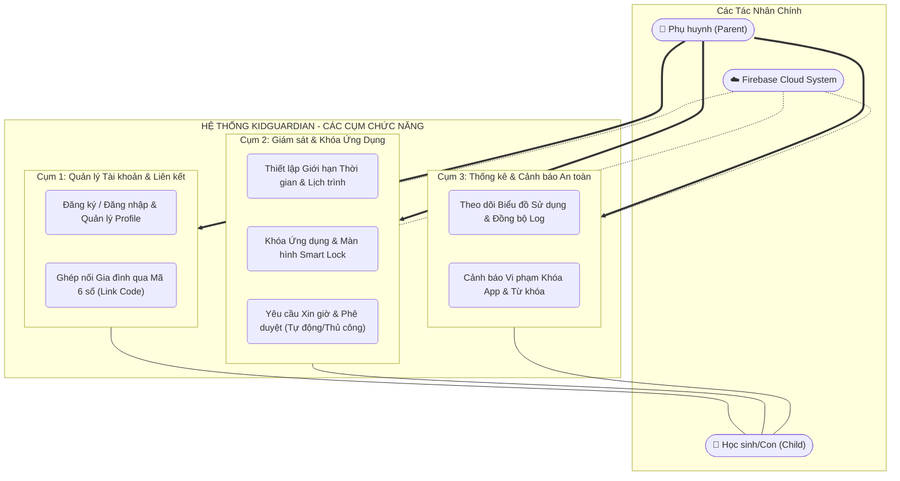
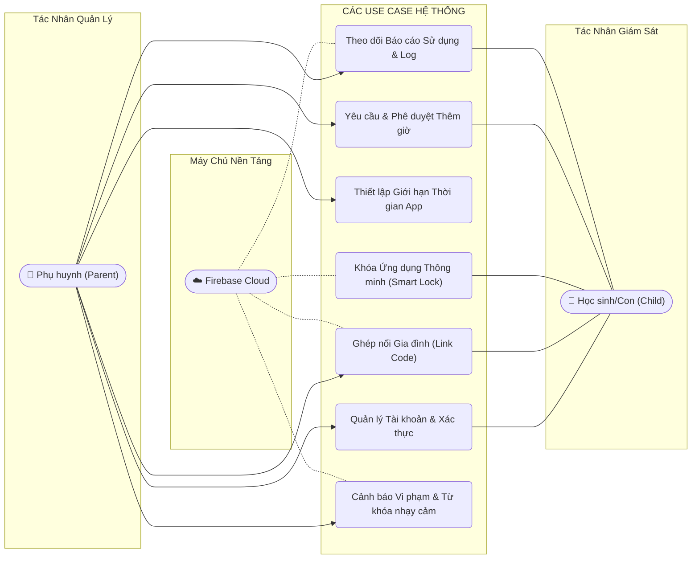
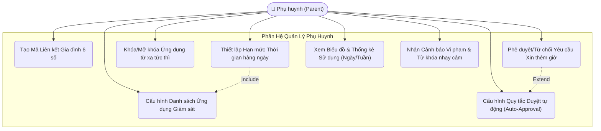
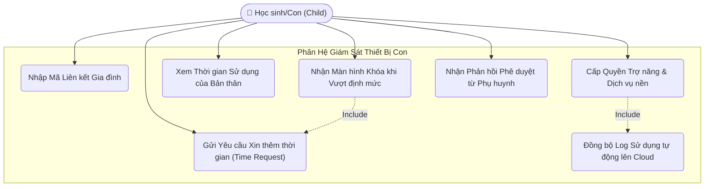
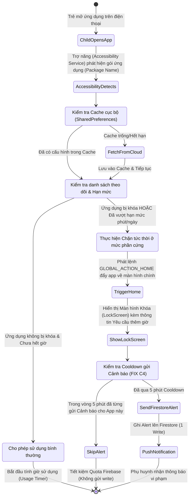
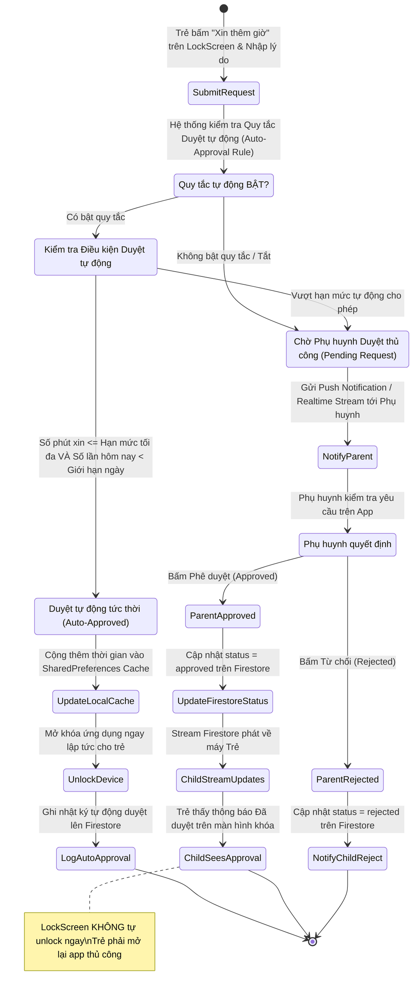
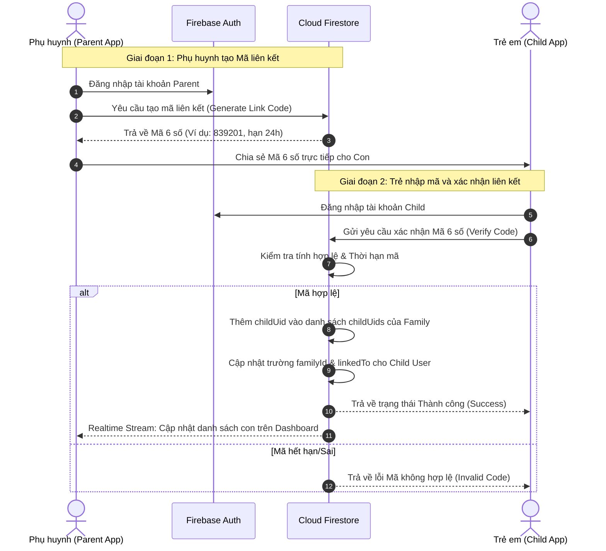
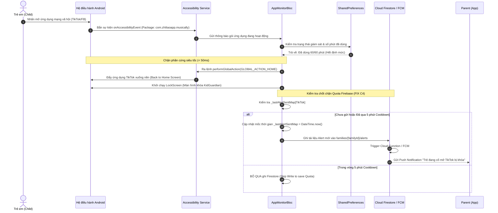

# BỘ BIỂU ĐỒ KỸ THUẬT PHẦN MỀM - KIDGUARDIAN (ĐỒNG HÀNH SỐ)

Tài liệu này tổng hợp đầy đủ các **Biểu đồ kiến trúc & UML (Use Case, Activity, Sequence, Database ERD)** bằng cú pháp chuẩn **Mermaid**, phục vụ cho báo cáo kỹ thuật, đồ án tốt nghiệp và tài liệu thiết kế hệ thống KidGuardian.

---

## 📋 MỤC LỤC
1. [Biểu đồ Use Case Tổng quát (General Use Case Diagram)](#1-biểu-đồ-use-case-tổng-quát)
2. [Biểu đồ Use Case Phân rã (Decomposed Use Case Diagrams)](#2-biểu-đồ-use-case-phân-rã)
   - [2.1 Phân rã Phân hệ Phụ huynh (Parent Subsystem)](#21-phân-rã-phân-hệ-phụ-huynh-parent-subsystem)
   - [2.2 Phân rã Phân hệ Học sinh/Con (Child Subsystem)](#22-phân-rã-phân-hệ-học-sinhcon-child-subsystem)
3. [Biểu đồ Hoạt động (Activity Diagrams)](#3-biểu-đồ-hoạt-động-activity-diagrams)
   - [3.1 Luồng Giám sát & Chặn ứng dụng thông minh (Smart Lock Activity Flow)](#31-luồng-giám-sát--chặn-ứng-dụng-thông-minh-smart-lock-activity-flow)
   - [3.2 Luồng Xin thêm giờ & Duyệt tự động (Time Request & Auto-Approval Flow)](#32-luồng-xin-thêm-giờ--duyệt-tự-động-time-request--auto-approval-flow)
4. [Biểu đồ Tuần tự (Sequence Diagrams)](#4-biểu-đồ-tuần-tự-sequence-diagrams)
   - [4.1 Luồng Ghép nối Gia đình qua Mã 6 số (Family Linking Sequence)](#41-luồng-ghép-nối-gia-đình-qua-mã-6-số-family-linking-sequence)
   - [4.2 Luồng Chặn ứng dụng phần cứng & Bảo vệ Quota (Hardware Interception & Quota Protection)](#42-luồng-chặn-ứng-dụng-phần-cứng--bảo-vệ-quota-hardware-interception--quota-protection)
5. [Biểu đồ Cơ sở dữ liệu (Database Schema / Entity-Relationship Diagram ERD)](#5-biểu-đồ-cơ-sở-dữ-liệu-database-schema--entity-relationship-diagram-erd)

---

## 1. BIỂU ĐỒ USE CASE TỔNG QUÁT

Để tránh hiện tượng các đường nối bị đan chéo nhau khó nhìn, biểu đồ Use Case tổng quát được trình bày theo **2 bố cục tối ưu (Clean Layouts)**: Bố cục Phân cụm Chức năng (Functional Clusters) và Bố cục Đối xứng Trái-Phải (Zero-Crossing Symmetrical Layout).

### 1.1 Bố cục Phân cụm Chức năng (Functional Clusters Layout)
Mô hình hóa các Use Case thành 3 cụm nghiệp vụ cốt lõi (`1. Xác thực & Liên kết`, `2. Giám sát & Khóa thông minh`, `3. Báo cáo & Cảnh báo`), giúp đường nối trực quan, mạch lạc và không bị chồng chéo.

### 1.2 Bố cục Đối xứng Trái - Phải (Zero-Crossing Symmetrical Layout)
Bố cục tách biệt Phụ huynh ở bên **Trái (Left)** và Học sinh ở bên **Phải (Right)**, kết nối ngang vào từng Use Case tương ứng ở giữa, đảm bảo **100% không có bất kỳ đường dây nào bị đan chéo (Zero Criss-Cross)**.

---

## 2. BIỂU ĐỒ USE CASE PHÂN RÃ

### 2.1 Phân rã Phân hệ Phụ huynh (Parent Subsystem)
Phụ huynh đóng vai trò quản trị viên gia đình, có đầy đủ quyền kiểm soát, cấu hình quy tắc và theo dõi báo cáo.

### 2.2 Phân rã Phân hệ Học sinh/Con (Child Subsystem)
Học sinh/Con sử dụng thiết bị dưới sự giám sát ngầm của Trợ năng (Accessibility) và Dịch vụ nền (Foreground Service), đảm bảo an toàn số và tuân thủ quy tắc gia đình.

---

## 3. BIỂU ĐỒ HOẠT ĐỘNG (ACTIVITY DIAGRAMS)

### 3.1 Luồng Giám sát & Chặn ứng dụng thông minh (Smart Lock Activity Flow)
Biểu đồ mô tả chi tiết logic xử lý tức thời ở mức phần cứng khi trẻ mở một ứng dụng mạng xã hội (TikTok, Facebook...), kết hợp cơ chế bộ nhớ đệm `SharedPreferences` và chống spam `Cooldown 5 phút`.

### 3.2 Luồng Xin thêm giờ & Duyệt tự động (Time Request & Auto-Approval Flow)
Biểu đồ mô tả quy trình xử lý thông minh khi trẻ gửi yêu cầu xin thêm giờ từ màn hình bị khóa.

---

## 4. BIỂU ĐỒ TUẦN TỰ (SEQUENCE DIAGRAMS)

### 4.1 Luồng Ghép nối Gia đình qua Mã 6 số (Family Linking Sequence)

### 4.2 Luồng Chặn ứng dụng phần cứng & Bảo vệ Quota (Hardware Interception & Quota Protection)

---

## 5. BIỂU ĐỒ CƠ SỞ DỮ LIỆU (DATABASE SCHEMA / ERD DIAGRAM)

Biểu đồ ERD thể hiện chi tiết cấu trúc các Thực thể (Entities) và mối quan hệ phân tầng bên trong **Cloud Firestore NoSQL Database** của KidGuardian.

```mermaid
erDiagram
    USER ||--o| FAMILY : "quản lý / thuộc về"
    FAMILY ||--|{ LINK_CODE : "sinh mã liên kết"
    FAMILY ||--|{ MONITORED_APP : "thiết lập giám sát cho con"
    FAMILY ||--|{ TIME_REQUEST : "nhận yêu cầu xin giờ"
    FAMILY ||--|{ ALERT : "lưu trữ cảnh báo vi phạm"
    FAMILY ||--|| AUTO_APPROVAL_RULE : "cấu hình quy tắc tự động duyệt"
    USER ||--|{ USAGE_LOG : "ghi nhận thời gian sử dụng"
    USER ||--|{ DAILY_SUMMARY : "tổng hợp báo cáo ngày"
    USER ||--|{ NOTIFICATION : "nhận thông báo cá nhân"

    USER {
        string uid PK "ID duy nhất từ Firebase Auth"
        string email "Email đăng nhập"
        string displayName "Tên hiển thị"
        string role "parent hoặc child"
        string familyId FK "ID của gia đình liên kết"
        string linkedTo "ID tài khoản đối tác liên kết"
        string fcmToken "Token FCM cho Push Notification"
        timestamp fcmTokenUpdatedAt "Thời gian cập nhật FCM token"
        timestamp createdAt "Thời gian tạo"
    }

    FAMILY {
        string familyId PK "ID duy nhất của gia đình"
        string parentUid FK "ID của phụ huynh chủ hộ"
        array childUids "Danh sách ID các con trong nhà"
        string linkingCode "Mã liên kết hiện tại"
        timestamp createdAt "Thời gian tạo gia đình"
        timestamp updatedAt "Thời gian cập nhật cuối"
    }

    LINK_CODE {
        string code PK "Mã 6 chữ số (Ví dụ: 839201)"
        string familyId FK "ID gia đình sinh mã"
        timestamp expiresAt "Thời điểm hết hạn (24h)"
    }

    MONITORED_APP {
        string appPackageName PK "Tên gói ứng dụng (packageName làm key)"
        string appName "Tên hiển thị ứng dụng"
        string iconUrl "URL icon ứng dụng (optional)"
        boolean isMonitored "Trạng thái bật/tắt theo dõi"
    }

    APP_TIME_LIMIT {
        string appPackageName PK "Tên gói ứng dụng (packageName làm key)"
        map limits "Hạn mức phân theo ngày (monday: 60, everyday: 90...)"
    }

    USAGE_LOG {
        string logId PK "ID nhật ký sử dụng"
        string childUid FK "ID của trẻ sử dụng"
        string packageName "Tên gói ứng dụng"
        timestamp startTime "Thời điểm bắt đầu dùng"
        int durationMinutes "Số phút sử dụng trong phiên"
    }

    DAILY_SUMMARY {
        string summaryId PK "ID báo cáo ngày (YYYY-MM-DD)"
        string childUid FK "ID của trẻ"
        string date "Ngày báo cáo"
        int totalMinutes "Tổng số phút đã dùng toàn app"
        map appUsage "Danh sách phút dùng theo từng app"
        boolean exceeded "Đã vượt hạn mức ngày hay chưa"
    }

    TIME_REQUEST {
        string requestId PK "ID yêu cầu xin giờ"
        string familyId FK "ID gia đình"
        string childUid FK "ID của trẻ xin giờ"
        string packageName "Gói ứng dụng cần xin"
        int requestedMinutes "Số phút muốn xin thêm"
        string status "pending, approved, hoặc rejected"
        string reason "Lý do xin giờ của trẻ"
        timestamp timestamp "Thời điểm gửi yêu cầu"
    }

    ALERT {
        string alertId PK "ID cảnh báo vi phạm"
        string familyId FK "ID gia đình nhận cảnh báo"
        string childUid FK "ID của trẻ vi phạm"
        string appPackageName "Ứng dụng vi phạm"
        string type "app_blocked hoặc sensitive_keyword"
        timestamp timestamp "Thời điểm vi phạm (đã lọc Cooldown 5p)"
    }

    AUTO_APPROVAL_RULE {
        string ruleId PK "ID cấu hình quy tắc"
        string familyId FK "ID gia đình"
        boolean isEnabled "Trạng thái bật/tắt tự động duyệt"
        int maxAutoApproveMinutes "Số phút tối đa cho phép tự duyệt"
        int dailyAutoApproveLimit "Số lần tối đa tự duyệt trong ngày"
        map appSpecificRules "Danh sách app được áp dụng tự duyệt"
    }

    NOTIFICATION {
        string notificationId PK "ID thông báo đẩy"
        string familyId FK "ID gia đình"
        string childUid FK "ID người nhận"
        string title "Tiêu đề thông báo"
        string body "Nội dung chi tiết"
        boolean isRead "Đã đọc hay chưa"
        timestamp timestamp "Thời điểm gửi"
    }
```

---
*Tài liệu được thiết kế đạt tiêu chuẩn chất lượng đồ án phần mềm kỹ thuật, thể hiện rõ tính nguyên bản và độ vững chắc của kiến trúc hệ thống KidGuardian.*
