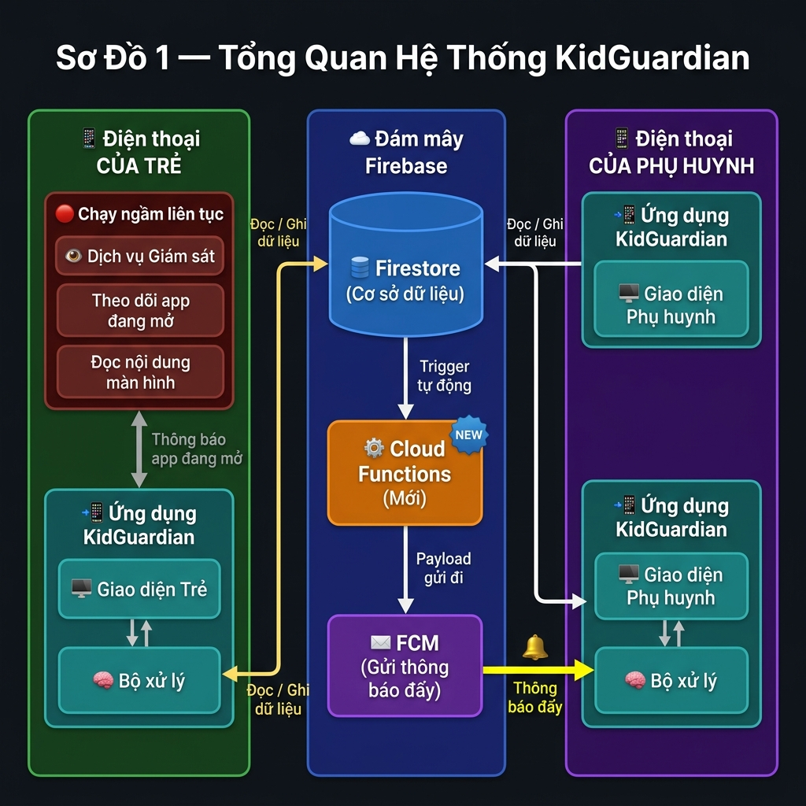
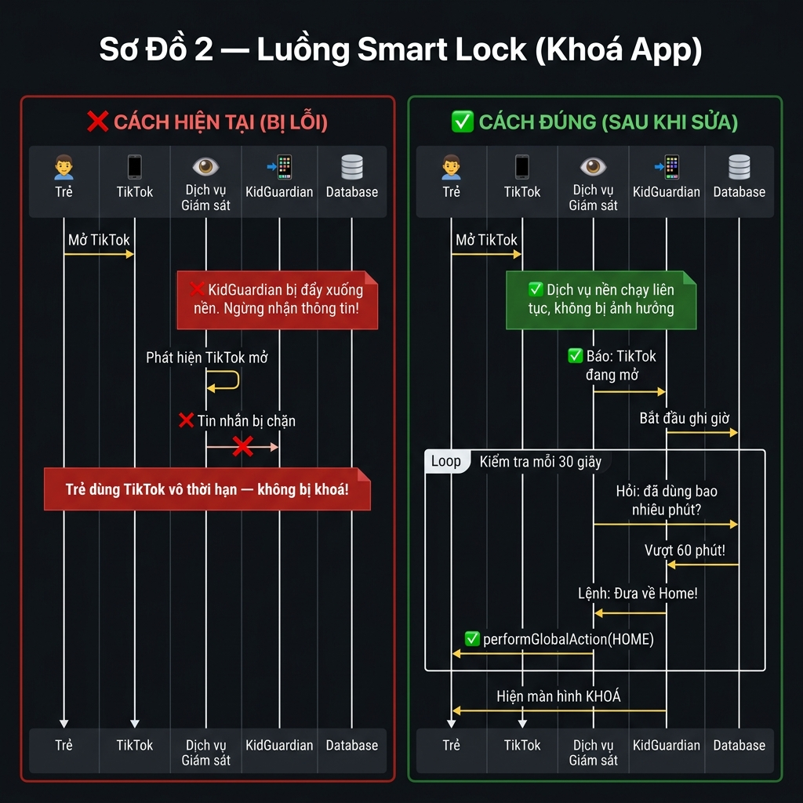
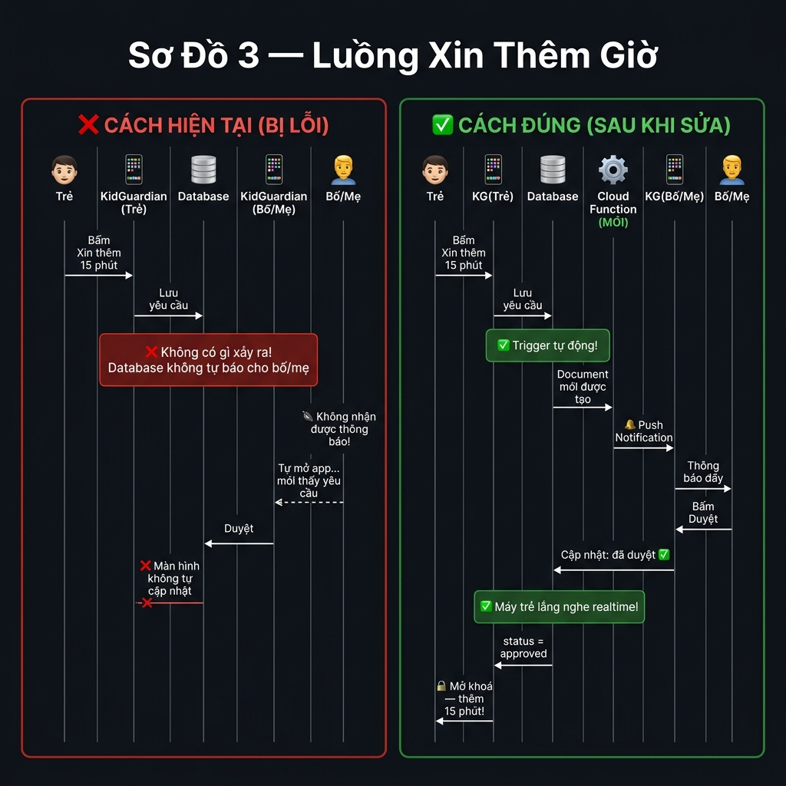
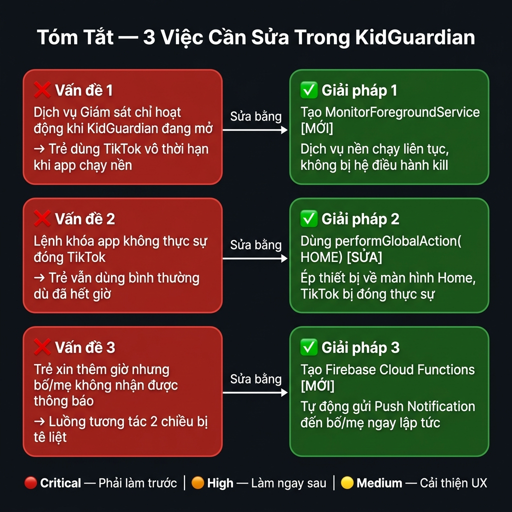

# Kiến Trúc Kỹ Thuật — KidGuardian Đồng Hành Số

**Phiên bản:** 2.0 | **Cập nhật:** 2026-06-05 | **Trạng thái:** Đã review & phê duyệt

---

## Sơ Đồ 1 — Tổng Quan Hệ Thống

Hệ thống bao gồm 3 thành phần chính giao tiếp với nhau: Điện thoại của Trẻ (có dịch vụ giám sát chạy ngầm), Firebase (lưu trữ + điều phối thông báo), và Điện thoại của Phụ huynh.



**Giải thích luồng chính:**
- 🔴 **Dịch vụ Giám sát** (chạy ngầm liên tục) → phát hiện app đang mở → thông báo cho Flutter
- 🧠 **Flutter App (Trẻ)** ↔ Firestore: đọc/ghi dữ liệu sử dụng, nhận cài đặt giới hạn
- ⚙️ **Cloud Functions** (Mới): tự động kích hoạt khi trẻ gửi yêu cầu → push FCM đến phụ huynh
- 🔔 **FCM** → Push Notification đến điện thoại phụ huynh theo thời gian thực

---

## Sơ Đồ 2 — Luồng Smart Lock (Khoá App)

So sánh luồng **bị lỗi** (hiện tại) và luồng **đúng** (sau khi sửa) khi trẻ dùng TikTok vượt giới hạn thời gian.



**Vấn đề cốt lõi đã tìm ra:**
- ❌ `BroadcastReceiver` đăng ký trong `MainActivity.onStart/onStop` → bị huỷ khi KidGuardian chạy nền
- ❌ Lệnh `moveTaskToBack()` chỉ minimize KidGuardian, không đóng TikTok
- ✅ **Giải pháp:** `MonitorForegroundService` giữ receiver sống + `performGlobalAction(GLOBAL_ACTION_HOME)` ép về Home

---

## Sơ Đồ 3 — Luồng Xin Thêm Giờ

So sánh luồng tương tác 2 chiều giữa trẻ và phụ huynh — **bị lỗi** vs **đúng**.



**Vấn đề cốt lõi đã tìm ra:**
- ❌ Không có cơ chế tự động thông báo cho phụ huynh khi có yêu cầu mới
- ❌ Màn hình trẻ không tự cập nhật khi phụ huynh duyệt
- ✅ **Giải pháp:** Firebase Cloud Function trigger FCM + Firestore realtime stream listener

---

## Sơ Đồ 4 — Tóm Tắt 3 Lỗi Kiến Trúc Cần Sửa



---

## Chi Tiết Kỹ Thuật — Các Thành Phần Chính

### Lớp Native (Android)

| Thành phần | Trạng thái | Vai trò |
|---|---|---|
| `AppMonitorService.kt` | ⚠️ Cần sửa | AccessibilityService — phát hiện app mở, đọc nội dung màn hình |
| `MonitorForegroundService.kt` | 🆕 Cần tạo | ForegroundService — giữ BroadcastReceiver sống khi app nền |
| `MainActivity.kt` | ⚠️ Cần sửa | Gỡ BroadcastReceiver ra khỏi onStart/onStop |
| `AndroidManifest.xml` | ⚠️ Cần sửa | Thêm permissions + khai báo ForegroundService |

### Lớp Flutter (Dart)

| Thành phần | Trạng thái | Vai trò |
|---|---|---|
| `AppMonitorBloc` | ⚠️ Cần sửa | Xử lý sự kiện từ Accessibility, kiểm tra giới hạn |
| `BlockAppUseCase` | ⚠️ Cần sửa | Gọi lệnh khóa — cần dùng `performGlobalAction` |
| `NotificationBloc` | ⚠️ Cần sửa | Thêm Firestore stream listener cho time_requests |
| `TimeRequestStatusScreen` | ⚠️ Cần sửa | Thêm realtime listener để tự cập nhật kết quả duyệt |

### Lớp Firebase (Cloud)

| Thành phần | Trạng thái | Vai trò |
|---|---|---|
| Firestore Schema | ✅ Ổn định | Lưu trữ users, families, usage_logs, alerts, timeRequests |
| FCM Token Registration | ✅ Có sẵn | Đăng ký token trong `NotificationService` |
| `onTimeRequestCreated` | 🆕 Cần tạo | Cloud Function: trigger khi có yêu cầu mới → push FCM |
| `onAlertCreated` | 🆕 Cần tạo | Cloud Function: trigger khi có keyword alert → push FCM |

---

## Quyền Truy Cập Android (Permissions)

```xml
<!-- Cần thêm vào AndroidManifest.xml -->
<uses-permission android:name="android.permission.FOREGROUND_SERVICE" />
<uses-permission android:name="android.permission.POST_NOTIFICATIONS" />
```

```xml
<!-- Khai báo Foreground Service mới -->
<service
    android:name=".service.MonitorForegroundService"
    android:foregroundServiceType="dataSync"
    android:exported="false" />
```

---

## Thứ Tự Ưu Tiên Sửa Lỗi

| Mức | Việc cần làm | File liên quan |
|---|---|---|
| 🔴 Critical | Tạo `MonitorForegroundService` | `android/.../service/` |
| 🔴 Critical | Sửa lệnh khóa app sang `performGlobalAction` | `AppMonitorService.kt` |
| 🔴 Critical | Tạo Firebase Cloud Functions | `firebase/functions/index.js` |
| 🟠 High | Thêm Firestore realtime stream cho TimeRequest | `time_request_status_screen.dart` |
| 🟠 High | Thêm listener FCM cho phụ huynh khi login | `notification_bloc.dart` |
| 🟡 Medium | Empty state UI cho Child Dashboard | `child_dashboard.dart` |
| 🟡 Medium | Entry point rõ ràng vào Family Management | `parent_dashboard.dart` |

---

*Tài liệu này mô tả kiến trúc đã được review và phê duyệt bởi Architecture Team. Mọi thay đổi về thiết kế phải cập nhật tài liệu này trước khi triển khai.*

**Người review:** Architecture Review Session — 2026-06-05
