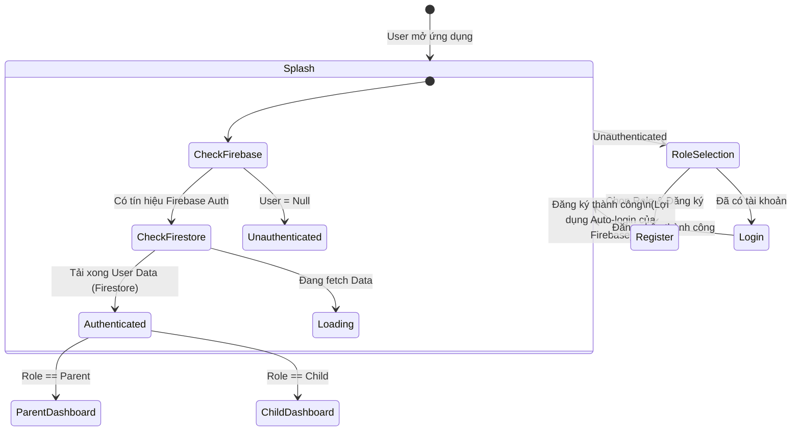
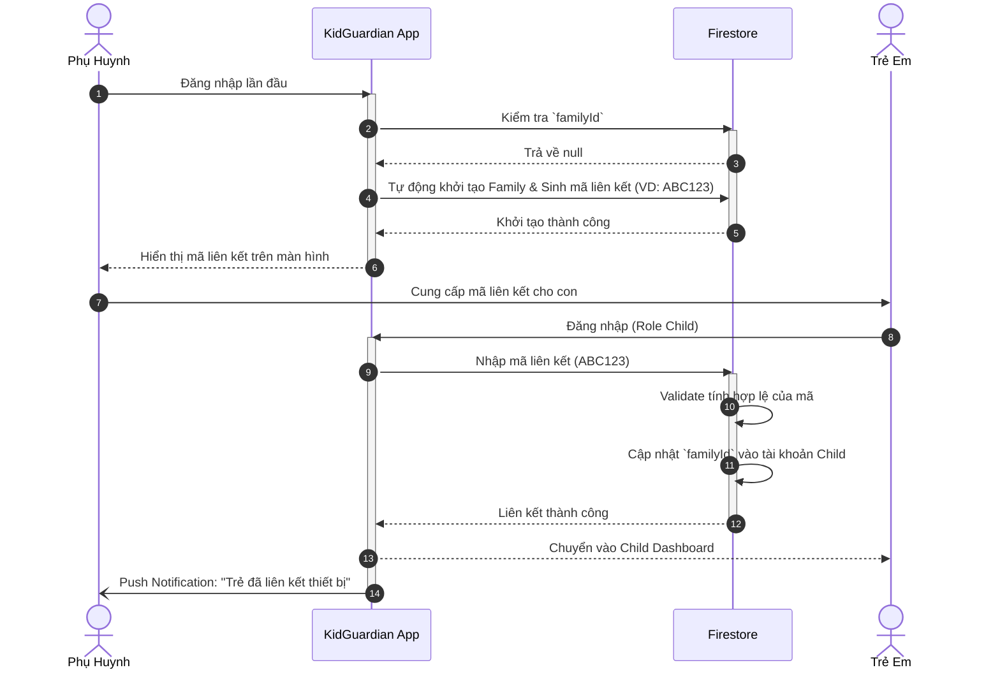
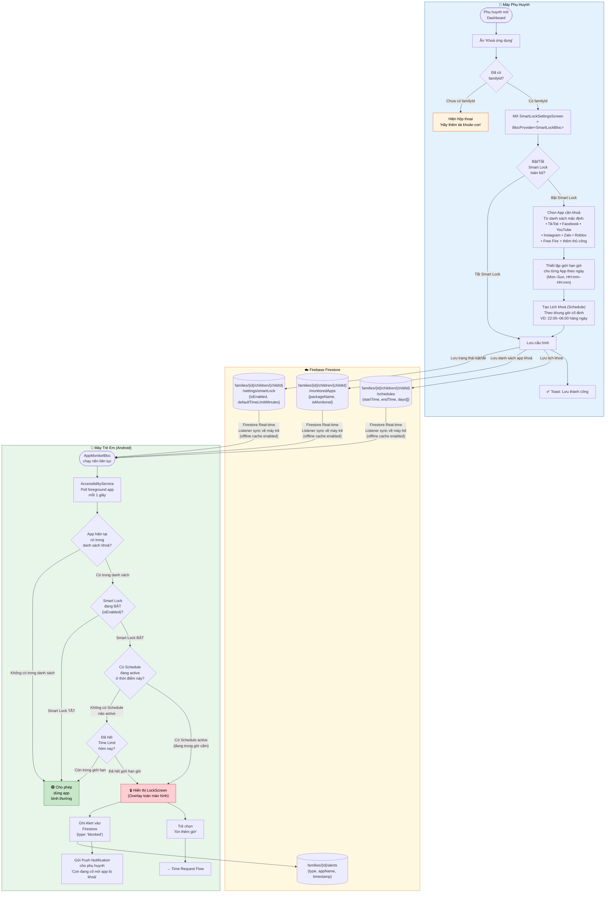
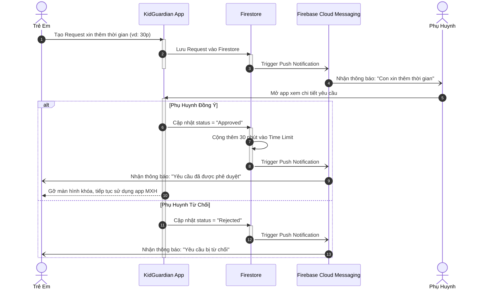
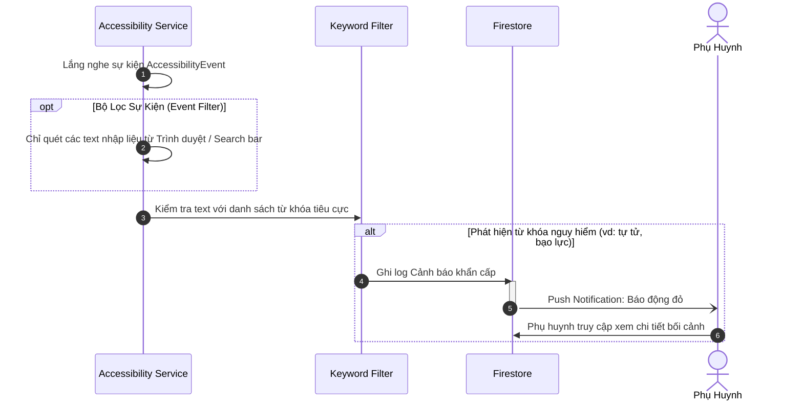
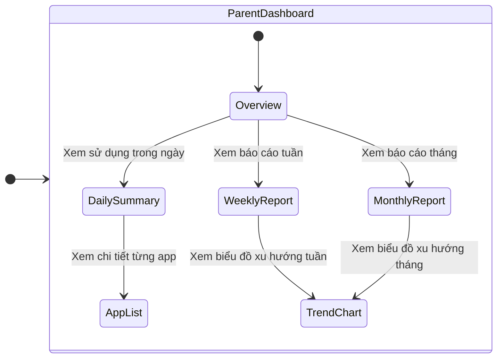

# Sơ Đồ Luồng Hoạt Động Cốt Lõi (Core Use Case Flows)
*Tài liệu chuẩn hóa kiến trúc luồng xử lý của KidGuardian*

## 1. Luồng Xác Thực & Khởi Tạo (Authentication Flow)
Sử dụng mô hình State Machine để quản lý trạng thái đồng bộ giữa Firebase Auth và Firestore thông qua Splash Screen.

## 2. Luồng Liên Kết Tài Khoản (Parent-Child Linking)
Tự động hóa luồng khởi tạo Family, giảm thiểu thao tác dư thừa cho phụ huynh.

## 3. Luồng Giám Sát & Khóa Ứng Dụng (Smart Lock Flow)
Cơ chế khóa theo chỉ định (Whitelist/Blacklist), không can thiệp vào các ứng dụng hệ thống cơ bản.
Phụ huynh cấu hình danh sách app cần khoá → Firestore → Máy trẻ real-time sync → Accessibility Service phát hiện vi phạm → LockScreen.

### Bảng Tham Chiếu Kỹ Thuật

| Thành phần | Mô tả chi tiết |
|---|---|
| **Trigger phát hiện** | `AccessibilityService` Android poll foreground app mỗi 1 giây qua `MethodChannel` |
| **Danh sách mặc định** | 7 app hardcode (TikTok, Facebook, YouTube, Instagram, Zalo, Roblox, Free Fire) |
| **Thêm app tuỳ chỉnh** | Nhập thủ công Package Name — **(UX cần cải thiện ở Sprint 2)** |
| **Offline safety** | Hiện chưa cache offline — nếu máy trẻ offline, danh sách khoá không áp dụng được **(fix ở Sprint 2)** |
| **Timeout Firestore** | Mọi lệnh ghi Firestore có `.timeout(3s)` → không bao giờ treo UI |
| **Lỗi đã fix** | `BlocProvider<SmartLockBloc>` đã được bổ sung tại 3 điểm navigate trong `parent_dashboard.dart` |

## 4. Luồng Xin Thêm Giờ (Time Request Flow)
Cơ chế tương tác 2 chiều (Two-way Interaction) thời gian thực thông qua FCM.

## 5. Luồng Cảnh Báo An Toàn (Safety Alerts & Keyword Filtering)
Giới hạn quyền Accessibility Service để tối ưu pin và bảo vệ quyền riêng tư.

## 6. Luồng Thống Kê & Báo Cáo (Dashboard & Reporting)

