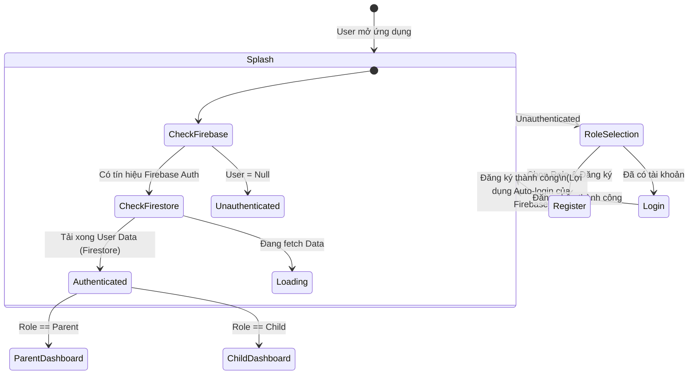
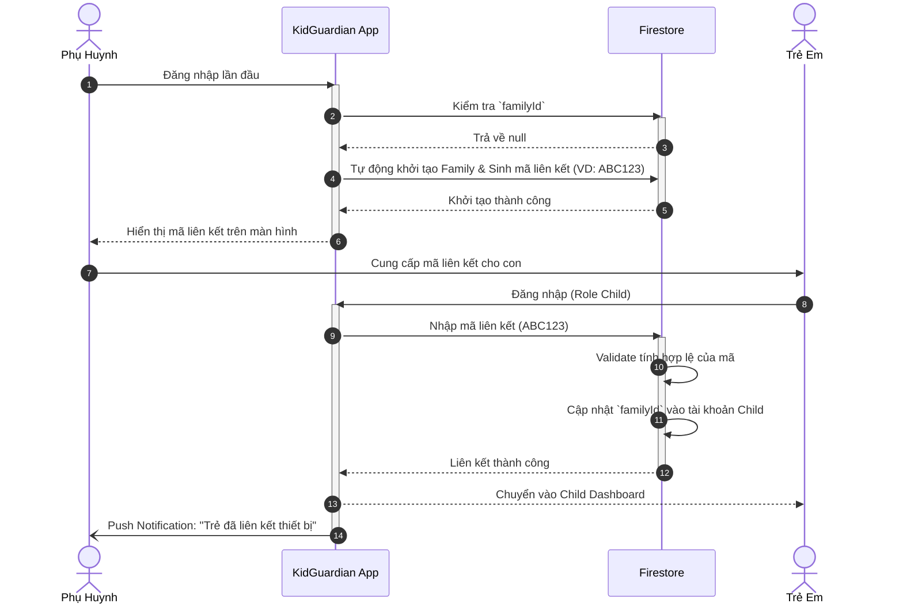
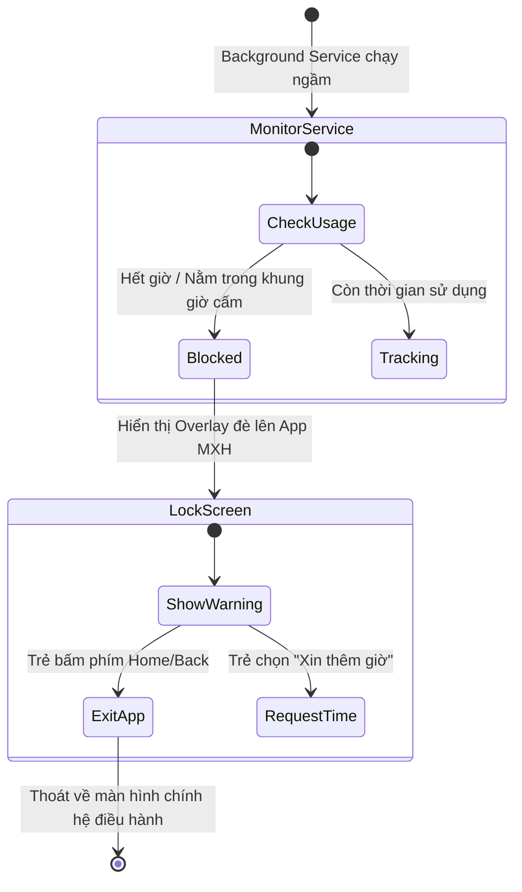
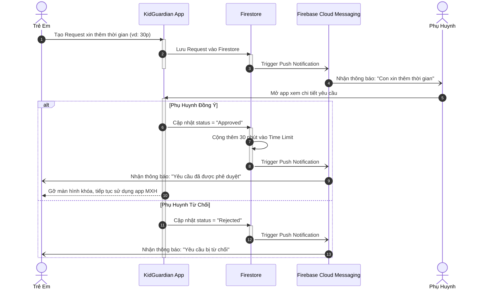
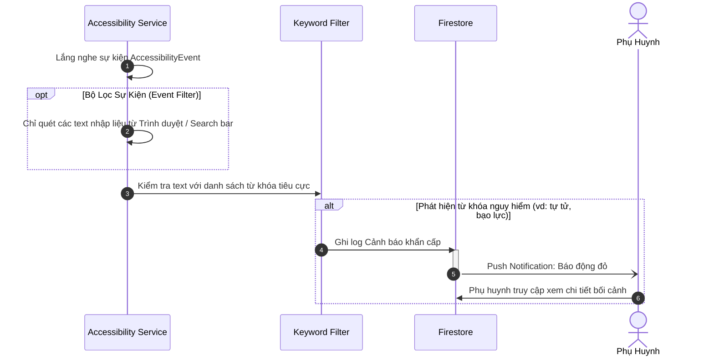
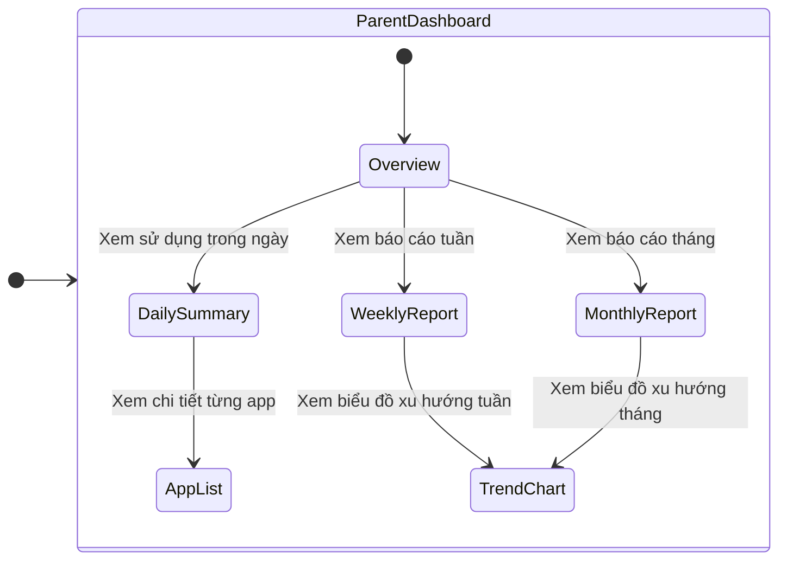

# Sơ Đồ Luồng Hoạt Động Cốt Lõi (Core Use Case Flows)
*Tài liệu chuẩn hóa kiến trúc luồng xử lý của KidGuardian*

## 1. Luồng Xác Thực & Khởi Tạo (Authentication Flow)
Sử dụng mô hình State Machine để quản lý trạng thái đồng bộ giữa Firebase Auth và Firestore thông qua Splash Screen.

## 2. Luồng Liên Kết Tài Khoản (Parent-Child Linking)
Tự động hóa luồng khởi tạo Family, giảm thiểu thao tác dư thừa cho phụ huynh.

## 3. Luồng Giám Sát & Khóa Ứng Dụng (Smart Lock Flow)
Cơ chế khóa theo chỉ định (Whitelist/Blacklist), không can thiệp vào các ứng dụng hệ thống cơ bản.

## 4. Luồng Xin Thêm Giờ (Time Request Flow)
Cơ chế tương tác 2 chiều (Two-way Interaction) thời gian thực thông qua FCM.

## 5. Luồng Cảnh Báo An Toàn (Safety Alerts & Keyword Filtering)
Giới hạn quyền Accessibility Service để tối ưu pin và bảo vệ quyền riêng tư.

## 6. Luồng Thống Kê & Báo Cáo (Dashboard & Reporting)

